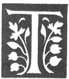

  
[Intangible Textual Heritage](../../index)  [Tarot](../index) 
[Index](index)  [Previous](gbt02)  [Next](gbt04) 

------------------------------------------------------------------------

[Buy this Book at
Amazon.com](https://www.amazon.com/exec/obidos/ASIN/0766157350/internetsacredte)

------------------------------------------------------------------------

*General Book of the Tarot*, by A. E. Thierens, \[1930\], at Intangible
Textual Heritage

------------------------------------------------------------------------

p. 13

# THE GENERAL BOOK OF THE TAROT

### I

### THE DOCTRINE

|                     |
|---------------------|
|  |

HE knowledge of the Tarot, handed down to us through the ages, and as we
find it at the beginning of the XXth century, can be traced in the
writings of many authors. Its most perfect interpretations until now are
to be found in the works of Éliphas Lévi (*Dogme et Rituel de la Haute
Magie*) and Dr. Papus (*Le Tarot des Bohémiens* and *Le Tarot
Divinatoire*). These may be said to represent the best results of
earlier times, including Eteilla and P. Christian.

A booklet by S. L. MacGregor Mathers, an author well known for his works
on subjects relating to the Kabbalah, quotes J. F. Vaillant (1857) as
saying "that it (the Tarot) belongs to the beginning of our time, to the
epoch of the preparation of the zodiac . . ." and ". . . The great
divinity *Ashtarot*, *As-Tarot*, is no other than the Indo-Tartar
*Tan-tara*, the *Tarot*, the Zodiac."

This is curious, and we wonder if one or the other ever worked out so
much as a real scheme of this relationship between the Tarot system and
the

p. 14

zodiacal principles. If so, as far as we know, it did not appear
publicly.

Another well-known author on ancient mysteries and symbolism, Arthur
Edward Waite, who revised and introduced an English edition of Papus'
*Tarot of the Bohemians*, by A. P. Morton, has presented us with a still
more precious booklet entitled *The Key to the Tarot*, from which we
quote:

"The Tarot is symbolism; it speaks no other language and offers no other
signs."

And we would add that true symbolism is always the figurative rendering
of cosmological truth or natural principles and laws in visual
linguistic or mental image. If astrological symbolism does the same, why
should we not seek for a correlation between the two systems? And if
further we come to the conclusion, as we must, that both systems give a
rendering of the process of creation itself, totally and definitely,
then the two must practically present the same point of view, and a
comparison between them must not only be instructive but may elucidate
both.

In the present work, it is our ardent desire to join with Mr. Waite, "so
that the effect of current charlatanism and unintelligence may be
reduced to a minimum."

 

We shall abstain from any special criticism and pass over the more
ancient literature on the subject--by such writers as Eteilla, Court de
Gebelin, P. Christian, etc.--literature which has been mostly embodied
in the works mentioned above, which we specially recommend to those
readers who wish to study the subject exhaustively. The best Tarot cards
are those drawn by Miss Pamela Colman Smith,

p. 15

published in England, and issued with Mr. Waite's booklet. The designs
on these cards appear to be the most pure in their symbolical details,
and to be drawn with inspiration and clear vision, though in general the
ancient description or traditional rendering has evidently been
followed.

 

The symbolical system of the Tarot consists of 78 picture cards of which
22 constitute the *Major Arcana* or *Trumps Major*, 56 (4 × 14) the
*Minor Arcana*, *Trumps Minor*. As far as we know the idea of analogy
with the zodiacal mysteries has, until now, found no further practical
realisation than a rather diffuse comparison of the four 'colours' or
suits in the Lesser Arcana with the Four Elements in the Cosmos, as we
find them in astrology.

------------------------------------------------------------------------

[Next: The Lesser Arcana](gbt04)
