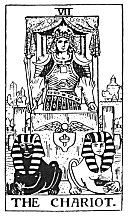

  
[Intangible Textual Heritage](../../index)  [Tarot](../index) 
[Index](index)  [Previous](gbt13)  [Next](gbt15) 

------------------------------------------------------------------------

[Buy this Book at
Amazon.com](https://www.amazon.com/exec/obidos/ASIN/0766157350/internetsacredte)

------------------------------------------------------------------------

*General Book of the Tarot*, by A. E. Thierens, \[1930\], at Intangible
Textual Heritage

------------------------------------------------------------------------

 

#### VII. The Chariot. Libra.

In the Seventh house of the evolutionary cycle the relation of the Self
with the Not-self or outer world is contracted and completed and the
'organism' arises as the systematic whole of organs, a lawful microcosm,
which in every instance is a phenomenon of the Cosmic Law, first
significance of Libra. This

p. 58

idea is very well illustrated by the picture of the Chariot, drawn by
the White and the Black Sphinx and governed by the Magician incarnate.
It is the Self embodied. This card consequently means marriage,
contract, body and bodily existence, organisation, achievement,
co-operation.

*P*. says this card has to do with the Hebrew letter *Zain*, which
"represents an arrow." Now it is very curious to see, that in Hindu
astrology the sign Libra is symbolised by an arrow touching an eye,
evidently meaning the principles of the organism or systematic complex
of organs, and at the same time the understanding, or knowing, which is
the result of the eye *seeing* the light.

The Magician has become the 'Conqueror'; the forces of good and of evil
both drawing his chariot symbolise the fact that good and evil,
agreeable as well as painful experiences, make us wiser and contain the
elements of Existence, spirit and matter both.

As a matter of fact the card may have to do with our adversaries.

On the front "we see the Indian *lingam*," says *P*. we should like to
add: in connection with the Indian (!) *yoni*, i.e. the union of the
sexes, or the two in one (bond). Here the 'Fall' into matter has been
completed. The sphinxes are female entities, the driver of the Chariot
is a man. This not only symbolises the subjugation of Nature by
will-power, but also the fact that, while inwardly 'woman rules the
world' (the Empress), rulership in the outer world lies with man, and it
is his duty to keep within due bonds the 'attractive' forces of woman,
who, however, appears to be the personification of motoric force to him
and his 'chariot.' That woman practically

p. 59

gives the inspirational lead and motive to man in this world is being
openly recognised by psychologists in our time.

------------------------------------------------------------------------

[Next: VIII. Justice. Scorpio](gbt15)
