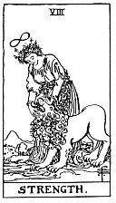

  
[Intangible Textual Heritage](../../index)  [Tarot](../index) 
[Index](index)  [Previous](gbt14)  [Next](gbt16) 

------------------------------------------------------------------------

[Buy this Book at
Amazon.com](https://www.amazon.com/exec/obidos/ASIN/0766157350/internetsacredte)

------------------------------------------------------------------------

*General Book of the Tarot*, by A. E. Thierens, \[1930\], at Intangible
Textual Heritage

------------------------------------------------------------------------

 

#### VIII. Justice. Scorpio.

Whosoever might hesitate before the emblems of this card and think it
might as well stand in relation with Libra on account of the idea of
'justice,' generally ascribed to the latter sign, and the balance which
the woman holds in her left hand, will do well to consider the
systematic relationship existing between all signs of the zodiac or
evolutionary cycle. The left hand derives from, while the right hand is
instrumental in giving out. Scorpio derives from Libra the balance and
the idea of justice, but the sword in the right hand shows, that we have
not justice pure and simple, platonic so to speak, but that which has
often been called 'avenging justice.' *Au fond* it is more vengeance
than justice and Scorpio is famous for its tendency to vengeance, in
every way and every form. After Libra, the stage of total manifestation,
this stage is the taking-back, the first step on the way home, which
explains the well-known feature of desire, thirst for experience in this
sign, because it wishes to bring home something from the voyage
'westward.' So the card of justice means above all the faculty of
desire, higher as well as lower, from the most spiritual or religious
longing down to the most crude lust. Sexual experience is one of the
most important expressions of it, and we may safely say, that one of the
principal significances of the card is sex. Another, principally where
sex is sublimated, is occult experience, and the psychical side of
earth-life in general. Naturally it stands in

p. 60

close relation to the sign Virgo, on the other hand of the Balance, in
which sensation was born; the faculty (or possibility) of the sensation
bringing the desire to realise it. It is the sign of transmutation,
which is the change of the inner composition by the experience won. The
sensation realised makes one feel, actually, bodily, psychically or
morally, the meaning of good and evil, and therefore the 'sword of
discrimination' is the emblem in the right hand of this figure. Every
mistake in the process of life will avenge itself with geometrical
certainty. This house is the school of life and it is remarkable how it
is concerned with 'school' in every respect. In this house the Self
takes from life and from the cosmos surrounding what it wants,
consequently what it does not yet possess, and the card of Justice
becomes the index for our debts or the possessions of other people.

Meanwhile the balance in the left hand of the figure denotes, without
the slightest doubt, that since Libra is on the left hand Justice must
be the VIIIth card, *not* the XIth as some authors have it.

*P*. identifies this principle with that of the Hebrew letter *Heth*,
which "expresses a field, from it springs the idea of anything that
requires labour, trouble, effort." The sexual union has taken place and
Adam-Eve are condemned to "earn their bread in the sweat of their face"
on the field. To say it less tragically the divine gift of the senses
obliges us to work with them and to suffer by them as well as to benefit
by the enjoyment of their impressions.

It is the card of sorrow as well as of deeper satisfaction. In the man
under this card there is always something of the 'avenger of wrongs,'
and very often

p. 61

it has to do with the proceedings of justitia in the world. It is also
the card of the secret, or hidden. Most authors are not very famous for
their interpretation of this card, but *P*. says a very good thing about
it: "The sword here is a sign of protection for the good, as well as a
menace for the bad."

------------------------------------------------------------------------

[Next: IX. The Hermit. Sagittarius](gbt16)
