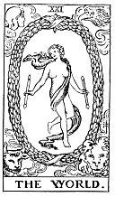

  
[Intangible Textual Heritage](../../index)  [Tarot](../index) 
[Index](index)  [Previous](gbt27)  [Next](gbt29) 

------------------------------------------------------------------------

[Buy this Book at
Amazon.com](https://www.amazon.com/exec/obidos/ASIN/0766157350/internetsacredte)

------------------------------------------------------------------------

*General Book of the Tarot*, by A. E. Thierens, \[1930\], at Intangible
Textual Heritage

------------------------------------------------------------------------

 

#### XXI. The World. Neptune.

As in the case of Uranus we want to point out that originally the planet
cannot have been appointed, astronomically, but the principle of cosmic
magetism, of which it is the organ, and the universal magnetised, field,
the field of the world in which we live, must have been well known to
the initiates, who worshipped Poseidon and Varuna, gods of the
world-ocean. The symbols of the four fixed signs are presented at the
corners of the cards, and where

p. 80

these fixed signs are seen as the foundation stones of our physical
world by such visionaries as Ezechiel and St. John of Patmos, we cannot
be far wrong in assuming that originally the meaning was that of the
physical world coming forth out of the magnetised etheric ocean of the
universe, which itself has been represented by the oval form, be it a
laurel wreath or something else. The World must have had a larger
meaning, originally, than that of the world of beings moving on the
surface of our Earth, and the oval figure may well have stood for the
form of the solar system at large, with its planets moving in oval orbs.

Appropriated to the world of men, it must mean 1 that which falls
outside our will-power, cosmic conditions to which we are subject, but
which at the f same time provide us with all that is wanted for our
physical conditions. The latter of course became the reason for
attaching to this card a generally benefic influence, especially in the
domain of the senses. "It is eloquent as an image of the swirl of the
sensitive life, of joy attained in the body, of the soul's
intoxication--(can any word remind us more strongly of Neptune's
workings than precisely this one: 'intoxication'?--Th.)--in the earthly
paradise, but still guarded by the Divine Watchers . . ." (*W*.) Let us
put it this way: it means that if we row with the cosmic tide, we shall
enjoy happiness and everything we want, but on the other hand we must
not neglect the implicit possibility, that when rowing against the tidal
current of the world, we shall experience trouble and no end of it, or
if we 'cross the stream' we shall have to stand firm on our legs. So
besides the joy of the senses, this card means also the cosmic origin

p. 81

of life, to which the candidate for initiation returns, and which now
and then appears in dreams. In fact this card has much to do with
dream-life. The relations of Neptune with the Moon and the lunar body
are not unknown to astrologers nowadays.

The Hebrew letter *Tau* is related to this card and "has the same
hieroglyphic meaning as the *Daleth* (fourth card)--that is the
womb;--(which confirms the relationship to the Moon--Th.)--but it is
chiefly the sign of reciprocity, the image of all that is mutual,
reciprocal." It is further added that abundance and perfection lie in
the card. (*P*.) Reciprocal certainly: from that we come and to that we
shall return, be it the world's dust or the ether of the cosmic ocean.

Very striking is *P*.'s saying that "This symbol represents macrocosm
and microcosm . . ." and even more so that "the empire of the world
belongs to the empire of Light, and the empire of Light is the throne of
God . . ." Scientifically expressed: the ethereal world, being the
bearer of light, is the universal womb of the material or physical
world. The nude female figure may certainly contain indications with
regard to the life of the senses, but is also a symbol of the angelic
state to which man will one day come after being delivered from the
bonds of the lower world. It may have to do with nature spirits. It is
Aphrodite rising from the sea, daughter of Neptune. Beauty and love and
happiness arising from the communion of souls.

------------------------------------------------------------------------

[Next: 0. (Zero) The Fool. Our Earth](gbt29)
