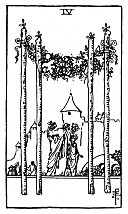

  
[Intangible Textual Heritage](../../index)  [Tarot](../index) 
[Index](index)  [Previous](gbt33)  [Next](gbt35) 

------------------------------------------------------------------------

[Buy this Book at
Amazon.com](https://www.amazon.com/exec/obidos/ASIN/0766157350/internetsacredte)

------------------------------------------------------------------------

*General Book of the Tarot*, by A. E. Thierens, \[1930\], at Intangible
Textual Heritage

------------------------------------------------------------------------

 

#### Four of Wands

TRADITION: Society, association, alliance, multitude and all that
implies a gathering of men, even armies; mixture; country life,
felicity, augmentation, prosperity, happiness, peace and concord, etc.,
convocation; advance.

THEORY: It is *Air* on the *Fourth house* and the mixing of mercurial
and lunar influence will of course explain the idea of gathering. We
cannot quite see some of the definitions (contract, pact, treaty), but
generally we find the idea of that which binds together by memory and
common motives, thoughts, mottos common to a certain group of people, be
it family or nation, clan or army. So this leads us to see in the card
the expression of the common motive, of that which binds people
together. It is not the contract, but the motive which afterwards leads
to contracts, or from which the contract will result. A common mistake,
in astrological descriptions as well, is this mixing up of definitions
relating to the cause and to the effect respectively. Mercury

p. 92

brooding over the house of the family and the moon, engenders homely
feelings, memories, thoughts of internal service, household matters, and
tends more or less to a profane and familiar or descriptive language, to
joke, fun and the theatrical art, to inviting people to come together
and have their share in weal and woe. It represents also common sense,
which, however, remains in many cases 'common' enough. And it contains
the motives, which actually govern the facts and actions in this world.

CONCLUSION: *Family-spirit, clan, home, the ideas and motives which rule
us*, consequently *that which is familiar to us; memory, reminiscences,
brooding and scheming, fantasy, theatrical arts, fancy, imagination*. It
can be *augmentation* as well as *decrease*, it generally means *change*
and *unstable conditions, popularity and vaccillation, profanation*. It
may denote some *group of people, a gathering or meeting,
family-council. A convocation. a call and a vote. Cosiness*.

------------------------------------------------------------------------

[Next: Five of Wands](gbt35)
