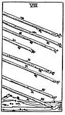

  
[Intangible Textual Heritage](../../index)  [Tarot](../index) 
[Index](index)  [Previous](gbt37)  [Next](gbt39) 

------------------------------------------------------------------------

[Buy this Book at
Amazon.com](https://www.amazon.com/exec/obidos/ASIN/0766157350/internetsacredte)

------------------------------------------------------------------------

*General Book of the Tarot*, by A. E. Thierens, \[1930\], at Intangible
Textual Heritage

------------------------------------------------------------------------

 

#### Eight of Wands

TRADITION: Examination, interior disputes, misunderstanding, regrets,
interior agitation, scruples, doubt, repentance, etc. But on the other
hand it is brought into connection with everything that has to do with
country life, the fields, gardens, woods, etc. Also: pleasure,
amusement, enjoyment,

p. 96

recreation. Quite apart from all this: an express messenger, the arrows
of love or the arrows of jealousy. "Great haste, great hope, speed
towards an end, which promises assured felicity." (*W*.)

THEORY: The card represents *Air* on the *Eighth house* and the
influence of Scorpio will make the mind acute and sharp, so as to
investigate and to examine the most hidden riddles, while in this house
the mind comes to the sensation or consciousness of pleasure and pain,
thirst and drinking. (The chalice will begin its suit later on the Ninth
house.) It is the house of hidden and 'forbidden' knowledge or rather
experience. The 'arrows of love' actually mean passion, and the 'arrows
of jealousy,' the common counterpart of the same. The sensation of sex
is born in this house and indicated by this card. As to swift or speedy
messages, this may sometimes happen, because the Scorpion is sometimes
very sudden in its movements. What the card should have to do with
country life is less evident. We should say rather that it must stand in
relation with the sea, fishermen and sailors. The mind in this house is
very critical and sharp-witted, sometimes subject to doubt and
misgivings, superstition and jealousy. It is in search of truth and
enjoyment. Artistic abilities will run along the line of poetry, music
and sculpture. It has always to do with the hidden side of things, the
interior, or the inner life.

CONCLUSION: *Examination, interrogation, internal or inner conceptions,
knowledge and disputes; misgivings, doubt and sometimes
misunderstandings; quick response, reaction, and answer to unspoken
words or meanings. The sensation of pleasure and pain, but at* 

p. 97

*the same time the knowledge and the occasion to avoid both or to get
the one and avoid the other. Life at or on the sea; sailors and
fishermen. Searchers for the hidden side of things, students of
occultism. Poetry, music and sculpture. Secret message; hidden meaning;
sex questions. Private interview or rendez-vous. Bad weather*.

------------------------------------------------------------------------

[Next: Nine of Wands](gbt39)
