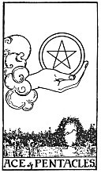

  
[Intangible Textual Heritage](../../index)  [Tarot](../index) 
[Index](index)  [Previous](gbt44)  [Next](gbt46) 

------------------------------------------------------------------------

[Buy this Book at
Amazon.com](https://www.amazon.com/exec/obidos/ASIN/0766157350/internetsacredte)

------------------------------------------------------------------------

*General Book of the Tarot*, by A. E. Thierens, \[1930\], at Intangible
Textual Heritage

------------------------------------------------------------------------

 

#### PENTACLES

#### Ace

TRADITION: Perfect contentment, felicity, happiness, ecstasy, perfect
joy, perfect remedy, fulfilment of what has been asked in prayer.
Reversed: Capital, riches, opulence, treasure. Something of principal
value or valuable, dear, expensive, rare, highly esteemed.

THEORY: The element of *Fire*, of the nature of the Sun and Venus, on
the *house of the Sun, the Fifth:* indeed this card has been well
defined by the traditional renderings, which give it all as very
benefic. How could it be anything else? The aces are all more or less a
commencement, new prospects, etc. If you get the ace of pentacles or
hearts on one

p. 106

of your houses in the horoscopic figure, you may be pretty sure that the
matters to which the house in question relates will be beneficial and,
on account of the fiery element, irresistible. It means the commencement
of that what is wished for, desired, and this is what man calls his
happiness. It is the spark of the Ego demonstrated in the practice of
daily life; and this is what may well be called the note of good, which
also brings good luck to other people. So there is creative energy in
this card. Not yet worked out into details, but originally decided and
fairly sure to work out in the future in lucky events and prosperous
happenings. So there is promise in it and it is above all a card of good
augury of a new and prosperous beginning. It is like a bright spark.
Even among very bad cards it is the bright spark of hope and good-will,
though of course in such cases it may be too weak to conquer adverse
circumstances immediately. It may mean further a person or thing of
first ranking. A child. A speculation.

CONCLUSION: *Creative energy, fulfilment of hope, wish and desire, good
luck, bright prospects, beginning of a new era in life, happiness, good
augury; a child; a speculation. As to material effects it is benefic
without being in itself the indication of riches or gold. It may be a
present, a donation. Profit. Promise. Goodness. Favour. It may indicate
the person, who is chiefly of interest, and of benefic influence*.

------------------------------------------------------------------------

[Next: Two of Pentacles](gbt46)
