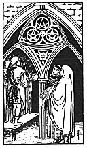

  
[Intangible Textual Heritage](../../index)  [Tarot](../index) 
[Index](index)  [Previous](gbt46)  [Next](gbt48) 

------------------------------------------------------------------------

[Buy this Book at
Amazon.com](https://www.amazon.com/exec/obidos/ASIN/0766157350/internetsacredte)

------------------------------------------------------------------------

*General Book of the Tarot*, by A. E. Thierens, \[1930\], at Intangible
Textual Heritage

------------------------------------------------------------------------

 

#### Three of Pentacles

TRADITION: Nobility, noblesse, good and generous action, aristocracy,
fame, glory, splendour, etc. Consideration, generous action. The
reversed meanings do not appear at all to respond to a card of
pentacle-nature and, as in many other cases, simply seem to imply the
absence of the better qualities: weakness, humility, vile and abject
action, etc. Another version gives: "Métier, trade, skilled labour."
(*W*.)

THEORY: The *Fire* on the *Seventh house*, which rules the contact of
the Self and the Not-self, the relations between both, the executive
ability in man. So this must lead to the idea of well-doing and noble
demeanour, owing to the Sun and Venus again. Compare horoscopes with the
Sun and Venus in VII. Well-conducted relations denote civilisation,
aristocracy, and the proper expression of one's relation to the world in
his occupation, his métier, as *W*. has it; profession, marriage and
employment. So this card has to do with 'workmanship,' which is well
expressed by the drawing of the card in the set of *W*.

CONCLUSION: *Civilisation, aristocracy, good workmanship, skill, civil
treatment and noblesse, agreeable relation, métier, employment,
profession, marriage; good done to other people, bounty, profitable
relations in business; restoration, reparation, beneficial arrangement.
A marriage will do much good*.

------------------------------------------------------------------------

[Next: Four of Pentacles](gbt48)
