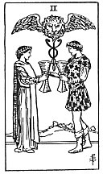

  
[Intangible Textual Heritage](../../index)  [Tarot](../index) 
[Index](index)  [Previous](gbt59)  [Next](gbt61) 

------------------------------------------------------------------------

[Buy this Book at
Amazon.com](https://www.amazon.com/exec/obidos/ASIN/0766157350/internetsacredte)

------------------------------------------------------------------------

*General Book of the Tarot*, by A. E. Thierens, \[1930\], at Intangible
Textual Heritage

------------------------------------------------------------------------

 

#### Two of Cups

TRADITION: Love, passion, inclination, sympathy, attraction, concord,
friendship, the inter-relation of the sexes; Reversed: Lust, cupidity,
jealousy, wish, desire, but the card may also give, says *W*., "that
desire which is not in nature, but by which nature is sanctified."

THEORY: The *Water* of the soul on the house of Capricorn, *the Tenth*
house of the act, the deed, manifestation. The two souls find each other
here in an act, which of course must be that of meeting in the body.
Soul-union, ending in bodily attraction. So the traditional rendering
appears once more to be fairly correct. It is the outcome of idealism,
indicated by the ace, shared by two souls. It is anyhow not the
sex-element as a curse, but as a blessing in practical life. The card
may further denote any sort of friendly act and sympathetic encounter.
We should say, as regards 'love,' it is to be rather defined as
love-making, courting.

p. 125

CONCLUSION: *Love-making, passion, friendship, attraction, concord, good
action, hospitable meeting or reception, the interrelation of the sexes,
desire. In the weaker aspect: lust, cupidity, 'cupboard' love*.

------------------------------------------------------------------------

[Next: Three of Cups](gbt61)
