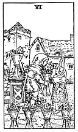

  
[Intangible Textual Heritage](../../index)  [Tarot](../index) 
[Index](index)  [Previous](gbt63)  [Next](gbt65) 

------------------------------------------------------------------------

[Buy this Book at
Amazon.com](https://www.amazon.com/exec/obidos/ASIN/0766157350/internetsacredte)

------------------------------------------------------------------------

*General Book of the Tarot*, by A. E. Thierens, \[1930\], at Intangible
Textual Heritage

------------------------------------------------------------------------

 

#### Six of Cups

TRADITION: The past, memories, looking back. Antiquity, ancient things,
etc. Reversed: Afterwards, regeneration, resurrection, renovation, etc.
Another version says: "Happiness, enjoyment, but coming rather from the
past . . ." (*W*.) Sometimes "new relations, new knowledge, new
environment. . . ."

THEORY: The *Water* of the soul on the house of Taurus, *the Second*,
house of exaltation of the Moon. The latter is no doubt responsible for
the addictions concerning memory and the past. The rest of the
traditional descriptions, however, are rather rudimentary. There is more
to be said of this house: it is full of meaning, as we already have
seen, in the line of art, economy, etc. It relates to the country, and
in connection with the latter the card will indicate rustic pleasures,
enjoyment of country life and restoration to health by residence on the
land. Happiness

p. 129

is surely a characteristic of this card, but we should say particularly
in a simple and country life. Further we ascribe much artistic value to
it, especially in painting, love for the picturesque. It means
receptivity for beautiful impressions in general. On the other hand it
may denote a love of good cheer and feasting. Good health and good
humour are certainly results of this combination. On account of the
Taurian qualities it will impart the tendency to collect objects of art
and of antiquarian value; also an instinctive understanding of the same,
so it promotes dealing in such objects. Appreciation of music in the
lighter style, love of the theatre, but love of Nature above all.

CONCLUSION: *Happiness, feeling of riches in oneself, joy, enjoyment,
love of Nature and country life; the picturesque, painting, instinctive
knowledge of art and antiquarian value; love of the lighter sorts of
music and theatre; good health, good cheer, feasting. Receptivity for
beauty. The only drawback may be the tendency to dissipation. Taurus,
the everlasting, may indeed produce impressions of the past as well as
of the future*.

------------------------------------------------------------------------

[Next: Seven of Cups](gbt65)
