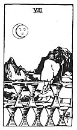

  
[Intangible Textual Heritage](../../index)  [Tarot](../index) 
[Index](index)  [Previous](gbt65)  [Next](gbt67) 

------------------------------------------------------------------------

[Buy this Book at
Amazon.com](https://www.amazon.com/exec/obidos/ASIN/0766157350/internetsacredte)

------------------------------------------------------------------------

*General Book of the Tarot*, by A. E. Thierens, \[1930\], at Intangible
Textual Heritage

------------------------------------------------------------------------

 

#### Eight of Cups

TRADITION: Fair girl, honest, practical girl, honour, modesty, timidity,
fear, sweetness, mildness.

p. 131

\[paragraph continues\] Reversed:
Happiness, gaiety, great joy, feasting, public rejoicing. Also
preparations and dispositions. *W*. says it means, "Deserting the cups
of his felicity."

THEORY: On the *Fourth house* the *Water* of the soul will be in its own
element, so to speak, and will consequently rejoice in its existence,
swimming in agreeable sensations, the family and the memory, as far as
the personal life goes, playing important rôles in the life of the
querent. The lunar and Jovian element passing over this house will
almost certainly cause the home and family-life to be forsaken or
relinquished; this perhaps may account for the interpretation:
"Deserting the cups of his felicity." We should prefer to substitute for
"felicity" his family or intimate circle. Changes in home-life, be it
for the better or for the worse. There cannot be much of order or rule
in this combination, and disorder or chaos is threatened. The strong
Cancerian peculiarities, such as shyness, timidity, prudishness, etc.,
may appear here, but we can see no reason for addictions like 'great
joy, feasting,' etc. Feelings, sentiments, wishes have very little
chance of becoming reality in this house, and this may be called the
true reason for 'leaving the house.' The latter seems to us to be the
proper meaning: either leaving the safe and comfortable home, or losing
the chance to realise more ambitious projects. Being the eighth card of
the suit, it may denote a girl, and cups are said to be related to the
fair or 'blonde' type.

CONCLUSION: *Leaving the house or home; changes in the
family*(-*circle*). *Little chance to see one's wishes and ambitions
realised. Shyness, timidity; disorder* 

p. 132

*and waywardness. Despondency, despairing of success. Mixed sensations,
no strongly preponderant feeling, unless it be that of dissatisfaction.
May be fair-haired girl*.

------------------------------------------------------------------------

[Next: Nine of Cups](gbt67)
