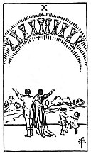

  
[Intangible Textual Heritage](../../index)  [Tarot](../index) 
[Index](index)  [Previous](gbt67)  [Next](gbt69) 

------------------------------------------------------------------------

[Buy this Book at
Amazon.com](https://www.amazon.com/exec/obidos/ASIN/0766157350/internetsacredte)

------------------------------------------------------------------------

*General Book of the Tarot*, by A. E. Thierens, \[1930\], at Intangible
Textual Heritage

------------------------------------------------------------------------

 

#### Ten of Cups

TRADITION: The town, native land, living place, residence; also
citizen(ship). Reversed: Agitation, irritation, indignation, anger.
Another version gives: "Husband and wife . . ." "Contentment, repose of
the entire heart"; and "A person who is taking care of the querent's
interests." (*W*.)

THEORY: It is the *Water* on the *Sixth house*, where it meets with
Virgo-influences. Now what about the town or city? Virgo is "the city
which killed the prophets"--Jerusalem--and the addiction originally will
have indicated the physical, sensual embodiment of the soul, in which
the spirit is 'buried' or 'killed' as the mystic formula has it. This
card may therefore be called, with truth, the indication of 'the city of
God' which, by analogy, becomes the physical body, as well as one's
residence or native land. It means the physical and sensatory possession
or ownership. Consequently it has to do with the agreeable sensation of
being 'at home' and 'at ease,' having possession of what is wanted. It
must also mean being fully acquainted with one's work. Good health and
wise living. This house rules servants, food, health.

CONCLUSION: *Well-earned security, wise living, husbandry, being at
ease, feeling safe; "a person who is taking care of the querent's
interests" may be correct and actually present, e.g., in the shape of
servants, shopmen, purveyors. The city, birthplace, physical
constitution*. (*Tabernaculum*.) *Medicine of* 

p. 134

*body and soul. Organic life in the body and in the community, viz.
practical social conditions. In weak cases the house of Virgo may cause
irritability and agitation, etc.: a weak nervous system must avoid the
full sway of emotions*.

------------------------------------------------------------------------

[Next: King of Cups](gbt69)
