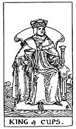

  
[Intangible Textual Heritage](../../index)  [Tarot](../index) 
[Index](index)  [Previous](gbt68)  [Next](gbt70) 

------------------------------------------------------------------------

[Buy this Book at
Amazon.com](https://www.amazon.com/exec/obidos/ASIN/0766157350/internetsacredte)

------------------------------------------------------------------------

*General Book of the Tarot*, by A. E. Thierens, \[1930\], at Intangible
Textual Heritage

------------------------------------------------------------------------

 

#### King of Cups

TRADITION: Fair and honest man; man of business, law or divinity;
responsible, disposed to oblige the querent; probity, equity, art and
science, and those who profess science, art and law. Reversed: Honest or
dishonest man equally (?); thief, brigand, rogue. Vice, corruption,
scandal.

THEORY: This king is the chief of the kingdom of the soul, coming on the
*Ninth house*, and consequently must indicate the teacher, prophet, man
of law and divinity; the professor, inspirer and great traveller;
sometimes a hunter, a wanderer, or a sailor, a yachtsman. Honesty and
probity will be generally his characteristics, but some fantasy may be
mixed with it and he may be less particular in details or accuracy. He
may be exuberant or even excessive, and this may cause some excitement,
but we see nothing of 'scandal, vice,' thievishness or anything of that
kind in this card. There is a lively sentiment of justice in it and the
person indicated by it will certainly be disposed to render justice to
the querent, whether he be connected with the law or not. If the querent
is himself a weak or vicious individual, the card may indicate the judge
before whom he has to appear. At all events it may represent the idea of
judgment of the querent's actions or business. Further there is less of
'science' in this

p. 135

card than of philosophy, which is quite another department. There is the
idea of promoting, inspiring, pushing. There lies promise for the future
and likeliness of monetary advances in this Sagittarian card.

CONCLUSION: *Honest man, philosophical or idealistic, doctor or
professor, teacher, man of the law, traveller, promoter, inspirer,
hunter, wanderer, sailor, etc. The querent's actions, business or wants
will be judged and brought to light. There may be some exaggeration,
fantasy or want of accuracy, but there is certainly hope and promise for
the future. Perhaps travelling on the sea*.

*W*. rightly observes under this head: "The implicit is that the sign of
the Cup naturally refers to water, which appears in all court-cards"
(i.e. of this suit.)

------------------------------------------------------------------------

[Next: Queen of Cups](gbt70)
