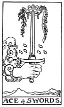

  
[Intangible Textual Heritage](../../index)  [Tarot](../index) 
[Index](index)  [Previous](gbt72)  [Next](gbt74) 

------------------------------------------------------------------------

[Buy this Book at
Amazon.com](https://www.amazon.com/exec/obidos/ASIN/0766157350/internetsacredte)

------------------------------------------------------------------------

*General Book of the Tarot*, by A. E. Thierens, \[1930\], at Intangible
Textual Heritage

------------------------------------------------------------------------

p. 140

 

#### SWORDS

#### Ace

TRADITION: The extreme or excessive, triumph, force. "It is a card of
great force, in love as well as in hatred." (*W*.) Vehemence, fury, etc.
Limits, extremity, frontier, confinement. Reversed: Conception,
pregnancy, childbirth, fructification, production, enlarging,
augmentation.

THEORY: This is the first step of the element of *Earth*, coming on the
*First house or ascendant*. Of course this has to do with a beginning, a
strong outpouring of force, an impulse, and a material one too. Positive
activity on the material plane is typically masculine, and this is a
very masculine card, perhaps the most of all. There is no negotiation
possible with it. It is emphatically 'yes' or 'no.' One of the primary
expressions of the masculine is fructification, and the male action is
indicated by this card. For the same reason it means germ, seed. And its
natural consequence is conception and childbirth, the ace indicating
here also the ascendant. In everything this card means the actual
beginning in material execution, which at the same time may cut short
something else. It may mean decapitation, or any justiciary execution.
It signifies of course a decision, the end of uncertainty or twilight.
It is a fresh starting point in matter: '*alea jacta est*.' And so it
may as well mean a strong demand, an appeal. There is courage in it and
firm initiative. It may cause pain and affliction, but annihilates
doubt, the greatest torture.

CONCLUSION: *Initiative, force, masculine activity*,

p. 141

*seed, germ, commencement in matter, decision, starting point, emphasis;
fructification. Execution, affliction, pain, but annihilation of doubt
and uncertainty. Courage, firmness, integrity. May denote great passion
or intense enmity. Fury, vehemence*.

------------------------------------------------------------------------

[Next: Two of Swords](gbt74)
