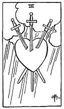

  
[Intangible Textual Heritage](../../index)  [Tarot](../index) 
[Index](index)  [Previous](gbt74)  [Next](gbt76) 

------------------------------------------------------------------------

[Buy this Book at
Amazon.com](https://www.amazon.com/exec/obidos/ASIN/0766157350/internetsacredte)

------------------------------------------------------------------------

*General Book of the Tarot*, by A. E. Thierens, \[1930\], at Intangible
Textual Heritage

------------------------------------------------------------------------

 

#### Three of Swords

TRADITION: Departure, absence, rupture, delay, division, removal,
being-far-away. Also aversion, hatred, disgust, etc. Contrarieties,
opposition, unsociable qualities, gruffness, separation, etc. Reversed:
Mental worries, troubles and even alienation. Error, mistake, loss. A
nun.

THEORY: The element of *Earth* on the *Third house* acts in the way of
the mind and mental processes, and must appear as 'troubles,' etc.,
because it gives the feeling of the mind being burdened, which might
easily go as far as oppression. If the burden becomes too heavy, either
the body or the soul may suffer severely, and pain, affliction or mental
aberration may ensue. This card must generally mean bad news too, the
message which brings news of the affliction. It may be a corrective to a
too easy and volatile imagination. It will in most cases denote some
sickness, as a result of the pressure or oppressed feeling in the mind
or in circumstances in general. It may be the result of worrying. The
house of Gemini also suggests some suffering on account of distance,
separateness, being far from one other. And the oppressed mind, which
cannot have its

p. 143

way, may easily denote the spiritual condition of a nun or some one who
takes refuge within the precincts of a monastery. In this case, however,
the motives are not of the more elevated or exalted order: there is
spitefulness, vexation, bitterness on account of unrealised hopes, want
of idealism. So this does not indicate the idealistic type of
monasticism. The card typifies the worries of the lesser sort of mind,
also small talk, evil thought, the wrestling of the inferior mind with
matter and all that may be expected from it.

CONCLUSION: *Oppression, worries, being burdened, baffled hopes,
troubles, tendency to separateness, rupture and seclusion, pessimism.
Removal, absence, delay. Small talk, bitter and evil thought, sickness;
in bad cases alienation. Error of judgment, wrong opinion, hatred,
aversion, etc. In general: affliction. Scheming, but not in a good
sense*.

------------------------------------------------------------------------

[Next: Four of Swords](gbt76)
