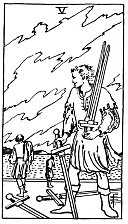

  
[Intangible Textual Heritage](../../index)  [Tarot](../index) 
[Index](index)  [Previous](gbt76)  [Next](gbt78) 

------------------------------------------------------------------------

[Buy this Book at
Amazon.com](https://www.amazon.com/exec/obidos/ASIN/0766157350/internetsacredte)

------------------------------------------------------------------------

*General Book of the Tarot*, by A. E. Thierens, \[1930\], at Intangible
Textual Heritage

------------------------------------------------------------------------

 

#### Five of Swords

TRADITION : Loss, dishonour, degradation, defeat, ruin, reversal of
fortune, diminution, wronging, bad luck, destruction, etc. Reversed :
Much the same, burial, obsequies. It is also said to represent a thief
and theft, corruption, seduction, plague, and all that is hideous and
horrible.

p. 145

THEORY: The element of *Earth* with its influence of Mars and Saturn on
the *Fifth house*, ruling the heart, cannot be very 'favourable' in the
ordinary sense of the word and is certain to lead to a feeling of being
wronged by the world, an inner bitterness and impotence, which hinders
enterprise and business; so these will suffer. And the heart itself,
being of precisely the opposite nature, will suffer and find things
awkward, horrible, hideous, etc. In the same way this card must indicate
affliction of honour, which is ruled by the Sun. Moreover, as "from the
heart are the issues of life," the card may indicate vice and a bad use
of the inner or spiritual forces. Still there is another possibility,
and this is given by Mr. *W*. when he says that this card's image
signifies a man who "is master of the field." So he may be if the inner
force is great enough to conquer the afflictions which assail him. In
other words, it need not be a card of absolute defeat, for there may
very well be a good result, but nevertheless it denotes serious
difficulty and a critical moment or period in life, in which the querent
or some one to whom it relates will be threatened with the
above-mentioned sad effects.

CONCLUSION: *Affliction, crisis, morose disposition, bitterness,
impotence, lack of self-respect, or self-confidence; it may be that
self-confidence is ascertained by some struggle or conflict;
difficulties, which after all may prove very useful but necessitate much
self-discipline. In the same way discipline of children is necessary.
Enterprise or expansion is impossible or not advisable. Things indicated
by this card may indeed be bad-looking or unpromising. There will be a
question of a loss in most cases*.

------------------------------------------------------------------------

[Next: Six of Swords](gbt78)
