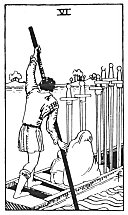

  
[Intangible Textual Heritage](../../index)  [Tarot](../index) 
[Index](index)  [Previous](gbt77)  [Next](gbt79) 

------------------------------------------------------------------------

[Buy this Book at
Amazon.com](https://www.amazon.com/exec/obidos/ASIN/0766157350/internetsacredte)

------------------------------------------------------------------------

*General Book of the Tarot*, by A. E. Thierens, \[1930\], at Intangible
Textual Heritage

------------------------------------------------------------------------

p. 146

 

#### Six of Swords

TRADITION: Route, way, path, envoy, journey by water, emigration,
manner, expedient. Reversed: Proclamation, declaration, publication,
avowal, knowledge, charter, constitution, bill, ordinance, discovery,
vision, revelation, apparition. A proposal of love, says another
rendering.

THEORY: This is the element of *Earth* on the *Sixth house*, and the
Virgo-particulars expressed in 'earth' become the 'ways' that carry the
message from the centre, the heart, to the parts of the system. So it is
the nervous system and the arterial system in the animal and human body.
Thus it must be the way or path leading out into the world from our
house or living place. This explains what tradition says about envoy and
emigration, though the latter is somewhat far-fetched, and not in every
instance will the way lead so far as that, nor the path be trodden until
we meet with a 'proposal of love.' But it is true, that the effect of
that which this card represents may go far and in general signifies the
message in the sphere of matter (Mercury is lord of this house), the
message materialised. And this explains why tradition says it means
'apparition'--'publication'--'constitution' etc. It is quite correct
therein. The message is conveyed by means of the way, path,
canalisation, etc., and appears in some effect or other. So it may even
be a vision or materialisation from the 'other side.' It may also,
however, be the passing over to that side, the crossing of the Styx,
which seems to be indicated by the picture of this card. The cusp of the
seventh house in the horoscope

p. 147

is 'the end,' in the same way as the ascendant is 'the beginning.'
Though tradition has not rendered it so, this card must in many
instances have the significance of passing away.

CONCLUSION: *Route, way, canal, conveyance, nervous system, arterial
system; experiment, order of service, practical prescriptions for any
service, rules and measures of internal service. It warns that care must
be taken for health and the internal service of the body must be
cleared, in order to avoid intestine troubles. There may be something of
a course, a voyage to be made, a cure or even emigration, if other
indications confirm it. If in connection with Venusian influences,
sensuality and the expressions of it. If badly aspected: serious illness
and probability of the passing away of the patient*.

------------------------------------------------------------------------

[Next: Seven of Swords](gbt79)
