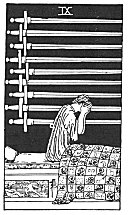

  
[Intangible Textual Heritage](../../index)  [Tarot](../index) 
[Index](index)  [Previous](gbt80)  [Next](gbt82) 

------------------------------------------------------------------------

[Buy this Book at
Amazon.com](https://www.amazon.com/exec/obidos/ASIN/0766157350/internetsacredte)

------------------------------------------------------------------------

*General Book of the Tarot*, by A. E. Thierens, \[1930\], at Intangible
Textual Heritage

------------------------------------------------------------------------

p. 150

 

### Nine of Swords

TRADITION: A bachelor, priest, clergyman, hermit; monastic order,
monastery, church; religion or cult; devotion, rite, ritual, ceremony.
Another version says: "Death, failure, miscarriage, delay, deception,
disappointment, despair." (*W*.) Reversed: Justified doubt, fear or
mistrust, scruple, shame, imprisonment; timidity, pudor.

THEORY: On the house of Sagittarius, the *Ninth*, the element of *Earth*
must of course relate to the earthy side of religion, i.e. the material
expressions of it, to the more heavy, earthy, materialistic mind and its
ideas about religion, ethics, etc. It is not very flattering for
priesthood in general, perhaps, that from this sort of condition have
come so many of those who call themselves ecclesiastics, but still it is
natural, because the 'ecclesia,' which has been built upon the rock
(Petrus = Capricorn,) is served by the teachers or inspirers of it, to
be found in the preceding house. In lay language this means: the
expression of religion, of ideals and ideas, descending into matter,
taking material shape and culminating in the church or monastery, which,
however, come under the tenth house, and into dogma and creed under the
ninth. Under the latter's influence are the representatives of dogma and
creed, viz. priest, officiant, monastic or monk. It is fairly sure, that
from the essence of this card arises inquisition and every sort of
intolerance, religious intolerance above all, because the materialistic
mind thinks itself in possession of the only expression of Truth, and
condemns every other. So this card nay also indicate all sorts of hard
judgment, rigid attitudes of mind, orthodoxy.

p. 151

\[paragraph continues\] For this indeed is
the meaning of materialism in religion and ethics. When the material
expression of truth and ideals is at its height, it reaches the value of
rite and ritual or religious ceremony, which at its best stands in
relation to dogmatism as the jewel to simple stones or dry sand.

CONCLUSION: *Dogma, dogmatism, ecclesiastic spirit, scholastic mind,
creed, rite, ritual, ceremonial. The persons representing these. Hard
judgment, orthodoxy, rigid attitude of mind, ascetism. Intolerance,
inquisition. The 'fear of God' may well be turned into hatred of
mankind. In weak cases there may be swearing, atheism, agnosticism,
shyness, miscarriage, shame, false evidence given, error of judgment. In
strong cases the mind is scrupulous, conscientious, and in strict accord
with time and fashion*.

------------------------------------------------------------------------

[Next: Ten of Swords](gbt82)
