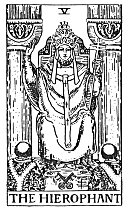

  
[Intangible Textual Heritage](../../index)  [Tarot](../index)  [Tarot
Reading](tarot0)  [Index](index)  [Previous](pktar04)  [Next](pktar06) 

------------------------------------------------------------------------

[Buy this Book at
Amazon.com](https://www.amazon.com/exec/obidos/ASIN/B002ACPMP4/internetsacredte)

------------------------------------------------------------------------

  
*The Pictorial Key to the Tarot*, by A.E. Waite, ill. by Pamela Colman
Smith \[1911\], at Intangible Textual Heritage

------------------------------------------------------------------------

### V

### The Hierophant

  [  
Click to enlarge](img/ar05.jpg)

He wears the triple crown and is seated between two pillars, but they
are not those of the Temple which is guarded by the High Priestess. In
his left hand he holds a sceptre terminating in the triple cross, and
with his right hand he gives the well-known ecclesiastical sign which is
called that of esotericism, distinguishing between the manifest and
concealed part of doctrine. It is noticeable in this connexion that the
High Priestess makes no sign. At his feet are the crossed keys, and two
priestly ministers in albs kneel before him. He has been usually called
the Pope, which is a particular application of the more general office
that he symbolizes. He is the ruling power of external religion, as the
High Priestess is the prevailing genius of the esoteric, withdrawn
power. The proper meanings of this card have suffered woeful admixture
from nearly all hands. Grand Orient says truly that the Hierophant is
the power of the keys, exoteric orthodox doctrine, and the outer side of
the life which leads to the doctrine; but he is certainly not the prince
of occult doctrine, as another commentator has suggested.

He is rather the *summa totius theologiæ*, when it has passed into the
utmost rigidity of expression; but he symbolizes also all things that
are righteous and sacred on the manifest side. As such, he is the
channel of grace belonging to the world of institution as distinct from
that of Nature, and he is the leader of salvation for the human race at
large. He is the order and the head of the recognized hierarchy, which
is the reflection of another and greater hierarchic order; but it may so
happen that the pontiff forgets the significance of this his symbolic
state and acts as if he contained within his proper measures all that
his sign signifies or his symbol seeks to shew forth. He is not, as it
has been thought, philosophy-except on the theological side; he is not
inspiration; and he is not religion, although he is a mode of its
expression.

------------------------------------------------------------------------

[Next: VI. The Lovers](pktar06)
