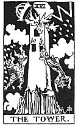

  
[Intangible Textual Heritage](../../index)  [Tarot](../index)  [Tarot
Reading](tarot0)  [Index](index)  [Previous](pktar15)  [Next](pktar17) 

------------------------------------------------------------------------

[Buy this Book at
Amazon.com](https://www.amazon.com/exec/obidos/ASIN/B002ACPMP4/internetsacredte)

------------------------------------------------------------------------

  
*The Pictorial Key to the Tarot*, by A.E. Waite, ill. by Pamela Colman
Smith \[1911\], at Intangible Textual Heritage

------------------------------------------------------------------------

### XVI

### The Tower

  [  
Click to enlarge](img/ar16.jpg)

Occult explanations attached to this card are meagre and mostly
disconcerting. It is idle to indicate that it depicts min in all its
aspects, because it bears this evidence on the surface. It is said
further that it contains the first allusion to a material building, but
I do not conceive that the Tower is more or less material than the
pillars which we have met with in three previous cases. I see nothing to
warrant Papus in supposing that it is literally the fall of Adam, but
there is more in favour of his alternative--that it signifies the
materialization of the spiritual word. The bibliographer Christian
imagines that it is the downfall of the mind, seeking to penetrate the
mystery of God. I agree rather with Grand Orient that it is the ruin of
the House of We, when evil has prevailed therein, and above all that it
is the rending of a House of Doctrine. I understand that the reference
is, however, to a House of Falsehood. It illustrates also in the most
comprehensive way the old truth that "except the Lord build the house,
they labour in vain that build it."

There is a sense in which the catastrophe is a reflection from the
previous card, but not on the side of the symbolism which I have tried
to indicate therein. It is more correctly a question of analogy; one is
concerned with the fall into the material and animal state, while the
other signifies destruction on the intellectual side. The Tower has been
spoken of as the chastisement of pride and the intellect overwhelmed in
the attempt to penetrate the Mystery of God; but in neither case do
these explanations account for the two persons who are the living
sufferers. The one is the literal word made void and the other its false
interpretation. In yet a deeper sense, it may signify also the end of a
dispensation, but there is no possibility here for the consideration of
this involved question.

------------------------------------------------------------------------

[Next: XVII. The Star](pktar17)
