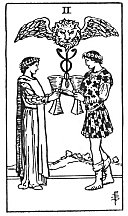

  
[Intangible Textual Heritage](../../index)  [Tarot](../index)  [Tarot
Reading](tarot0)  [Index](index)  [Previous](pktcu03)  [Next](pktcuac) 

------------------------------------------------------------------------

[Buy this Book at
Amazon.com](https://www.amazon.com/exec/obidos/ASIN/B002ACPMP4/internetsacredte)

------------------------------------------------------------------------

  
*The Pictorial Key to the Tarot*, by A.E. Waite, ill. by Pamela Colman
Smith \[1911\], at Intangible Textual Heritage

------------------------------------------------------------------------

#### CUPS

#### Two

  [  
Click to enlarge](img/cu02.jpg)

A youth and maiden are pledging one another, and above their cups rises
the Caduceus of Hermes, between the great wings of which there appears a
lion's head. It is a variant of a sign which is found in a few old
examples of this card. Some curious emblematical meanings are attached
to it, but they do not concern us in this place. *Divinatory Meanings*:
Love, passion, friendship, affinity, union, concord, sympathy, the
interrelation of the sexes, and--as a suggestion apart from all offices
of divination--that desire which is not in Nature, but by which Nature
is sanctified.

------------------------------------------------------------------------

[Next: Ace of Cups](pktcuac)
