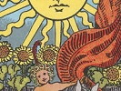

  
[Intangible Textual Heritage](../../index)  [Tarot](../index)  [Tarot
Reading](tarot0)  [Index](index)  [Previous](pktcu06)  [Next](pktcu04) 

------------------------------------------------------------------------

[Buy this Book at
Amazon.com](https://www.amazon.com/exec/obidos/ASIN/B002ACPMP4/internetsacredte)

------------------------------------------------------------------------

  
*The Pictorial Key to the Tarot*, by A.E. Waite, ill. by Pamela Colman
Smith \[1911\], at Intangible Textual Heritage

------------------------------------------------------------------------

#### CUPS

#### Five

  [  
Click to enlarge](img/cu05.jpg)

A dark, cloaked figure, looking sideways at three prone cups two others
stand upright behind him; a bridge is in the background, leading to a
small keep or holding. *Divanatory Meanings*: It is a card of loss, but
something remains over; three have been taken, but two are left; it is a
card of inheritance, patrimony, transmission, but not corresponding to
expectations; with some interpreters it is a card of marriage, but not
without bitterness or frustration. *Reversed*: News, alliances,
affinity, consanguinity, ancestry, return, false projects.

------------------------------------------------------------------------

[Next: Four of Cups](pktcu04)
