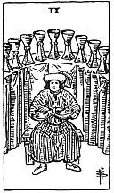

  
[Intangible Textual Heritage](../../index)  [Tarot](../index)  [Tarot
Reading](tarot0)  [Index](index)  [Previous](pktcu10)  [Next](pktcu08) 

------------------------------------------------------------------------

[Buy this Book at
Amazon.com](https://www.amazon.com/exec/obidos/ASIN/B002ACPMP4/internetsacredte)

------------------------------------------------------------------------

  
*The Pictorial Key to the Tarot*, by A.E. Waite, ill. by Pamela Colman
Smith \[1911\], at Intangible Textual Heritage

------------------------------------------------------------------------

#### CUPS

#### Nine

  [  
Click to enlarge](img/cu09.jpg)

A goodly personage has feasted to his heart's content, and abundant
refreshment of wine is on the arched counter behind him, seeming to
indicate that the future is also assured. The picture offers the
material side only, but there are other aspects. *Divinatory Meanings*:
Concord, contentment, physical *bien-être*; also victory, success,
advantage; satisfaction for the Querent or person for whom the
consultation is made. *Reversed*: Truth, loyalty, liberty; but the
readings vary and include mistakes, imperfections, etc.

------------------------------------------------------------------------

[Next: Eight of Cups](pktcu08)
