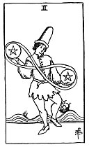

  
[Intangible Textual Heritage](../../index)  [Tarot](../index)  [Tarot
Reading](tarot0)  [Index](index)  [Previous](pktpe03)  [Next](pktpeac) 

------------------------------------------------------------------------

[Buy this Book at
Amazon.com](https://www.amazon.com/exec/obidos/ASIN/B002ACPMP4/internetsacredte)

------------------------------------------------------------------------

  
*The Pictorial Key to the Tarot*, by A.E. Waite, ill. by Pamela Colman
Smith \[1911\], at Intangible Textual Heritage

------------------------------------------------------------------------

#### PENTACLES

#### Two

  [  
Click to enlarge](img/pe02.jpg)

A young man, in the act of dancing, has a pentacle in either hand, and
they are joined by that endless cord which is like the number 8
reversed. *Divinatory Meanings*: On the one hand it is represented as a
card of gaiety, recreation and its connexions, which is the subject of
the design; but it is read also as news and messages in writing, as
obstacles, agitation, trouble, embroilment. *Reversed*: Enforced gaiety,
simulated enjoyment, literal sense, handwriting, composition, letters of
exchange.

------------------------------------------------------------------------

[Next: Ace of Pentacles](pktpeac)
