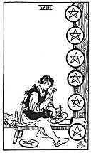

  
[Intangible Textual Heritage](../../index)  [Tarot](../index)  [Tarot
Reading](tarot0)  [Index](index)  [Previous](pktpe09)  [Next](pktpe07) 

------------------------------------------------------------------------

[Buy this Book at
Amazon.com](https://www.amazon.com/exec/obidos/ASIN/B002ACPMP4/internetsacredte)

------------------------------------------------------------------------

  
*The Pictorial Key to the Tarot*, by A.E. Waite, ill. by Pamela Colman
Smith \[1911\], at Intangible Textual Heritage

------------------------------------------------------------------------

#### PENTACLES

#### Eight

  [  
Click to enlarge](img/pe08.jpg)

An artist in stone at his work, which he exhibits in the form of
trophies. *Divinatory Meanings*: Work, employment, commission,
craftsmanship, skill in craft and business, perhaps in the preparatory
stage. *Reversed*: Voided ambition, vanity, cupidity, exaction, usury.
It may also signify the possession of skill, in the sense of the
ingenious mind turned to cunning and intrigue.

------------------------------------------------------------------------

[Next: Seven of Pentacles](pktpe07)
