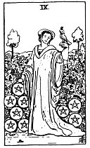

  
[Intangible Textual Heritage](../../index)  [Tarot](../index)  [Tarot
Reading](tarot0)  [Index](index)  [Previous](pktpe10)  [Next](pktpe08) 

------------------------------------------------------------------------

[Buy this Book at
Amazon.com](https://www.amazon.com/exec/obidos/ASIN/B002ACPMP4/internetsacredte)

------------------------------------------------------------------------

  
*The Pictorial Key to the Tarot*, by A.E. Waite, ill. by Pamela Colman
Smith \[1911\], at Intangible Textual Heritage

------------------------------------------------------------------------

#### PENTACLES

#### Nine

  [  
Click to enlarge](img/pe09.jpg)

A woman, with a bird upon her wrist, stands amidst a great abundance of
grapevines in the garden of a manorial house. It is a wide domain,
suggesting plenty in all things. Possibly it is her own possession and
testifies to material well-being. *Divinatory Meanings*: Prudence,
safety, success, accomplishment, certitude, discernment. *Reversed*:
Roguery, deception, voided project, bad faith.

------------------------------------------------------------------------

[Next: Eight of Pentacles](pktpe08)
