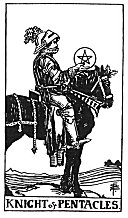

  
[Intangible Textual Heritage](../../index)  [Tarot](../index)  [Tarot
Reading](tarot0)  [Index](index)  [Previous](pktpequ)  [Next](pktpepa) 

------------------------------------------------------------------------

[Buy this Book at
Amazon.com](https://www.amazon.com/exec/obidos/ASIN/B002ACPMP4/internetsacredte)

------------------------------------------------------------------------

  
*The Pictorial Key to the Tarot*, by A.E. Waite, ill. by Pamela Colman
Smith \[1911\], at Intangible Textual Heritage

------------------------------------------------------------------------

#### PENTACLES

#### Knight

  [  
Click to enlarge](img/pekn.jpg)

He rides a slow, enduring, heavy horse, to which his own aspect
corresponds. He exhibits his symbol, but does not look therein.
*Divinatory Meanings*: Utility, serviceableness, interest,
responsibility, rectitude-all on the normal and external plane.
*Reversed*: inertia, idleness, repose of that kind, stagnation; also
placidity, discouragement, carelessness.

------------------------------------------------------------------------

[Next: Page of Pentacles](pktpepa)
