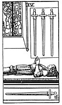

  
[Intangible Textual Heritage](../../index)  [Tarot](../index)  [Tarot
Reading](tarot0)  [Index](index)  [Previous](pktsw05)  [Next](pktsw03) 

------------------------------------------------------------------------

[Buy this Book at
Amazon.com](https://www.amazon.com/exec/obidos/ASIN/B002ACPMP4/internetsacredte)

------------------------------------------------------------------------

  
*The Pictorial Key to the Tarot*, by A.E. Waite, ill. by Pamela Colman
Smith \[1911\], at Intangible Textual Heritage

------------------------------------------------------------------------

#### SWORDS

#### Four

  [  
Click to enlarge](img/sw04.jpg)

The effigy of a knight in the attitude of prayer, at full length upon
his tomb. *Divinatory Meanings*: Vigilance, retreat, solitude, hermit's
repose, exile, tomb and coffin. It is these last that have suggested the
design. *Reversed*: Wise administration, circumspection, economy,
avarice, precaution, testament.

------------------------------------------------------------------------

[Next: Three of Swords](pktsw03)
