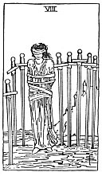

  
[Intangible Textual Heritage](../../index)  [Tarot](../index)  [Tarot
Reading](tarot0)  [Index](index)  [Previous](pktsw09)  [Next](pktsw07) 

------------------------------------------------------------------------

[Buy this Book at
Amazon.com](https://www.amazon.com/exec/obidos/ASIN/B002ACPMP4/internetsacredte)

------------------------------------------------------------------------

  
*The Pictorial Key to the Tarot*, by A.E. Waite, ill. by Pamela Colman
Smith \[1911\], at Intangible Textual Heritage

------------------------------------------------------------------------

#### SWORDS

#### Eight

  [  
Click to enlarge](img/sw08.jpg)

A woman, bound and hoodwinked, with the swords of the card about her.
Yet it is rather a card of temporary durance than of irretrievable
bondage. *Divinatory Meanings*: Bad news, violent chagrin, crisis,
censure, power in trammels, conflict, calumny; also sickness.
*Reversed*: Disquiet, difficulty, opposition, accident, treachery; what
is unforeseen; fatality.

------------------------------------------------------------------------

[Next: Seven of Swords](pktsw07)
