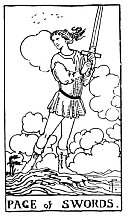

  
[Intangible Textual Heritage](../../index)  [Tarot](../index)  [Tarot
Reading](tarot0)  [Index](index)  [Previous](pktswkn)  [Next](pktsw10) 

------------------------------------------------------------------------

[Buy this Book at
Amazon.com](https://www.amazon.com/exec/obidos/ASIN/B002ACPMP4/internetsacredte)

------------------------------------------------------------------------

  
*The Pictorial Key to the Tarot*, by A.E. Waite, ill. by Pamela Colman
Smith \[1911\], at Intangible Textual Heritage

------------------------------------------------------------------------

#### SWORDS

#### Page

  [  
Click to enlarge](img/swpa.jpg)

A lithe, active figure holds a sword upright in both hands, while in the
act of swift walking. He is passing over rugged land, and about his way
the clouds are collocated wildly. He is alert and lithe, looking this
way and that, as if an expected enemy might appear at any moment.
*Divinatory Meanings*: Authority, overseeing, secret service, vigilance,
spying, examination, and the qualities thereto belonging. *Reversed*:
More evil side of these qualities; what is unforeseen, unprepared state;
sickness is also intimated.

------------------------------------------------------------------------

[Next: Ten of Swords](pktsw10)
