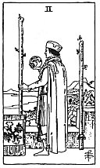

  
[Intangible Textual Heritage](../../index)  [Tarot](../index)  [Tarot
Reading](tarot0)  [Index](index)  [Previous](pktwa03)  [Next](pktwaac) 

------------------------------------------------------------------------

[Buy this Book at
Amazon.com](https://www.amazon.com/exec/obidos/ASIN/B002ACPMP4/internetsacredte)

------------------------------------------------------------------------

  
*The Pictorial Key to the Tarot*, by A.E. Waite, ill. by Pamela Colman
Smith \[1911\], at Intangible Textual Heritage

------------------------------------------------------------------------

#### WANDS

#### Two

  [  
Click to enlarge](img/wa02.jpg)

A tall man looks from a battlemented roof over sea and shore; he holds a
globe in his right hand, while a staff in his left rests on the
battlement; another is fixed in a ring. The Rose and Cross and Lily
should be noticed on the left side. *Divinatory Meanings*: Between the
alternative readings there is no marriage possible; on the one hand,
riches, fortune, magnificence; on the other, physical suffering,
disease, chagrin, sadness, mortification. The design gives one
suggestion; here is a lord overlooking his dominion and alternately
contemplating a globe; it looks like the malady, the mortification, the
sadness of Alexander amidst the grandeur of this world's wealth.
*Reversed*: Surprise, wonder, enchantment, emotion, trouble, fear.

------------------------------------------------------------------------

[Next: Ace of Wands](pktwaac)
