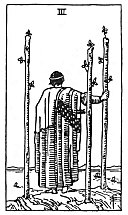

  
[Intangible Textual Heritage](../../index)  [Tarot](../index)  [Tarot
Reading](tarot0)  [Index](index)  [Previous](pktwa04)  [Next](pktwa02) 

------------------------------------------------------------------------

[Buy this Book at
Amazon.com](https://www.amazon.com/exec/obidos/ASIN/B002ACPMP4/internetsacredte)

------------------------------------------------------------------------

  
*The Pictorial Key to the Tarot*, by A.E. Waite, ill. by Pamela Colman
Smith \[1911\], at Intangible Textual Heritage

------------------------------------------------------------------------

#### WANDS

#### Three

  [  
Click to enlarge](img/wa03.jpg)

A calm, stately personage, with his back turned, looking from a cliff's
edge at ships passing over the sea. Three staves are planted in the
ground, and he leans slightly on one of them. *Divinatory Meanings*: He
symbolizes established strength, enterprise, effort, trade, commerce,
discovery; those are his ships, bearing his merchandise, which are
sailing over the sea. The card also signifies able co-operation in
business, as if the successful merchant prince were looking from his
side towards yours with a view to help you. *Reversed*: The end of
troubles, suspension or cessation of adversity, toil and disappointment.

------------------------------------------------------------------------

[Next: Two of Wands](pktwa02)
