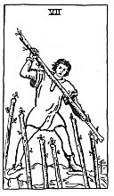

  
[Intangible Textual Heritage](../../index)  [Tarot](../index)  [Tarot
Reading](tarot0)  [Index](index)  [Previous](pktwa08)  [Next](pktwa06) 

------------------------------------------------------------------------

[Buy this Book at
Amazon.com](https://www.amazon.com/exec/obidos/ASIN/B002ACPMP4/internetsacredte)

------------------------------------------------------------------------

  
*The Pictorial Key to the Tarot*, by A.E. Waite, ill. by Pamela Colman
Smith \[1911\], at Intangible Textual Heritage

------------------------------------------------------------------------

#### WANDS

#### Seven

  [  
Click to enlarge](img/wa07.jpg)

A young man on a craggy eminence brandishing a staff; six other staves
are raised towards him from below. *Divinatory Meanings*: It is a card
of valour, for, on the surface, six are attacking one, who has, however,
the vantage position. On the intellectual plane, it signifies
discussion, wordy strife; in business--negotiations, war of trade,
barter, competition. It is further a card of success, for the combatant
is on the top and his enemies may be unable to reach him. *Reversed*:
Perplexity, embarrassments, anxiety. It is also a caution against
indecision.

------------------------------------------------------------------------

[Next: Six of Wands](pktwa06)
