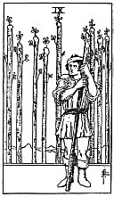

  
[Intangible Textual Heritage](../../index)  [Tarot](../index)  [Tarot
Reading](tarot0)  [Index](index)  [Previous](pktwa10)  [Next](pktwa08) 

------------------------------------------------------------------------

[Buy this Book at
Amazon.com](https://www.amazon.com/exec/obidos/ASIN/B002ACPMP4/internetsacredte)

------------------------------------------------------------------------

  
*The Pictorial Key to the Tarot*, by A.E. Waite, ill. by Pamela Colman
Smith \[1911\], at Intangible Textual Heritage

------------------------------------------------------------------------

#### WANDS

#### Nine

  [  
Click to enlarge](img/wa09.jpg)

The figure leans upon his staff and has an expectant look, as if
awaiting an enemy. Behind are eight other staves--erect, in orderly
disposition, like a palisade. *Divinatory Meanings*: The card signifies
strength in opposition. If attacked, the person will meet an onslaught
boldly; and his build shews, that he may prove a formidable antagonist.
With this main significance there are all its possible adjuncts--delay,
suspension, adjournment. *Reversed*: Obstacles, adversity, calamity.

------------------------------------------------------------------------

[Next: Eight of Wands](pktwa08)
