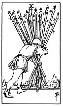

  
[Intangible Textual Heritage](../../index)  [Tarot](../index)  [Tarot
Reading](tarot0)  [Index](index)  [Previous](pktwapa)  [Next](pktwa09) 

------------------------------------------------------------------------

[Buy this Book at
Amazon.com](https://www.amazon.com/exec/obidos/ASIN/B002ACPMP4/internetsacredte)

------------------------------------------------------------------------

  
*The Pictorial Key to the Tarot*, by A.E. Waite, ill. by Pamela Colman
Smith \[1911\], at Intangible Textual Heritage

------------------------------------------------------------------------

#### WANDS

#### Ten

  [  
Click to enlarge](img/wa10.jpg)

A man oppressed by the weight of the ten staves which he is carrying.
*Divinatory Meanings*: A card of many significances, and some of the
readings cannot be harmonized. I set aside that which connects it with
honour and good faith. The chief meaning is oppression simply, but it is
also fortune, gain, any kind of success, and then it is the oppression
of these things. It is also a card of false-seeming, disguise, perfidy.
The place which the figure is approaching may suffer from the rods that
he carries. Success is stultified if the Nine of Swords follows, and if
it is a question of a lawsuit, there will be certain loss. *Reversed*:
Contrarieties, difficulties, intrigues, and their analogies.

------------------------------------------------------------------------

[Next: Nine of Wands](pktwa09)
