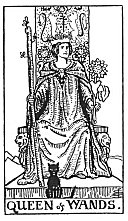

  
[Intangible Textual Heritage](../../index)  [Tarot](../index)  [Tarot
Reading](tarot0)  [Index](index)  [Previous](pktwaki)  [Next](pktwakn) 

------------------------------------------------------------------------

[Buy this Book at
Amazon.com](https://www.amazon.com/exec/obidos/ASIN/B002ACPMP4/internetsacredte)

------------------------------------------------------------------------

  
*The Pictorial Key to the Tarot*, by A.E. Waite, ill. by Pamela Colman
Smith \[1911\], at Intangible Textual Heritage

------------------------------------------------------------------------

#### WANDS

#### Queen

  [  
Click to enlarge](img/waqu.jpg)

The Wands throughout this suit are always in leaf, as it is a suit of
life and animation. Emotionally and otherwise, the Queen's personality
corresponds to that of the King, but is more magnetic. *Divinatory
Meanings*: A dark woman, countrywoman, friendly, chaste, loving,
honourable. If the card beside her signifies a man, she is well disposed
towards him; if a woman, she is interested in the Querent. Also, love of
money, or a certain success in business. *Reversed*: Good, economical,
obliging, serviceable. Signifies also--but in certain positions and in
the neighbourhood of other cards tending in such directions--opposition,
jealousy, even deceit and infidelity.

------------------------------------------------------------------------

[Next: Knight of Wands](pktwakn)
