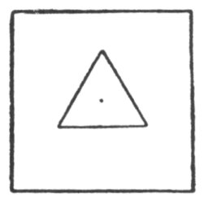

  
[Intangible Textual Heritage](../../index)  [Tarot](../index)  [Tarot
Reading](../pkt/tarot0)  [Index](index)  [Previous](sot00) 
[Next](sot02) 

------------------------------------------------------------------------

p. 3

# WHAT IS THE TAROT?

No study of occult philosophy is possible without an acquaintance with
symbolism, for if the words occultism and symbolism are correctly used,
they mean almost one and the same thing. Symbolism cannot be learned as
one learns to build bridges or speak a foreign language, and for the
interpretation of symbols a special cast of mind is necessary; in
addition to knowledge, special faculties, the power of creative thought
and a developed imagination are required. One who understands the use of
symbolism in the arts, knows, in a general way, what is meant by occult
symbolism. But even then a special training of the mind is necessary, in
order to comprehend the "language of the Initiates", and to
[express](errata.htm#0) in this language the intuitions as they arise.

There are many methods for developing the "sense of symbols" in those
who are striving to understand the hidden forces of Nature and Man, and
for teaching the fundamental principles as well as the elements of the
esoteric language. The most synthetic, and one of the most interesting
of these methods, is the Tarot

In its exterior form the Tarot is a pack of cards

p. 4

used in the south of Europe for games and fortune-telling. These cards
were first known in Europe at the end of the fourteenth century, when
they were in use among the Spanish gypsies.

A pack of Tarot contains the fifty-two ordinary playing cards with the
addition of one "picture card" to every suit, namely, the Knight, placed
between the Queen and the Knave. These fifty-six cards are divided into
four suits, two black and two red and have the following designation:
sceptres (clubs), cups (hearts), swords (spades), and pentacles or disks
(diamonds). In addition to the fifty-six cards the pack of Tarot has
twenty-two numbered cards with special names:--

|                          |                    |
|--------------------------|--------------------|
| 1 The Magician.          | 12 The Hanged Man. |
| 2 The High Priestess.    | 13 Death.          |
| 3 The Empress.           | 14 Temperance.     |
| 4 The Emperor.           | 15 The Devil.      |
| 5 The Chariot. (7).      | 16 The Tower.      |
| 6 The Lovers.            | 17 The Star.       |
| 7 The Hierophant. (5).   | 18 The Moon.       |
| 8 Strength.              | 19 The Sun.        |
| 9 The Hermit.            | 20 judgment.       |
| 10 The Wheel of Fortune. | 21 The World.      |
| 11 Justice.              | 0 The Fool.        |

 

This pack of cards, in the opinion of many investigators, represents the
Egyptian hieroglyphic book of seventy-eight tablets, which came to us
almost miraculously.

The history of the Tarot is a great puzzle. During the Middle Ages, when
it first appeared historically, there existed a tendency to build up
synthetic

p. 5

symbolical or logical systems of the same sort as Ars Magna by Raymond
Lully. But productions similar to the Tarot exist in India and China, so
that we cannot possibly think it one of those systems created during the
Middle Ages in Europe; it is also evidently connected with the Ancient
Mysteries and the Egyptian Initiations. Although its origin is in
oblivion and the aim of its author or authors quite unknown, there is no
doubt whatever that it is the most complete code of Hermetic symbolism
we possess.

Although represented as a pack of cards, the Tarot really is something
quite different. It can be "read" in a variety of ways. As one instance,
I shall give a metaphysical interpretation of the general meaning or of
the general content of the book of Tarot, that is to say, its
metaphysical title, which will plainly show that this work could not
have been invented by illiterate gypsies of the fourteenth century.

The Tarot falls into three divisions: The first part has twenty-one
numbered cards; the second part has one card 0; the third part has
fifty-six cards, i. e., the four suits of fourteen cards. Moreover, the
second part appears to be a link between the first and third parts,
since all the fifty-six cards of the third part together are equal to
the card 0.

Now, if we imagine twenty-one cards disposed in the shape of a triangle,
seven cards on each side, a point in the centre of the triangle
represented by the zero card, and a square round the triangle (the
square

p. 6

consisting of fifty-six cards, fourteen on each side), we shall have a
representation of the relation between God, Man and the Universe, or the
relation between the world of ideas, the consciousness of man and the
physical world.

 

The triangle is God (the Trinity) or the world of ideas, or the noumenal
world. The point is man's soul. The square is the visible, physical or
phenomenal world. Potentially, the point is equal to the square, which
means that all the visible world is contained in man's consciousness, is
created in man's soul. And the soul itself is a point having no
dimension in the world of the spirit, symbolized by the triangle. It is
clear that such an idea could not have originated with ignorant people
and clear also that the Tarot is something more than a pack of playing
or fortune-telling cards.

H. P. Blavatsky mentions the Tarot in her works, and we have some reason
for believing that she studied the Tarot. It is known that she loved to
"play patience". We do not know what she read in the cards as she played
this game, but the author was told that \[paragraph continues\]

p. 7

Madame Blavatsky searched persistently and for a long time for a MSS. on
the Tarot.

In order to become acquainted with the Tarot, it is necessary to
understand the basic ideas of the Kabala and of Alchemy. For it
represents, as, indeed, many commentators of the Tarot think, a summary
of the Hermetic Sciences--the Kabala, Alchemy, Astrology, Magic, with
their different divisions. All these sciences, attributed to Hermes
Trismegistus, really represent one system of a very broad and deep
psychological investigation of the nature of man in his relation to the
world of noumena (God, the world of Spirit) and to the world of
phenomena (the visible, physical world). The letters of the Hebrew
alphabet and the various allegories of the Kabala, the names of metals,
acids and salts in alchemy; of planets and constellations in astrology;
of good and evil spirits in magic--all these were only means to veil
truth from the uninitiated.

But when the true alchemist spoke of seeking for gold, he spoke of gold
in the soul of man. And he called gold that which in the New Testament
is called the Kingdom of Heaven, and in Buddhism, Nirvana. And when the
true astrologer spoke of constellations and planets he spoke of
constellations and planets in the soul of man, i.e., of the qualities of
the human soul and its relations to God and to the world. And when the
true Kabalist spoke of the Name of God,

p. 8

he sought this Name in the soul of man and in Nature, not in dead books,
nor in biblical texts, as did the Kabalist-Scholastics. The Kabala,
Alchemy, Astrology, Magic are parallel symbolical systems of psychology
and metaphysics. Any alchemical sentence may be read in a Kabalistic or
astrological way, but the meaning will always be psychological and
metaphysical.

We are surrounded by a wall built of our conceptions of the world, and
are unable to look over this wall at the real world. The Kabala presents
an effort to break this "enchanted circle". It investigates the world as
it is, the world in itself.

The world in itself, as the Kabalists hold, consists of four elements,
or the four principles forming One. These four principles are
represented by the four letters of the name of Jehovah. The basic idea
of the Kabala consists in the study of the Name of God in its
manifestation. Jehovah in Hebrew is spelt by four letters, Yod, He, Vau
and He--I. H. V. H. To these four letters is given the deepest
symbolical meaning. The first letter expresses the active principle, the
beginning or first cause, motion, energy, "I"; the second letter
expresses the passive element, inertia, quietude, "not I;" the third,
the balance of opposites, "form"; and the fourth, the result or latent
energy.

The Kabalists affirm that every phenomenon and every object consists of
these four principles, i.e., that

p. 9

every object and every phenomenon consists of the Name of God (The
Word),--Logos.

The study of this Name (or the four-lettered word, tetragrammaton, in
Greek) and the finding of it in everything constitutes the main problem
of Kabalistic philosophy.

To state it in another way the Kabalists hold that these four principles
penetrate and create everything. Therefore, when the man finds these
four principles in things and phenomena of quite different categories
(where before he had not seen similarity), he begins to see analogy
between these phenomena. And, gradually, he becomes convinced that the
whole world is built according to one and the same law, on one and the
same plan. The richness and growth of his intellect consists in the
widening of his faculty for finding analogies. Therefore the study of
the law of the four letters, or the name of Jehovah presents a powerful
means for widening consciousness.

This idea is perfectly clear, for if the Name of God be really in all
(if God be present in all), all should be analogous to each other--the
smallest particle analogous to the whole, the speck of dust analogous to
the universe, and all analogous to God. The Name of God, the Word or
Logos is the origin of the world. Logos also means Reason; the Word is
the Logos, the Reason of everything.

There is a complete correspondence between the \[paragraph continues\]

p. 10

Kabala and Alchemy and Magic. In Alchemy the four elements which
constitute the real world are called fire, water, air and earth; these
fully correspond in significance with the four kabalistic letters. In
Magic they are expressed as the four classes of spirits: elves (or
salamanders), undines, sylphs and gnomes.

The Tarot in its turn is quite analogous to the Kabala, Alchemy and
Magic, and, as it were, includes them. Corresponding to the four first
principles or four letters of the Name of God, or the four alchemistic
elements, or the four classes of spirits, the Tarot has four
suits--sceptres, cups, swords and pentacles. Thus every suit, every side
of the square, equal to the point, represents one of the elements,
controls one class of spirits . The sceptres are fire or elves (or
salamanders); the cups are water or undines; the swords are air or
sylphes; and pentacles, earth or gnomes. Moreover, in every suit the
King means the first principle or fire; the Queen--the second principle
or water; the Knight--the third principle or air, and the Page
(knave)--the fourth principle or earth.

Then again, the ace means fire; the deuce water; the three-spot, air;
the four-spot earth. Then again the four-spot is the first principle,
the five spot, the second etc.

In regard to the suits, one may add that the black suits (sceptres and
swords) express activity and

p. 11

energy, will, initiative and the subjective side of consciousness; and
the red (cups and pentacles) express passivity, inertia and the
objective side of consciousness. Then the first two suits (sceptres and
cups) signify "good" and the other two (swords and pentacles) mean
"evil". Thus every card of the fifty-six indicates (independently of its
number) the presence of the principle of activity or passivity, of
"good" or "evil", arising either in man's will or from without. And the
significance of each card is further deciphered thorough its various
combinations with the suits and numbers in their symbolical meaning. The
fifty-six cards as a whole represent, as it were, a complete picture of
all the possibilities of man's consciousness. And this makes the Tarot
adaptable for fortune-telling. Thus, including the Kabala, Astrology,
Alchemy and Magic, the Tarot makes it possible to "seek gold", "to evoke
spirits," and "to draw horoscopes", simply by means of this pack of
cards without the complicated paraphernalia and ceremonies of an
alchemist, astrologer or magician.

But the main interest of Tarot is in the twenty-two numbered cards.
These cards have numerical meaning and also a very involved symbolical
significance.

The literature relating to the Tarot has in view mainly the reading of
the symbolical designs of the twenty-two cards. Very many writers on
occultism have arranged their works on the plan of the Tarot. But this
is

p. 12

not often suspected because the Tarot is rarely mentioned. Oswald Wirth
speaks of origin of the Tarot in his Essay upon the Astronomical Tarot.

"According to Christian, [1](#fn_0) the
twenty-two major arcana of the Tarot represent the hieroglyphic
paintings which were found in the spaces between the columns of a
gallery which the neophyte was obliged to cross in the Egyptian
initiations. There were twelve columns to the north and the same number
to the south, that is, eleven symbolical pictures on each side. These
pictures were explained to the candidate for initiation in regular
order, and they contained the rules and principles for the Initiate.
This opinion is confirmed by the correspondence which exists between
arcana when they are thus arranged."

In the gallery of the Temple the pictures were arranged in pairs, one
opposite another, so that the last picture was opposite the first, the
last but one opposite the second, etc. When the cards are so placed we
find a highly interesting and deep suggestion. In this way the mind
finds the one in the two, and is led from dualism to monism, which is
what we might call the unification of the duad. One card explains the
other and each pair shows moreover that they can be only mutually
explanatory and mean nothing when taken separately.

Thus, for instance, the cards 10 and 13 ("Life" and "Death") signify
together a certain whole or complementary condition which we cannot
conceive by the ordinary, imperfect mental processes. We think of life
and death as two "opposites", antagonistic one to the

p. 13

other, but, if we thought further, we should see that each depends on
the other for existence and neither could come into existence
separately.

A symbol may serve to transfer our intuitions and to suggest new ones
only so long as its meaning is not defined. Real symbols are perpetually
in process of creation; but when they receive a definite significance
they become hieroglyphs and finally a mere alphabet. As this they
express simply ordinary concepts, cease to be a language of the Gods or
of initiates and become a language of men which everyone may learn.

Properly speaking, a symbol in occultism means the same as in art. If an
artist uses ready-made symbols his work will not be true art, but only
pseudo-art,. If an occultist begins to use ready-made symbols, his work
will not be truly occult, for it will contain no esotericism, no
mysticism, but only pseudo-occultism, pseudo-esotericism,
pseudo-mysticism. Symbolism in which the symbols have definite meanings
is pseudo-symbolism.

\_\_\_\_\_\_\_\_\_\_\_\_\_\_\_\_

Having made this idea clear in his mind, the author found that the key
to the Tarot must lie in imagination and he decided to make an effort to
re-design the cards, giving descriptive pictures of the Tarot, and to
interpret the symbols, not by means of analysis, but by synthesis. The
reader will find in the following little "pen pictures" reflections of
many authors who wrote on the Tarot as St. Martin, Eliphas Levi, Dr.
Papus etc.

p. 14

and of other authors who certainly never thought of the Tarot as, for
example, Plotinus, Gichtel (XVII century), Friedrich Nietzsche, M.
Collins etc., who came nevertheless to the same fundamental principles
as the unknown authors of the Tarot.

Descriptions of the arcanas in these "pen pictures" often represent a
conception which is almost entirely subjective, for instance, that of
card 18. And the author likes to think that another might conceive of
the same symbols differently, in any case he considers this quite
possible.

Any one interested in this philosophical puzzle might well ask, What
then is the Tarot? Is it a doctrine or merely a method? Is it a definite
system or merely an alphabet by means of which any system may be
constructed? In short, is it a book containing specific teachings, or is
it merely an apparatus, a machine which we may use to build anything,
even a new universe.

The author believes that the Tarot may be used for both purposes,
though, of course, the contents of a book that may be read either
forward or backward cannot be said to be, in the ordinary sense,
strictly definite. But perhaps we find in this very indefiniteness of
the Tarot and in the complexity of its philosophy, the element which
constitutes its definiteness. The fact that we question the Tarot as to
whether it be a method or a doctrine shows the limitation of our "three
dimensional mind," which is unable to rise above the world of form and
contra-positions or to free itself from thesis

p. 15

and antithesis! Yes, the Tarot contains and expresses any doctrine to be
found in our consciousness, and in this sense it h a s definiteness. It
represents Nature in all the richness of its infinite possibilities, and
there is in it as in Nature, not one but all potential meanings. And
these meanings are fluent and ever-changing, so the Tarot cannot be
specifically this or that, for it ever moves and yet is ever the same.

\_\_\_\_\_\_\_\_\_\_\_\_\_\_\_

In the following "pen-pictures" cards are taken in pairs:--I and 0; II
and XXI; III and XX etc.--in each pair one card completing the sense of
another and two making one.

Card I.--"The Magician".

"Man" Superman. The Initiate. The Occultist. Higher consciousness. Human
Logos. The kabalistic "Adam Kadmon". Humanity. "Homo Sapiens".

Card II.--"The High Priestess".

Occultism. Esoterism. Mysticism. Theosophy. Initiation. Isis. Mystery.

Card III.--"The Empress".

Nature in its phenomenal aspect. The ever renewing and re-creating force
of Nature. The objective reality.

Card IV.--"The Emperor".

Tetragrammaton. The law of four. Latent energy of Nature. Logos in the
full aspect with all possibilities of the new Logos. Hermetic
philosophy.

Card V.--"The Chariot".

"Man." The Imagination. Magic. Self-suggestion. Self deceit.\[paragraph
continues\]

p. 16

Artificial means of attainment. Pseudo-occultism. Pseudo-theosophy.

Card VI.--"The Lovers".

"Man". Another aspect of the "Adam Kadmon", the "Perfect Man", "The
divine androgyne". Love as the efforts of "Adam Kadmon" to find himself.
The equilibrium of contraries. The unification of the duad, as the means
of attaining the Light.

Card VII.--"The Hierophant".

Mysticism. Theosophy. Esoteric side of all religions.

Card VIII.--"Strength".

The Real Power. Strength of love. Strength of Union (Magic chain).
Strength of the Infinite. Occultism. Esoterism. Theosophy.

Card IX.--"The Hermit".

"Man". The Path to the Initiation. Seeking for truth in the right way.
Inner Knowledge. Inner Light. Inner Force. Theosophy. Occultism.

Card X.--"The Wheel of Chance".

The Wheel of Life. The life ever changing and ever remaining the same.
The Circle of Time and the four elements. The idea of the circle.

Card XI. -"Justice".

Truth. Real Knowledge. Inner Truth. Occultism. Esoterism. Theosophy.

Card XII.--"The Hanged Man".

"Man". The Pain of the higher consciousness bound by the limitations of
the body and mind. Superman in the separate man.

Card XIII.--"Death".

Another aspect of Life. Going away in order to come back at the same
time. Completion of the circle.

Card XIV.--"Temperance". (Time).

The first attainment. The "Arcanum Magnum" of the occultists. The Fourth
Dimension. Higher space. "Eternal Now".

p. 17

Card XV.--"The Devil".

"Man". Weakness. Falsehood. The Fall of man into separateness, into
hatred and into finiteness.

Card XVI.--"The Tower".

Sectarianism. Tower of Babel. Exoterism. Confusion of tongues. Fall of
exoterism. The force of Nature re-establishing the truth distorted by
men.

Card XVII.--"The Star".

The real aspect of the Astral World. That which maybe seen in extasy.
The imagination of Nature. Real Knowledge. Occultism.

Card XVIII.--"The Moon".

The Astral World as it is seen by the artificial means of magic.
"Psychic", "spiritistic" world. Dreads of the night. The real light from
above and the false representation of that light from below.
Pseudo-mysticism.

Card XIX.--"The Sun".

The Symbol and manifestation of the tetragrammaton. Creative power. Fire
of life.

Card XX.--"Judgment".

The resurrection. Constant victory of life over death. Creative activity
of nature in the death.

Card XXI.--"World".

Nature. The World as it is. Nature in its noumenal aspect. Esoteric side
of nature. That which is made known in esoterism. Inner reality of
things. Human [consciousness](errata.htm#1) in the circle of time
between the four elements.

Card 0.--"The Fool".

"Man." An ordinary man. A separate man. The uninitiate Lower
consciousness. The end of a ray not knowing its relation to the centre.

The twenty-two cards may be divided into three divisions including each
seven cards of similar meaning, the \[paragraph continues\]

p. 18

22-nd card (No 21) as a duplicate (of the No 10) standing outside the
triangle or forming a point in its centre.

The three sets of sevens belong: the first one to the Man, the second to
the Nature and the third to the higher knowledge or to the Theosophy in
the large sense of the word.

The First set of 7.

Cards: I--Magician; 0--The Fool; V--The Chariot; IX--The Hermit;
VI--Lovers; XV--The Devil; XII--The Hanged Man.

The contents of these seven cards if taken in time picture seven degrees
of the path of Man in his way to the Superman, or if taken in the
Eternal Now picture seven faces of Man or seven I-s of man co-existing
in him. This last meaning represents the inner sense of the secret
doctrine of the Tarot in its relations to Man.

The second set of 7 (Nature) includes cards: III.--The Empress; X--Life;
XIII--Death; XIV--Time; XVI--The Tower; XIX--The Sun; XX--Judgement.

The third set of 7 (Theosophy) includes cards: II--The High Priestess;
IV--The Emperor; VIII--Strength; VII--The Hierophant; XI-Justice;
XVII--The Star; XVIII--The Moon.

------------------------------------------------------------------------

### Footnotes

[12:1](sot01.htm#fr_0) "Histoire do la Magie".

------------------------------------------------------------------------

[Next: Card I. The Magician](sot02)
