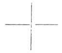

  
[Intangible Textual Heritage](../../index)  [Tarot](../index)  [Tarot
Reading](../pkt/tarot0)  [Index](index)  [Previous](tob03) 
[Next](tob05) 

------------------------------------------------------------------------

p. 15 p. 16

# PART I.

### GENERAL KEY TO THE TAROT,

### GIVING THE ABSOLUTE KEY TO OCCULT SCIENCE.

p. 17

## CHAPTER II.

יהוה

### THE SACRED WORD YOD-HE-VAU-HE.

The Kabbalah and the Sacred Word--The Yod--The He--The Vau--The second
He--Synthesis of the Sacred Word.

ACCORDING to the ancient oral tradition of the Hebrews, or
*Kabbalah*, [1](#fn_9) a sacred word exists,
which gives to the mortal who can discover the correct way of
pronouncing it, the key to all the sciences, divine and human. This
word, which the Israelites never uttered, and which the High Priest
pronounced once a year, amidst the shouts of the laity, is found at the
head of every initiative ritual, it radiates from the centre of the
flaming triangle at the

p. 18

\[paragraph continues\] 33rd degree of the Freemasonry of Scotland, it
is displayed above the gateways of our old cathedrals, is formed of four
Hebrew letters, and reads thus, *Yod-he-vau-he*, יהוה.

It is used in the *Sepher Bereschit*, or Genesis of Moses, to designate
the divinity, and its grammatical construction recalls even by its
formation [1](#fn_10) the attributes which men
have always delighted to ascribe to God. Now we shall see that the
powers attributed to this word are real up to a certain point, for with
its aid the symbolical gate of the arch, which contains the explanation
of the whole doctrine of ancient science, is easily opened. It is
therefore necessary to enter into some detail respecting it.

The word is formed of four letters, *Yod* (י), *he* (ה), *vau* (ו), *he*
(ה). This last letter *he* is repeated twice.

A number is attributed to each letter of the Hebrew alphabet. We must
look at those which relate to the letters we are now considering.

י Yod = 10

ה he = 5

ו vau = 6

 

p. 19

The total numerical value of the word יהוה is therefore

10 + 5 + 6 + 5 = 26.

Let us now study each letter separately.

THE YOD.

The *Yod*, shaped like a comma or a dot, represents the *principle* or
*origin* of all things.

The other letters of the Hebrew alphabet are all produced by different
combinations of the letter *Yod*. [1](#fn_11)
The synthetic study of nature had led the ancients to conclude that one
law only existed, and ruled all natural productions. This law, the basis
of analogy, placed the Unity-principle at the origin of all things, and
regarded them as the *reflections* at various degrees of this
Unity-principle. Thus the *Yod*, which alone forms all the other
letters, and therefore all the words and all the phrases of the
alphabet, was justly used as the image and representation of this
*Unity-principle*, of which the profane had no knowledge.

Thus the law which presided over the creation of the Hebrew language is
the same law that presided over the creation of the Universe, and to
know the one is to know the other, unreservedly. The *Sepher
Yetzirah*, [2](#fn_12) one of the most ancient
books of the Kabbalah, proves this fact.

Before proceeding any further, let us illustrate the definition which we
have just given of the Yod by an example. The first letter of the Hebrew
alphabet, the aleph (א), is composed of four yods placed opposite to
each other; the other letters are all formed on the same basis. [3](#fn_13)

p. 20

The numerical value of the yod leads to other considerations. The
Unity-principle, according to the doctrine of the Kabbalists, is also
the Unity-end of beings and of things, so that eternity, from this point
of view, is only an eternal present. The ancients used a dot in the
centre of a circle as the symbol of this idea, the representation of the
Unity-principle (*the dot*) in the centre of eternity (*the circle*, a
line without beginning or end). [1](#fn_14)

 

 

 

According to these demonstrations, the *Unity* is regarded as the
*whole*, of which all created beings are only the *constituent parts*;
just as the Unity-man is formed of an agglomeration of molecules, which
compose his being.

The Kabbalah, therefore, places at the origin of all things the absolute
assertion of the being by itself of the Ego-Unity, which is represented
by the *yod* symbolically, and by the number 10. This number 10,
representing the All-principle 1, with the Zero-nothing 0, well supplies
the requisite conditions. [2](#fn_15)

p. 21

THE HE. [1](#fn_16)

But the Ego cannot be realized except through its opposition to the
Non-Ego. The assertion of the Ego is scarcely established, when we must
instantly realize a reaction of the Ego, Absolute, upon itself, from
which the conception of its existence will be drawn, by a kind of
division of the Unity. This is the origin of *duality*, of opposition,
of the *Binary*, the image of femininity, even as the Unity is the image
of the masculine. Ten, divided by itself, in opposition to itself, then
equals 10/2 = 5, five, the exact number of the letter *He*, the second
letter of the great sacred name.

The He therefore represents the passive in relation to the Yod, which
symbolizes the active; the Non-Ego in relation to the Ego, the *woman*
relatively to the *man*; the *substance* relatively to the *essence*;
*life* in its relation to the *soul*, &c., &c.

THE VAU. [2](#fn_17)

But the opposition of the Ego and the Non-Ego immediately gives rise to
another factor; this is the *Affinity* existing between this Ego and
this Non-Ego.

Now the *Vau*, the sixth letter of the Hebrew alphabet, produced by 10
(yod) + 5 (he) = 15 = 6 (or 1 + 5), signifies link or analogy. It is the
link which, uniting

p. 22

antagonisms in the whole of nature, constitutes the third word of this
mysterious Trinity.

Ego--Non-Ego.

Affinity of the Ego with the Non-Ego.

THE 2nd HE.

Nothing can exist beyond this Trinity, considered as a law.

The Trinity is the synthetic and absolute formula to which all the
sciences converge; and this formula, forgotten with regard to its
scientific value, has been transmitted to us integrally, by all the
religious of the world, the unconscious depositaries of the SCIENCE
WISDOM of primitive civilizations. [1](#fn_18)

Thus the great sacred name is formed of three letters only. The fourth
term of the name is formed by the repetition of the second letter, the
*He*.

This repetition indicates the passage of the Trinitarian law into a new
application; that is, to speak correctly, a transition from the
metaphysical to the physical world, or generally, of any world whatever
to the world that immediately follows it. [2](#fn_19)

The knowledge of the property of the second He is the

p. 23

key to the whole divine name, in every application of which it is
susceptible. We shall presently see *the proof of this statement*.

SUMMARY UPON THE WORD YOD-HE-VAU-HE.

Now that we have separately studied each of the letters that compose the
sacred name, we will apply the law of synthesis to them, and sum up the
results obtained.

The word *Yod-he-vau-he* is formed of four letters, signifying:

<table data-cellspacing="0" data-border="0" data-cellpadding="9" width="779">
<colgroup>
<col style="width: 50%" />
<col style="width: 50%" />
</colgroup>
<tbody>
<tr class="odd">
<td width="19%" data-valign="TOP">
<em>The Yod</em>
</td>
<td width="81%" data-valign="TOP">
The active principle pre-eminent.

The Ego = 10.
</td>
</tr>
<tr class="even">
<td width="19%" data-valign="TOP"><em></em>

The He
</td>
<td width="81%" data-valign="TOP">
The passive principle pre-eminent.

The Non-Ego = 5.
</td>
</tr>
<tr class="odd">
<td width="19%" data-valign="TOP"><em></em>

The Vau
</td>
<td width="81%" data-valign="TOP">
The Median letter, the <em>link</em>, which unites the active to the passive.

The Affinity between the Ego and the Non-Ego = 6.
</td>
</tr>
</tbody>
</table>

 

These three letters express the Trinitarian law of the Absolute.

|              |                                                                            |
|--------------|----------------------------------------------------------------------------|
| *The 2nd He* | The second He marks the passage from one world to another. The Transition. |

 

This second *He* represents the complete Being, comprising in one
Absolute Unity the three letters which compose it: Ego, Non-Ego,
Affinity.

It indicates the passage from the noumenal to the phenomenal or
reciprocal; it serves as means of ascension from one scale to another.

p. 24

REPRESENTATION OF THE SACRED WORD.

The word *Yod-he-vau-he* can be represented in various ways, which are
all useful.

The circle can be drawn in this way--

<table data-cellspacing="0" data-border="0" data-cellpadding="9" width="497">
<colgroup>
<col style="width: 33%" />
<col style="width: 33%" />
<col style="width: 33%" />
</colgroup>
<tbody>
<tr class="odd">
<td width="33%" data-valign="MIDDLE">
 
</td>
<td width="33%" data-valign="MIDDLE">
yod 
י
</td>
<td width="33%" data-valign="MIDDLE">
 
</td>
</tr>
<tr class="even">
<td width="33%" data-valign="MIDDLE">
1st he 
ה
</td>
<td width="33%" data-valign="MIDDLE">
 
</td>
<td width="33%" data-valign="MIDDLE">
1st he 
ה
</td>
</tr>
<tr class="odd">
<td width="33%" data-valign="MIDDLE">
 
</td>
<td width="33%" data-valign="MIDDLE">
vau 
ו
</td>
<td width="33%" data-valign="MIDDLE">
 
</td>
</tr>
</tbody>
</table>

 

But since the second He, the sign of transition, becomes the active
entity in the following scale, *i. e.* since this *He* only represents a
*yod* in germ, [1](#fn_20) the sacred word can
be represented, with the *second he under the first yod*, thus--

<table data-cellspacing="0" data-border="0" data-cellpadding="9" width="346">
<colgroup>
<col style="width: 33%" />
<col style="width: 33%" />
<col style="width: 33%" />
</colgroup>
<tbody>
<tr class="odd">
<td width="33%" data-valign="TOP">
<em>yod</em>
</td>
<td width="33%" data-valign="TOP">
1<em>st he</em>
</td>
<td width="33%" data-valign="TOP"><em></em>

vau
</td>
</tr>
<tr class="even">
<td width="33%" data-valign="TOP">
2<em>nd he</em>
</td>
<td width="33%" data-valign="TOP">
 
</td>
<td width="33%" data-valign="TOP">
 
</td>
</tr>
</tbody>
</table>

 

Lastly, a third method of representing the word consists in enveloping
the Trinity, *Yod-he-vau*, with the tonalisating letter, or second He,
thus--

 

 

 

p. 25

Now we will leave these data, to which we must return later on, and
speak of the occult or Pythagorean conception of numbers.

------------------------------------------------------------------------

### Footnotes

[17:1](tob04.htm#fr_9) "It appears, according to
the most famous rabbis, that Moses himself, foreseeing the fate which
awaited his book, and the false interpretations which would be given to
it in the course of time, resorted to an oral law, which he delivered
verbally to reliable men, whose fidelity he had tested, and whom he
charged to transmit it to others in the secret of the sanctuary, who in
their turn, transmitting it from age to age, secured its preservation
even for the most distant posterity. This oral law, which modern Jews
still flatter themselves that they possess, is called the Kabbalah, from
a Hebrew word which signifies that which is received, that which comes
from elsewhere, that which passes from hand to hand."--FABRE D'OLIVET,
*La Langue Hébraïque Restituée*, p. 29.

[18:1](tob04.htm#fr_10) This name presents first
the sign which indicates life, repeated twice, and thus forming the
essentially living root EE (הה). This root is never used as a noun, and
is the only one which enjoys this prerogative. It is from its formation
not only a verb, but a unique verb, from which all the others are merely
derivations; in short, the verb הוה (ÉVÉ), to be, being. Here, as we can
see, and as I have carefully explained in my grammar the sign of
intelligible light ו (VÔ) is placed in the midst of the root of life.
Moses, when using this unique verb to form the proper name of the Being
of Beings, added to it the sign of potential manifestation and of
eternity, י (I); he thus obtained יהוה (IEVE), in which the facultative
Being is placed between a past tense without origin, and a future
without limit. This admirable word thus exactly signifies the Being who
is, who was, and who will be."--FABRE D'OLIVET, *La Langue Hébraïque
Restituée*.

[19:1](tob04.htm#fr_11) See the *Kabbala
Denudata*.

[19:2](tob04.htm#fr_12) Translated into English
by Dr. Wynn Westcott.

[19:3](tob04.htm#fr_13) See the *Kabbala
Denudata*.

[20:1](tob04.htm#fr_14) See Kircher, Œdipus
Ægyptiacus; See Lenain, *La Science Kabbalistique*; See J. Dée, *Monas
Hieroglyphica*.

[20:2](tob04.htm#fr_15) See Saint-Martin, Des
rapports qui existent entre Dieu, l'Homme et l'Univers. See Lacuria,
*Harmonies de l'Être exprimées par les nombres*.

[21:1](tob04.htm#fr_16) See Eliphas Levi, *Dogme
et Rituel de la Haute Magie*; *la Clef des Grands Mystères*;--Lacuria,
op. cit.

[21:2](tob04.htm#fr_17) See Fabre d'Olivet, *La
Langue Hébraïque Restituée*.

[22:1](tob04.htm#fr_18) See Louis Lucas, *Le
Roman alchimique*.

"*Præter hæc tria numera non est alia magnitudo, quod tria sunt omnia,
et ter undecunque, ut pythagorici dicunt; omne et omnia tribus
determinata sunt*."--ARISTOTLE. (Quoted by Ostrowski, page 24 of his
*Mathèse*.)

[22:2](tob04.htm#fr_19) Ostrowski has seen this
clearly. "The passage of 3 in 4 corresponds to that of the Trimurti in
Maïa, and as the latter opens the second ternary of the pregenesetic
decade, so the figure 4 opens that of the second ternary of our
genesetic decimal."-- *Mathèse*, p. 25.

[24:1](tob04.htm#fr_20) The second He, upon
which we are intentionally dwelling at some length, may be compared to
*a grain of wheat* relatively to the p. 25
ear. The ear, the Trinity, manifest or *yod-he-vau*, exerts all its
activity in the production of the grain of wheat, or second He. But this
grain of wheat is only the *transition* between the ear which gave it
birth, and the ear to which it will itself give birth in the following
generation. It is the transition between one generation and another
which it contains in germ; this is why the second *He* is a *Yod* in
germ.

------------------------------------------------------------------------

[Next: Chapter III. The Esoterism of Numbers](tob05)
