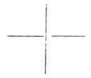

  
[Intangible Textual Heritage](../../index)  [Tarot](../index)  [Tarot
Reading](../pkt/tarot0)  [Index](index)  [Previous](tob05) 
[Next](tob07) 

------------------------------------------------------------------------

p. 32

# CHAPTER IV.

### ANALOGY BETWEEN THE SACRED WORD AND NUMBERS.

The Kabbalistic Word and the Series of Numbers--Explanation of the
*Tetractys* of Pythagoras--Figuration of the General Law.

NUMBERS AND THE KABBALISTIC WORD.

This sequence of numbers 1, 2, 3, and 4, representing the active, the
passive, the neuter, and a second active principle, corresponds in all
points with the series of the letters of the sacred name, so that the
latter may be thus written--

 

Yod--He--Vau--  
2nd He = Yod, etc.,

 

which demonstrates analogically that--

|     |            |            |
|-----|------------|------------|
| 1   | represents | Yod        |
| 2   | ---        | He         |
| 3   | ---        | Van        |
| 4   | ---        | The 2nd He |

 

We can prove the truth of these analogies by the identity of the action
of the *number* 4, which becomes a unity (4 = 10 = 1), and of the
*second He*, which represents the Yod of the following sequence.

p. 33

In comparing the two identical series we obtain the following figures--

 

Kabbalistic sequence 

<table data-cellspacing="0" data-border="0" data-cellpadding="9" width="420">
<colgroup>
<col style="width: 33%" />
<col style="width: 33%" />
<col style="width: 33%" />
</colgroup>
<tbody>
<tr class="odd">
<td width="33%" data-valign="MIDDLE">
 
</td>
<td width="33%" data-valign="MIDDLE"><em></em>

Yod 
</td>
<td width="33%" data-valign="MIDDLE">
 
</td>
</tr>
<tr class="even">
<td width="33%" data-valign="MIDDLE"><em></em>

he 
</td>
<td width="33%" data-valign="MIDDLE">
 
</td>
<td width="33%" data-valign="MIDDLE">
2<em>nd he</em> 
</td>
</tr>
<tr class="odd">
<td width="33%" data-valign="MIDDLE">
 
</td>
<td width="33%" data-valign="MIDDLE"><em></em>

vau 
</td>
<td width="33%" data-valign="MIDDLE">
 
</td>
</tr>
</tbody>
</table>

 

 

Sequence of numbers 

|     |                                                 |     |
|-----|-------------------------------------------------|-----|
|     | 1                                               |     |
| 2   |   | 3   |
|     | 4                                               |     |

 

 

Identity of the two sequences 

<table data-cellspacing="0" data-border="0" data-cellpadding="9" width="517">
<colgroup>
<col style="width: 33%" />
<col style="width: 33%" />
<col style="width: 33%" />
</colgroup>
<tbody>
<tr class="odd">
<td width="33%" data-valign="MIDDLE">
 
</td>
<td width="33%" data-valign="MIDDLE">
1 
<em>Yod</em>  
י
</td>
<td width="33%" data-valign="MIDDLE">
 
</td>
</tr>
<tr class="even">
<td width="33%" data-valign="MIDDLE">
2 <em>he</em> ה
</td>
<td width="33%" data-valign="MIDDLE">
 
</td>
<td width="33%" data-valign="MIDDLE">
ה 2nd <em>he</em> 4
</td>
</tr>
<tr class="odd">
<td width="33%" data-valign="MIDDLE">
 
</td>
<td width="33%" data-valign="MIDDLE">
ו 
<em>vau</em>  
3
</td>
<td width="33%" data-valign="MIDDLE">
 
</td>
</tr>
</tbody>
</table>

 

We can now understand why Pythagoras, initiated in Egypt into the
mysteries of the sacred word *Yod-he-vau-he*, replaced this word in his
esoteric teachings by the sequence of the 4 first numbers or tetractys.

This sequence of the numbers is, in all points, identical with the
sequence of the letters of the sacred name, and the tetractys of
Pythagoras, 1, 2, 3, 4,, equals and absolutely represents the word
*Yod-he-vau-he*.

The sequence of the numbers, or the sequence of the letters, therefore,
resolves itself definitely into the following data--

p. 34

1 Term positive and generator.

The *Yod* or the 1.

1 Term negative or generant.

The *He* or the 2.

1 Term neuter or generated proceeding from the two preceding.

The *Vau* or the 3.

1 Term of transition individualizing itself in the following sequence.

The 2*nd He* or the 4.

Provided with these preliminary data, which are absolutely
indispensable, let us now take our pack of cards, or *Tarot*, and see if
we cannot find the universal law in it--

 

<table data-cellspacing="0" data-border="0" data-cellpadding="9" width="420">
<colgroup>
<col style="width: 33%" />
<col style="width: 33%" />
<col style="width: 33%" />
</colgroup>
<tbody>
<tr class="odd">
<td width="33%" data-valign="MIDDLE">
 
</td>
<td width="33%" data-valign="MIDDLE"><em></em>

Yod 
</td>
<td width="33%" data-valign="MIDDLE">
 
</td>
</tr>
<tr class="even">
<td width="33%" data-valign="MIDDLE"><em></em>

he 
</td>
<td width="33%" data-valign="MIDDLE">
 
</td>
<td width="33%" data-valign="MIDDLE">
2<em>nd he</em> 
</td>
</tr>
<tr class="odd">
<td width="33%" data-valign="MIDDLE">
 
</td>
<td width="33%" data-valign="MIDDLE"><em></em>

vau 
</td>
<td width="33%" data-valign="MIDDLE">
 
</td>
</tr>
</tbody>
</table>

 

symbolized through antiquity by the Cross.

------------------------------------------------------------------------

[Next: Chapter V: The Key to the Minor Arcana](tob07)
