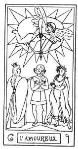
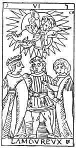
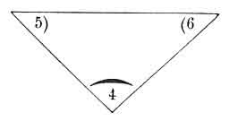

  
[Intangible Textual Heritage](../../index)  [Tarot](../index)  [Tarot
Reading](../pkt/tarot0)  [Index](index)  [Previous](tob18) 
[Next](tob20) 

------------------------------------------------------------------------

p. 127

  
THE LOVERS.

   

  
THE LOVERS.

6\. ו

The 6th Hebrew letter (Vau).

ORIGIN OF THE SYMBOLISM OF THE SIXTH CARD OF THE TAROT.

The hieroglyphic sign for the Vau is the eye, all that relates to light
and brilliancy. The eye establishes the link between the external world
and ourselves; by it light and form are revealed to us. The dominant
idea expressed by this letter will therefore be that *of a connection,
of a link between antagonists*. We have already dwelt at some length
upon the Vau, but we think it may be useful to quote Fabre d'Olivet's
observations upon this letter in *extenso*--

"This sign is the image of the deepest and most inconceivable mystery,
the image of the knot which reunites, or of the point which separates,
the nothing from

p. 128

the being. It is the universal convertible sign, which forms the passage
from one nature to the other; communicating on one side with the sign of
light and of spiritual sense וֹ (a pointed Vau), which is but a higher
form of itself; on the other hand linking itself in its degeneration
with Ayin (ע), the sign of darkness and of the material senses, which
again is but a lower form of itself."

The Vau is the second simple letter; astronomically it represents the
second sign of the zodiac, the Bull.

THE SIXTH CARD OF THE TAROT.

The Lovers.

This symbol represents reunion, antagonism, with all their consequences.

A beardless youth (our Juggler of the 1st arcanum), but without a hat,
is *standing* motionless in the angle where two roads meet. His arms
form a diagonal cross upon his breast.

The repetition of the 1st arcanum under another form. Here the man is
not one of the Initiates. He does not know how to direct the magnetic
currents of the Astral Light; he is therefore plunged in the
*antagonism* of the different ideas which he cannot master.

Two women, one on his right, the other on his left, each with one hand
upon his shoulder, point to the two roads. The woman on the right has a
circle of gold upon her head, the one on the left is dishevelled and
crowned with vine leaves.

The two arms of the Juggler, expressing the positive and negative, the
two columns of the temple of Isis, expressing necessity and liberty, are
here personified by the two women, who represent Vice and Virtue.

p. 129

The future of the young man depends upon the road which he chooses,
whether he becomes one of the Initiates, the Mage of the 1st arcanum
(the spiritual ו), or the rash thunder-stricken personage of the 16th
arcanum (the ע).

The spirit of Justice floats above this group in a radiant halo; he
bends his bow and aims the arrow of Punishment at the personification of
Vice.

A profound symbol indicating that if man chooses the path of Virtue he
will not be left unaided, but that Providence will ally itself to his
will and assist him to overcome vice.

In short, this hieroglyphic expresses the struggle between the passions
and conscience, the antagonism of ideas.

But this antagonism is also the most powerful natural producer that
exists in the world, when it resolves itself into LOVE, which attracts
the opponents and unites them for ever.

This sixth card of the Tarot must be regarded under two aspects, which
tend to the same signification.

1\. As 3 of the 4, that is to say, as representing the 4th arcanum, or
the reflection of 1 considered in its relation to union.

2\. As balancing 4 and 5; this is shown in the triangle formed by the
second ternary--

 

 

 

Each card balances the two others.

p. 130

The 4 balances the 5 and the 6.  
The 5 ---------- the 4 and the 6.  
The 6 ---------- the 4 and the 5.

Its signification proceeds from this:--

In the Divine. The Equilibrium between Will and Intelligence--

BEAUTY

(characteristic of the Holy Spirit).

In the Human. The Equilibrium between Power and Authority--

LOVE

(characteristic of Humanity).

CHARITY.

In Nature. The Equilibrium between the Universal soul and the Universal
life--

THE UNIVERSAL ATTRACTION.

Universal Love.

 

p. 131

6\. ו

The Lovers.

<table data-border="" data-cellspacing="1" data-cellpadding="9" width="798">
<colgroup>
<col style="width: 50%" />
<col style="width: 50%" />
</colgroup>
<tbody>
<tr class="odd">
<td width="50%" data-valign="TOP">
AFFINITIES
</td>
<td width="50%" data-valign="TOP">
SIGNIFICATIONS
</td>
</tr>
<tr class="even">
<td width="50%" data-valign="TOP">
Primitive Hieroglyphic: The eye, The ear

Kabbalah: TIPHERETH

Astronomy: The Bull

Month: April

Hebrew Letter: Vau (simple)
</td>
<td width="50%" data-valign="TOP">
Equilibrium of Will and Intelligence

BEAUTY

__________

Equilibrium of Power and Authority

LOVE

CHARITY
</td>
</tr>
<tr class="odd">
<td width="50%" data-valign="TOP">
OBSERVATIONS
</td>
<td width="50%" data-valign="TOP">
Equilibrium of the Universal Soul and the Universal Life

THE UNIVERSAL ATTRACTION

or UNIVERSAL LOVE
</td>
</tr>
</tbody>
</table>

 

p. 132

 

 [  
Click to enlarge](img/13200.jpg)  
1ST SEPTENARY. CONSTITUTION OF GOD.  

 

------------------------------------------------------------------------

[Next: Key to the Second Septenary](tob20)
