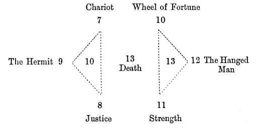
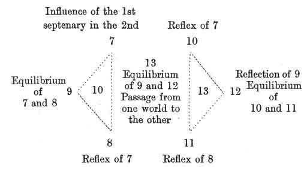

  
[Intangible Textual Heritage](../../index)  [Tarot](../index)  [Tarot
Reading](../pkt/tarot0)  [Index](index)  [Previous](tob19) 
[Next](tob21) 

------------------------------------------------------------------------

p. 133

# CHAPTER XI.

### SECOND SEPTENARY. ARCANA 7 TO 13.

### ANDROGONY.

Key to the 2nd Septenary--The Zain and the Chariot--The Heth and
Justice--The Teth and the Hermit--The Yod and the Wheel of Fortune--The
Kaph and Strength--The Lamed and the Hanged Man.

Summary of the 2nd Septenary-Constitution of Man.

KEY TO THE SECOND SEPTENARY.

ARRANGEMENT OF THE FIGURES FOR STUDY.

 

 

p. 134

 

CHARACTER OF THE FIGURES.

 

 

The 1st septenary has shown us the *World of principles*, or of the
Creation under all its aspects; we shall now study the *World of laws*,
or of Preservation.

------------------------------------------------------------------------

[Next: 7. The Chariot](tob21)
