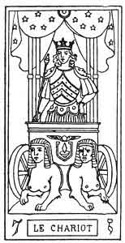
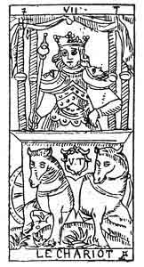

  
[Intangible Textual Heritage](../../index)  [Tarot](../index)  [Tarot
Reading](../pkt/tarot0)  [Index](index)  [Previous](tob20) 
[Next](tob22) 

------------------------------------------------------------------------

7\. ז

7th Hebrew letter (Zain).

ORIGIN OF THE SYMBOLISM OF THE SEVENTH CARD OF THE TAROT.

Hieroglyphically the Zain expresses an arrow, and therefore it suggests
the idea of a *weapon*, of the instrument which man uses *to rule and
conquer*, and to attain his object.

The Zain expresses victory in all the worlds. As a simple letter it
corresponds with the astronomic sign of the Twins in the Zodiac.

p. 135

  
THE CHARIOT.

   

  
THE CHARIOT.

SEVENTH CARD OF THE TAROT.

The Chariot.

The symbolism of this card corresponds in all points with the ideas
which it expresses.

A Conqueror, crowned with a coronet, upon which rise three shining
Pentagrams of gold, advances in a cubical chariot, surmounted by an
azure, star-decked canopy supported by four columns.

This symbol reproduces the 1st and 21st arcana in another order of
ideas. The four columns represent the four animals of the 1st arcanum,
and the four symbols of the 1st arcanum, symbols of the *quaternary* in
all its acceptations.

The Conqueror, who occupies the centre of the four elements, is the man
who has vanquished and directed the elementary forces: this victory is
confirmed by the cubical p. 136 form of the
chariot, and by the Pentagrams, which crown the Initiate.

The Conqueror has three right angles upon his cuirass, and he bears upon
his shoulders the Urim and Thummim of the sovereign sacrificant,
represented by the two crescents of the moon on the right and left; in
his hand is a sceptre surmounted by a globe, a square, and a triangle.
Upon the square, which forms the front of the chariot, we see the Indian
*lingam*, surmounted by the flying sphere of Egypt.

Two sphinxes, one white, the other black, are harnessed to the chariot.

This symbol represents the sacred septenary in all its manifestations.
The word *Yod-he-vau-he* is portrayed upon the front of the chariot by
the winged globe, to indicate that the septenary gives the key to the
whole Tarot. The two sphinxes correspond to the two principles, active
and passive. The Conqueror corresponds especially with the *Sword* and
the Vau of the sacred name.

The 7th card of the Tarot shows the influence of the creation in the
preservation of the Divine in the Human. It represents the *Yod* or the
God of the 2nd septenary.

THE GOD *of the 2nd septenary*.

Man performing the function of God the Creator.

THE FATHER.

The law of the 2nd septenary.

REALIZATION.

(Reflex of the Power.)

The Man of the 2nd septenary.

Nature performing the function of Adam.

THE ASTRAL LIGHT.

p. 137

7\. ז

The Chariot.

<table data-border="" data-cellspacing="1" data-cellpadding="9" width="798">
<colgroup>
<col style="width: 50%" />
<col style="width: 50%" />
</colgroup>
<tbody>
<tr class="odd">
<td width="50%" data-valign="TOP">
AFFINITIES
</td>
<td width="50%" data-valign="TOP">
SIGNIFICATIONS
</td>
</tr>
<tr class="even">
<td width="50%" data-valign="TOP">
Primitive Hieroglyphic: Arrow

Kabbalah: HOD

Astronomy: The Twins

Month: May

Hebrew Letter: Zain (simple)
</td>
<td width="50%" data-valign="TOP">
Man performing the function of God the Creator

THE FATHER

The Realizer

__________

Law

THE REALIZATION
</td>
</tr>
<tr class="odd">
<td width="50%" data-valign="TOP">
OBSERVATIONS
</td>
<td width="50%" data-valign="TOP">
Nature performing the function of Adam

THE ASTRAL LIGHT
</td>
</tr>
</tbody>
</table>

 

 

The passage from one world to the other is scarcely performed, when we
see the same law in action that we found in the 1st septenary. The
second terra of this series will be *the reflection* of the first, just
as the second term of the first series also reflected the first.
However, since this 2nd septenary is the central one, we shall find as
the foundation of all its constituent arcana, the idea of mediation or
equilibrium. This is shown by the eighth card.

------------------------------------------------------------------------

[Next: 8. Justice](tob22)
