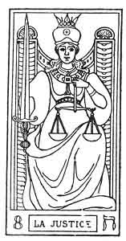
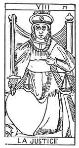

  
[Intangible Textual Heritage](../../index)  [Tarot](../index)  [Tarot
Reading](../pkt/tarot0)  [Index](index)  [Previous](tob21) 
[Next](tob23) 

------------------------------------------------------------------------

p. 138

  
JUSTICE.

   

  
JUSTICE.

8\. ח

8th Hebrew letter (Heth).

ORIGIN OF THE SYMBOLISM OF THE EIGHTH CARD OF THE TAROT.

Hieroglyphically the Heth expresses a field. From it springs the idea of
anything that requires labour, trouble, an effort.

Continued effort results in the establishment of an equilibrium, between
the destruction of the works of man accomplished by nature, when left to
herself, and the preservation of this work. Hence the idea of *balancing
power*, and consequently of Justice attributed to this letter. [1](#fn_60)

p. 139

Astronomically the Heth corresponds to the sign of Cancer in the zodiac.

THE EIGHTH CARD OF THE TAROT.

Justice.

The ideas expressed by this symbol are of *Equilibrium* in all its
forms.

A woman seen full face, and wearing an iron coronet, is seated upon a
throne. She is placed between the two columns of the temple. The solar
cross is traced upon her breast.

Here we find the continuation of the symbolism of the 2nd and 5th
arcana. The Seated woman occupies the Centre between the columns, the
first idea of the equilibrium between Good and Evil.

She holds a sword, point upwards, in her right hand, and a balance in
her left.

Occult science (2), at first theoretical, has become practical (5), and
has been taught verbally. Now it appears in all the pitilessness of
consequences, terrible for the false Magi (the Sword), but just toward
the true Initiates (Balance). The signification of this arcanum is
central between the 5th (ה He) and the 11th (כ Kaph) arcana.

This card is the complement of the eleventh, as the fifth was of the
second. In the 1st septenary all the cards which, by addition, formed
the number 7, completed each other; in the 2nd septenary all the cards
which, added together, form 19, act in the same way.

p. 140

<table data-cellspacing="0" data-border="0" data-cellpadding="9" width="664">
<colgroup>
<col style="width: 33%" />
<col style="width: 33%" />
<col style="width: 33%" />
</colgroup>
<tbody>
<tr class="odd">
<td width="33%" data-valign="TOP">
7
</td>
<td width="33%" data-valign="TOP">
 
</td>
<td width="33%" data-valign="TOP">
12
</td>
</tr>
<tr class="even">
<td width="33%" data-valign="TOP">
The Chariot
</td>
<td width="33%" data-valign="TOP">
is completed by
</td>
<td width="33%" data-valign="TOP">
The Hanged Man
</td>
</tr>
<tr class="odd">
<td width="33%" data-valign="TOP">
 
</td>
<td width="33%" data-valign="TOP">
7 + 12 = 19 
19 = 10 = 1
</td>
<td width="33%" data-valign="TOP">
 
</td>
</tr>
<tr class="even">
<td width="33%" data-valign="TOP">
8
</td>
<td width="33%" data-valign="TOP">
 
</td>
<td width="33%" data-valign="TOP">
11
</td>
</tr>
<tr class="odd">
<td width="33%" data-valign="TOP">
Justice
</td>
<td width="33%" data-valign="TOP">
is completed by
</td>
<td width="33%" data-valign="TOP">
Strength
</td>
</tr>
<tr class="even">
<td width="33%" data-valign="TOP">
 
</td>
<td width="33%" data-valign="TOP">
8+11=19
</td>
<td width="33%" data-valign="TOP">
 
</td>
</tr>
<tr class="odd">
<td width="33%" data-valign="TOP">
9
</td>
<td width="33%" data-valign="TOP">
 
</td>
<td width="33%" data-valign="TOP">
10
</td>
</tr>
<tr class="even">
<td width="33%" data-valign="TOP">
The Hermit
</td>
<td width="33%" data-valign="TOP">
is completed by
</td>
<td width="33%" data-valign="TOP">
The Wheel of Fortune
</td>
</tr>
<tr class="odd">
<td width="33%" data-valign="TOP">
 
</td>
<td width="33%" data-valign="TOP">
9+10=19
</td>
<td width="33%" data-valign="TOP">
 
</td>
</tr>
</tbody>
</table>

 

The eighth card of the Tarot represents the conception in preservative
of the second card. It synthetizes in itself the meaning of the second
and of the fifth card of the Tarot, and represents the reflex of the
seventh. It signifies--

1\. *In the Divine*. God the Son of the 2nd septenary. The woman
fulfilling, the functions of God the Son.

THE MOTHER.

Reflex of the Father. Preserver of God the Son in Humanity.

2\. Passive law of the 2nd septenary.

JUSTICE.

Reflex of Realization and Authority.

3\. *The woman of the 2nd septenary*. Nature fulfilling the function of
Eve.

ELEMENTARY EXISTENCE.

Reflex of the Astral Light. Preservation of Natura naturata in the
World.

p. 141

8\. ח

Justice.

<table data-border="" data-cellspacing="1" data-cellpadding="9" width="798">
<colgroup>
<col style="width: 50%" />
<col style="width: 50%" />
</colgroup>
<tbody>
<tr class="odd">
<td width="50%" data-valign="TOP">
AFFINITIES
</td>
<td width="50%" data-valign="TOP">
SIGNIFCATIONS
</td>
</tr>
<tr class="even">
<td width="50%" data-valign="TOP">
Primitive Hieroglyphic: A Field

Kabbalah: NIZAH

Astronomy: Cancer

Month: June

Hebrew Letter: Heth (simple)
</td>
<td width="50%" data-valign="TOP">
The woman fulfilling the functions of God the Son.

THE MOTHER

__________

Law

JUSTICE
</td>
</tr>
<tr class="odd">
<td width="50%" data-valign="TOP">
OBSERVATIONS
</td>
<td width="50%" data-valign="TOP">
Nature performing the function of Eve

ELEMENTARY EXISTENCE
</td>
</tr>
</tbody>
</table>

 

The elementary existence is the means by which the astral vivifying
fluid or astral light (7) manifests itself through the ether or astral
matter (9). This is demonstrated by the following arcanum.

------------------------------------------------------------------------

### Footnotes

[138:1](tob22.htm#fr_60) This letter, an
intermediary between ה (He) and כ (Kaph), the one designating life,
absolute existence, the other the relative life, assimilated existence,
is the sign of elementary existence: it is the image of a kind of
equilibrium, and attaches itself to ideas of effort, of labour, and of
normal and legislative action.--FABRE D'OLIVET.

------------------------------------------------------------------------

[Next: 9. The Hermit](tob23)
