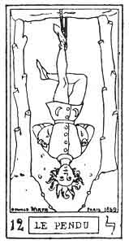
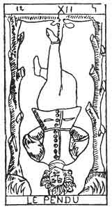
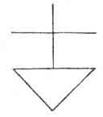

  
[Intangible Textual Heritage](../../index)  [Tarot](../index)  [Tarot
Reading](../pkt/tarot0)  [Index](index)  [Previous](tob25) 
[Next](tob27) 

------------------------------------------------------------------------

  
THE HANGED MAN.

   

  
THE HANGED MAN.

12\. ל

12th Hebrew letter (Lamed).

ORIGIN OF THE SYMBOLISM OF THE TWELFTH CARD OF THE TAROT.

Hieroglyphically the Lamed designates the arm, and therefore it is
connected with anything that stretches, that raises, that unfolds like
the arm, and has become *the sign of expansive movement*. It is applied
to all ideas of extension, of occupation, of possession. As a last sign,
it is the image of the power derived from elevation.

Divine expansion in humanity is produced by the

p. 152

prophets and revelation, and this inspires the idea of the *revealed
law*. But the revelation of the law involve punishment for him who
violates it, or elevation for him who understands it; and here we find
the ideas of punishment, of violent death, voluntary or involuntary.

The Lamed, a simple letter, astronomically corresponds with the zodiacal
sign of the Balance.

TWELFTH CARD OF THE TAROT.

The Hanged Man.

A man hanging by one foot to a gibbet, resting upon two trees, each
bearing six branches, which have been cut off.

The man's hands are tied behind his back, and the fold of his arms forms
the base of a reversed triangle, of which his head forms the point. His
eyes are open and his fair hair floats upon the wind. His right leg
crosses his left and so forms a cross.

This young man is again the Juggler whose transformations we have
already followed in the 1st, 6th, and 7th arcana.

Like the sun placed in the midst of the signs of the Zodiac (six on each
side, the lopped branches), our young hero is again suspended between
two decisions, from which will spring, no longer his physical future, as
in the 6th arcanum, but his spiritual future.

The 12th arcanum fills the centre between the 6th arcanum (Wisdom) and
the 15th (Fatality). These arcana represent the two women of the 6th
arcanum, regarded in the spiritual sense.

This Hanged Man serves for an *example* to the presumptuous,

p. 153

and his position indicates discipline, the absolute submission which the
human owes to the Divine.

Considered alchemically, the Hanged Man shows the sign of personality.

 

 

 

In the hermetic grade of the Rosy-Cross (18th degree of the Freemasonry
of Scotland) one of the signs of recognition consists in crossing the
legs like those of the Hanged Man. It is needless to say that the origin
and meaning of this sign is quite unknown to the Freemasons.

The twelfth card of the Tarot represents Equilibrist Power. It
neutralizes the oppositions of the tenth and eleventh cards.

1\. Equilibrium of Necessity and Liberty--

CHARITY.--Grace.

(Preserving power of Love.)

2\. Equilibrium of Power and Courage. Reflex of Prudence--

ACQUIRED EXPERIENCE.

(Knowledge.)

3\. Equilibrium of the potential Manifestation (10), and of reflected
Life (11). Reflex of the astral Fluid.

EQUILIBRIST FORCE.

p. 154

12\. ל

The Hanged Man.

<table data-border="" data-cellspacing="1" data-cellpadding="9" width="798">
<colgroup>
<col style="width: 50%" />
<col style="width: 50%" />
</colgroup>
<tbody>
<tr class="odd">
<td width="50%" data-valign="TOP">
AFFINITIES
</td>
<td width="50%" data-valign="TOP">
SIGNIFICATIONS
</td>
</tr>
<tr class="even">
<td width="50%" data-valign="TOP">
Primitive Hieroglyphic: The Arm outstretched

Astronomy: The Balance

Month: September

Hebrew Letter: Lamed (Simple)
</td>
<td width="50%" data-valign="TOP">
CHARITY

Grace

__________

ACQUIRED EXPERIENCE

(Knowledge)
</td>
</tr>
<tr class="odd">
<td width="50%" data-valign="TOP">
OBSERVATIONS
</td>
<td width="50%" data-valign="TOP">
EQUILIBRIST FORCE
</td>
</tr>
</tbody>
</table>

 

Modifying force is the last term of the 2nd septenary. By it the Astral
will *realize itself* to pass into the physical, from the world of
preservation and reception (2nd septenary) into the world of
transformation (3rd septenary).

------------------------------------------------------------------------

[Next: Constitution of Man](tob27)
