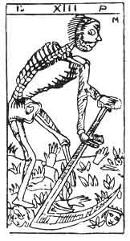

  
[Intangible Textual Heritage](../../index)  [Tarot](../index)  [Tarot
Reading](../pkt/tarot0)  [Index](index)  [Previous](tob28) 
[Next](tob30) 

------------------------------------------------------------------------

p. 158

  
DEATH.

   

  
DEATH.

13\. מ

13th Hebrew letter (Mem).

ORIGIN OF THE SYMBOLISM OF THE THIRTEENTH CARD OF THE TAROT.

The hieroglyphic meaning of the Mem is a woman, the companion of man, it
therefore gives rise to ideas of fertility and formation. It is
pre-eminently the maternal and female, the local and plastic sign, the
image of external and passive action. Employed at the end of words, this
letter becomes a collective sign ם (final Mem). In this case it develops
the being in unlimited space.

Creation necessitates equal destruction in a contrary sense, and
therefore the Mem designates all the regenerations that have sprung from
previous destruction, all

p. 159

transformations, and consequently death, regarded as the passage from
one world to the other.

The Mem is one of the three Mother letters.

THIRTEENTH CARD OF THE TAROT.

Death, or the Skeleton Mower.

The ideas expressed by this arcanum are those of destruction preceding
or following regeneration.

A skeleton mows down beads in a field, from which hands and feet spring
up on all sides, as the scythe pursues its work.

The works of the head (conception) become immortal as soon as they are
realized (heads and feet).

The 13th arcanum is explained by the 10th (Fortune) and by the 16th
(Destruction), between which it stands.

10 + 16 = 26      26/2 = 13.

13 is therefore the centre between the Yod (Principle of the creation)
and the Ayin (16), Principle of destruction.

The 13th arcanum is completed by the 18th, its complementary, as the
fifth was of the second, and the twelfth of the seventh. (See the 8th
and the 5th arcana.)

<table data-cellspacing="0" data-border="0" data-cellpadding="9" width="590">
<colgroup>
<col style="width: 33%" />
<col style="width: 33%" />
<col style="width: 33%" />
</colgroup>
<tbody>
<tr class="odd">
<td width="33%" data-valign="TOP">
13
</td>
<td width="33%" data-valign="TOP">
 
</td>
<td width="33%" data-valign="TOP">
18
</td>
</tr>
<tr class="even">
<td width="33%" data-valign="TOP">
Death
</td>
<td width="33%" data-valign="TOP">
is completed by
</td>
<td width="33%" data-valign="TOP">
The Moon
</td>
</tr>
<tr class="odd">
<td width="33%" data-valign="TOP">
 
</td>
<td width="33%" data-valign="TOP">
13 + 18 = 31 
31= 4=10=1
</td>
<td width="33%" data-valign="TOP">
 
</td>
</tr>
<tr class="even">
<td width="33%" data-valign="TOP">
14
</td>
<td width="33%" data-valign="TOP">
 
</td>
<td width="33%" data-valign="TOP">
17
</td>
</tr>
<tr class="odd">
<td width="33%" data-valign="TOP">
Temperance
</td>
<td width="33%" data-valign="TOP">
is completed by
</td>
<td width="33%" data-valign="TOP">
The Stars
</td>
</tr>
<tr class="even">
<td width="33%" data-valign="TOP">
 
</td>
<td width="33%" data-valign="TOP">
14+17 = 31
</td>
<td width="33%" data-valign="TOP">
 
</td>
</tr>
<tr class="odd">
<td width="33%" data-valign="TOP">
15
</td>
<td width="33%" data-valign="TOP">
 
</td>
<td width="33%" data-valign="TOP">
16
</td>
</tr>
<tr class="even">
<td width="33%" data-valign="TOP">
The Devil
</td>
<td width="33%" data-valign="TOP">
is completed by
</td>
<td width="33%" data-valign="TOP">
Destruction
</td>
</tr>
<tr class="odd">
<td width="33%" data-valign="TOP">
 
</td>
<td width="33%" data-valign="TOP">
15 + 16 = 31
</td>
<td width="33%" data-valign="TOP">
 
</td>
</tr>
</tbody>
</table>

 

p. 160

The thirteenth card of the Tarot is placed between the invisible and the
visible worlds. It is the universal link in nature, the means by which
all the influences react from one world to the other. It Signifies--

1\. God the transformer--

THE UNIVERSAL TRANSFORMING PRINCIPLE.

Destructive and creative.

2\. The negative of realization--

DEATH.

3\. The Astral light accomplishing the function of the Creator--

THE UNIVERSAL PLASTIC FORCE.

(Balancing death and the transforming force.)

13\. מ

Death.

<table data-border="" data-cellspacing="1" data-cellpadding="9" width="798">
<colgroup>
<col style="width: 50%" />
<col style="width: 50%" />
</colgroup>
<tbody>
<tr class="odd">
<td width="50%" data-valign="TOP">
AFFINITIES
</td>
<td width="50%" data-valign="TOP">
SIGNIFICATIONS
</td>
</tr>
<tr class="even">
<td width="50%" data-valign="TOP">
Primitive Hieroglyph: The Woman

Hebrew Letter: Mem (one of the 3 mothers)
</td>
<td width="50%" data-valign="TOP">
THE UNIVERSAL TRANSFORMING PRINCIPLE

Destroyer and Creator

__________

DEATH
</td>
</tr>
<tr class="odd">
<td width="50%" data-valign="TOP">
OBSERVATIONS
</td>
<td width="50%" data-valign="TOP">
THE UNIVERSAL PLASTIC FORCE
</td>
</tr>
</tbody>
</table>

 

------------------------------------------------------------------------

[Next: 14. Temperance](tob30)
