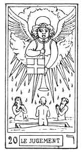
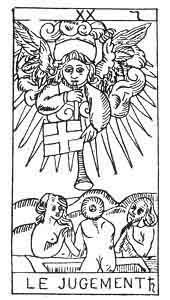

  
[Intangible Textual Heritage](../../index)  [Tarot](../index)  [Tarot
Reading](../pkt/tarot0)  [Index](index)  [Previous](tob37) 
[Next](tob39) 

------------------------------------------------------------------------

p. 182

  
THE JUDGEMENT.

   

  
THE JUDGEMENT.

20\. ר

20th Hebrew letter (Resh).

ORIGIN OF THE SYMBOLISM OF THE TWENTIETH CARD OF THE TAROT.

The hieroglyphic meaning of the Resh is the *head of man*, and it is
therefore associated with the idea of all that possesses in itself an
original, determined movement. It is the sign of motion itself, good or
bad, and expresses the renewal of things with regard to their innate
power of Motion.

The Resh is a double letter, and responds astronomically to Saturn.

p. 183

TWENTIETH CARD OF THE TAROT.

The Judgment.

An angel with fiery wings, surrounded by a radiant halo, sounds the
trumpet of the last judgment. The instrument is decorated with a cross.

A tomb opens in the earth, and a man, woman, and child issue from it;
their hands are joined in sign of adoration.

How can the reawakening of nature under the influence of the Word be
better expressed? We must admire the way in which the symbol answers to
the corresponding Hebrew hieroglyphic.

1\. Return to the divine World. The Spirit finally regains possession of
itself--

ORIGINAL DETERMINED MOTION.

2\. Life renews itself by its own motion--

VEGETABLE LIFE.

RESPIRATION.

3\. The material world progresses one degree in its ascension towards
God--

THE VEGETABLE WORLD.

p. 184

20\. ר

The Judgment.

<table data-border="" data-cellspacing="1" data-cellpadding="9" width="798">
<colgroup>
<col style="width: 50%" />
<col style="width: 50%" />
</colgroup>
<tbody>
<tr class="odd">
<td width="50%" data-valign="TOP">
AFFINITIES
</td>
<td width="50%" data-valign="TOP">
SIGNIFICATIONS
</td>
</tr>
<tr class="even">
<td width="50%" data-valign="TOP">
Hieroglyphic Primitive: The Head of Man

Astronomy: Saturn

Day: Saturday

Hebrew letter: Resh (double)
</td>
<td width="50%" data-valign="TOP">
ORIGINAL AND DETERMINED MOTION

__________

RESPIRATION

Vegetable Life
</td>
</tr>
<tr class="odd">
<td width="50%" data-valign="TOP">
OBSERVATIONS
</td>
<td width="50%" data-valign="TOP">
THE VEGETABLE KINGDOM
</td>
</tr>
</tbody>
</table>

 

------------------------------------------------------------------------

[Next: 21. The Fool](tob39)
