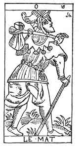

  
[Intangible Textual Heritage](../../index)  [Tarot](../index)  [Tarot
Reading](../pkt/tarot0)  [Index](index)  [Previous](tob38) 
[Next](tob40) 

------------------------------------------------------------------------

p. 185

  
THE FOOL.

   

  
THE MATE.

21\. סה

21st Hebrew letter (Shin).

ORIGIN OF THE SYMBOLISM OF THE UNNUMBERED CARD OF THE TAROT.

The Shin [1](#fn_63) expresses the same
hieroglyphic meaning as the Zain (7th arcanum) and the Samech (15th):
this is an arrow, an object directed to an aim. But the movement which
was direct in the Zain (ז) and which became circular in the Samech (ס),
here takes the form of a vibration from one pole to the other, with an
unstable point of equilibrium in the centre. The Shin is therefore the
sign of *relative duration* and of the movement relating to it, whilst
the

p. 186

\[paragraph continues\] Samech expresses cyclic movement, and therefore
absolute duration.

Shin is one of the three mother letters.

TWENTY-FIRST (UNNUMBERED) CARD OF THE TAROT.

The Foolish Man.

A careless-looking man, wearing a fool's cap, with torn clothes and a
bundle upon his shoulder, goes quietly on his way, paying no attention
to a dog which bites his leg. He does not look where he is going, so
walks towards a precipice, where a crocodile is waiting to devour him.

This is an image of the state to which unresisted passion will reduce a
man. It is the symbol of the Flesh and of its gratification. From a
moral point of view the following verses of Eliphas Levi well explain
this symbol--

"Souffrir c'est travailler, c'est accomplir sa tâche,  
Malheur au paresseux qui dort sur le chemin;  
La douleur, comme un chien, mord les talons du lâche,  
Qui, d'un seul jour perdu, surcharge un lendemain." [1](#fn_64)

1\. More rapid return to the Divine World. Personality asserts itself--

THE MOTION OF RELATIVE DURATION.

2\. The intellect roughly appears under the influence of evolution--

INNERVATION. INSTINCT.

 

p. 187

3\. The matter of the world attains the maximum of its material
progression--

THE ANIMAL KINGDOM.

21\. סה

The Foolish Man.

<table data-border="" data-cellspacing="1" data-cellpadding="9" width="798">
<colgroup>
<col style="width: 50%" />
<col style="width: 50%" />
</colgroup>
<tbody>
<tr class="odd">
<td width="50%" data-valign="TOP">
AFFINITIES
</td>
<td width="50%" data-valign="TOP">
SIGNIFICATIONS
</td>
</tr>
<tr class="even">
<td width="50%" data-valign="TOP">
Hieroglyphic Primitive: The Arrow

Hebrew letter: The Shin (one of the 3 mothers)
</td>
<td width="50%" data-valign="TOP">
THE MOTION of Relative Duration

__________

INNERVATION

Instinct
</td>
</tr>
<tr class="odd">
<td width="50%" data-valign="TOP">
OBSERVATIONS
</td>
<td width="50%" data-valign="TOP">
THE ANIMAL KINGDOM
</td>
</tr>
</tbody>
</table>

 

------------------------------------------------------------------------

### Footnotes

[185:1](tob39.htm#fr_63) This letter is derived
from its vocal י (Yod), become a consonant; and it adds to its original
meaning the respective significations of the letters ז (Zain) and ס
(Samech).--FABRE D'OLIVET.

[186:1](tob39.htm#fr_64)

"Sorrow lessens in work, in fulfilling a task,  
Woe to the sluggard who sleeps on his way;  
Like a dog at his heels pain clings to him fast,  
If he leave for to-morrow the work of to-day."

------------------------------------------------------------------------

[Next: 22. The World](tob40)
