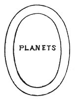
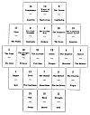
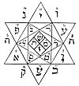
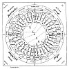

  
[Intangible Textual Heritage](../../index)  [Tarot](../index)  [Tarot
Reading](../pkt/tarot0)  [Index](index)  [Previous](tob43) 
[Next](tob45) 

------------------------------------------------------------------------

# CHAPTER XVI.

### THE ASTRONOMICAL TAROT.

Egyptian Astronomy--The Four Seasons--The Twelve Months----The
Thirty--six Decani--The Planets--Absolute Analogy with the Tarot--Figure
containing, the Application of the Tarot to Astronomy--Key to the
Astrological Works of Christian----Oswald Wirth's Astronomical Tarot.

THE ASTRONOMICAL TAROT.

IN order to demonstrate the accuracy of the principles upon which the
construction of the Tarot is based, we will take the constitution of the
Universe itself, as shown by Astronomy, for our example of the first
application of its system.

It is known that the Egyptians divided the year into four seasons, each
composed of three months. Each month contained three decani or periods
of ten days, which gave three hundred and sixty days in each year. They
added to complete it a period of five days, or *Epagomenes*, placed
after the 30th degree of the Lion (August).

We must therefore find in our Tarot--

1\. The four seasons;

2\. The twelve months, or, better still, the twelve signs of the zodiac;

p. 234

3\. The thirty-six decani.

Moreover each month, or, still better, each zodiacal sign, and each of
the decani is ruled by a planet.

1\. *The Four Seasons*.

The four figures of the Tarot correspond absolutely with the four
seasons of the year.

If we then look at the twenty-first card of the Tarot, the origin, as we
have seen, of all its applications, we shall see that the four figures
in the corners represent the four colours of the Tarot, and in this case
the four seasons of the year.

The elliptic space between these four figures and the centre correspond
to the *zodiac* and its divisions.

Finally, the central portion corresponds to the planets, which influence
the whole system.

 

 

 

2\. *The* 12 *Signs of the Zodiac*.

Each colour represents one season. Each season is composed of three
months. How, then, will the months be represented in our colour?

p. 235

The months will be represented by the figures, and the correspondence is
established in this way--

<table data-cellspacing="0" data-border="0" data-cellpadding="9" width="779">
<colgroup>
<col style="width: 50%" />
<col style="width: 50%" />
</colgroup>
<tbody>
<tr class="odd">
<td width="19%" data-valign="TOP">
KING.
</td>
<td width="81%" data-valign="TOP">
1st Month or Active Month in the Season. 
   <em>Creative Month. Yod</em>.
</td>
</tr>
<tr class="even">
<td width="19%" data-valign="TOP">
QUEEN.
</td>
<td width="81%" data-valign="TOP">
2nd Month or Passive Month in each Season. 
   <em>Equilibrist Month. He</em>.
</td>
</tr>
<tr class="odd">
<td width="19%" data-valign="TOP">
KNIGHT.
</td>
<td width="81%" data-valign="TOP">
3rd Month or Realizing Month, 
   <em>Equilibrist</em> of the Season. <em>Vau</em>.
</td>
</tr>
<tr class="even">
<td width="19%" data-valign="TOP">
KNAVE.
</td>
<td width="81%" data-valign="TOP">
Transition from the preceding Season to the one following. 
   <em>Epagomene</em>. <a href="#fn_79">1</a>
</td>
</tr>
</tbody>
</table>

 

(Consult, for further details, the first part of our study upon the
Tarot.)

We therefore find twelve figures, which respond to the twelve signs of
the Zodiac, as follows--

|                                          |                   |              |        |
|------------------------------------------|-------------------|--------------|--------|
|                                          | King of Sceptres  | The Ram      |        |
| SCEPTRES                                 | Queen             | The Bull     | SPRING |
|                                          | Knight            | The Twins    |        |
|  *Knave      Transition      Epagomene * |                   |              |        |
|                                          | King of Cups      | Cancer       |        |
| CUPS                                     | Queen             | The Lion     | SUMMER |
|                                          | Knight            | The Virgin   |        |
|  *Knave      Transition      Epagomene * |                   |              |        |
|                                          | King of Swords    | The Balance  |        |
| SWORDS                                   | Queen             | The Scorpion | AUTUMN |
|                                          | Knight            | Sagittarius  |        |
|  *Knave      Transition      Epagomene * |                   |              |        |
|                                          | King of Pentacles | Capricornus  |        |
| PENTACLES                                | Queen             | Aquarius     | WINTER |
|                                          | Knight            | The Fishes   |        |
|  *Knave      Transition      Epagomene * |                   |              |        |

 

p. 236

3\. *The* 36 *Decani*.

Each season is divided into three months, but each month is divided into
three decani, or periods of ten days each.

We need only recall the analogy existing between the *figures* and the
*numbers* in the minor arcana, to ascertain which cards of the Tarot
represent these new divisions.

If we take one of the figures--the King, for instance--we know that this
king governs certain cards: the Ace, two, three, and the first ternary.

We then obtain the following analogies--

KING OF SCEPTRES: zodiacal sign, the Ram.

|        |                                                                                                                      |
|--------|----------------------------------------------------------------------------------------------------------------------|
| ACE.   | 1st Decan or *Active Decan* of the Month. *Creative Decan*. *Yod*.                                                   |
| TWO.   | 2nd Decan or *Passive Decan* of the Month. *Forming or Preserving Decan*. *He*.                                      |
| THREE. | 3rd Decan or *Equilibrist Decan*. *Vau*.                                                                             |
| FOUR.  | Transition between the third Decan of the actual series, to the first Decan of the following series, which it forms. |

 

The thirty-six decani are therefore represented in the Tarot in the
following series--

<table style="width:100%;" data-cellspacing="0" data-border="0" data-cellpadding="9" width="736">
<colgroup>
<col style="width: 16%" />
<col style="width: 16%" />
<col style="width: 16%" />
<col style="width: 16%" />
<col style="width: 16%" />
<col style="width: 16%" />
</colgroup>
<tbody>
<tr class="odd">
<td width="17%" data-valign="TOP">
 
</td>
<td width="17%" data-valign="TOP">
Ace
</td>
<td width="17%" data-valign="TOP">
of Sceptres
</td>
<td width="17%" data-valign="TOP">
1st
</td>
<td width="17%" data-valign="TOP">
Decan
</td>
<td width="17%" data-valign="TOP">
 
</td>
</tr>
<tr class="even">
<td width="17%" data-valign="TOP">
King
</td>
<td width="17%" data-valign="TOP">
2
</td>
<td width="17%" data-valign="TOP">
---
</td>
<td width="17%" data-valign="TOP">
2nd
</td>
<td width="17%" data-valign="TOP">
---
</td>
<td width="17%" data-valign="TOP">
of the Ram
</td>
</tr>
<tr class="odd">
<td width="17%" data-valign="TOP">
 
</td>
<td width="17%" data-valign="TOP">
3
</td>
<td width="17%" data-valign="TOP">
---
</td>
<td width="17%" data-valign="TOP">
3rd
</td>
<td width="17%" data-valign="TOP">
---
</td>
<td width="17%" data-valign="TOP">
 
</td>
</tr>
<tr class="even">
<td width="17%" data-valign="TOP">
 
</td>
<td width="17%" data-valign="TOP">
4
</td>
<td width="17%" data-valign="TOP">
---
</td>
<td width="17%" data-valign="TOP">
1st
</td>
<td width="17%" data-valign="TOP">
Decan
</td>
<td width="17%" data-valign="TOP">
 
</td>
</tr>
<tr class="odd">
<td width="17%" data-valign="TOP">
Queen
</td>
<td width="17%" data-valign="TOP">
5
</td>
<td width="17%" data-valign="TOP">
---
</td>
<td width="17%" data-valign="TOP">
2nd
</td>
<td width="17%" data-valign="TOP">
---
</td>
<td width="17%" data-valign="TOP">
of the Bull
</td>
</tr>
<tr class="even">
<td width="17%" data-valign="TOP">
 
</td>
<td width="17%" data-valign="TOP">
6
</td>
<td width="17%" data-valign="TOP">
---
</td>
<td width="17%" data-valign="TOP">
3rd
</td>
<td width="17%" data-valign="TOP">
---
</td>
<td width="17%" data-valign="TOP">
 
</td>
</tr>
<tr class="odd">
<td width="17%" data-valign="TOP">
 
</td>
<td width="17%" data-valign="TOP">
7
</td>
<td width="17%" data-valign="TOP">
---
</td>
<td width="17%" data-valign="TOP">
1st
</td>
<td width="17%" data-valign="TOP">
Decan
</td>
<td width="17%" data-valign="TOP">
 
</td>
</tr>
<tr class="even">
<td width="17%" data-valign="TOP">
Knight
</td>
<td width="17%" data-valign="TOP">
8
</td>
<td width="17%" data-valign="TOP">
---
</td>
<td width="17%" data-valign="TOP">
2nd
</td>
<td width="17%" data-valign="TOP">
---
</td>
<td width="17%" data-valign="TOP">
of the Twins
</td>
</tr>
<tr class="odd">
<td width="17%" data-valign="TOP">
 
</td>
<td width="17%" data-valign="TOP">
9
</td>
<td width="17%" data-valign="TOP">
---
</td>
<td width="17%" data-valign="TOP">
3rd
</td>
<td width="17%" data-valign="TOP">
---
</td>
<td width="17%" data-valign="TOP">
 
</td>
</tr>
<tr class="even">
<td width="17%" data-valign="TOP"><em></em>

Knave 
</td>
<td width="17%" data-valign="TOP">
10
</td>
<td width="17%" data-valign="TOP"><em></em>

Transition 
</td>
<td width="17%" data-valign="TOP"><em></em>

Epagomene 
</td>
<td width="17%" data-valign="TOP">
 
</td>
<td width="17%" data-valign="TOP">
p. 237
</td>
</tr>
<tr class="odd">
<td width="17%" data-valign="TOP">
 
</td>
<td width="17%" data-valign="TOP">
Ace
</td>
<td width="17%" data-valign="TOP">
of Cups
</td>
<td width="17%" data-valign="TOP">
1st
</td>
<td width="17%" data-valign="TOP">
Decan
</td>
<td width="17%" data-valign="TOP">
 
</td>
</tr>
<tr class="even">
<td width="17%" data-valign="TOP">
King
</td>
<td width="17%" data-valign="TOP">
2
</td>
<td width="17%" data-valign="TOP">
---
</td>
<td width="17%" data-valign="TOP">
2nd
</td>
<td width="17%" data-valign="TOP">
---
</td>
<td width="17%" data-valign="TOP">
of Cancer
</td>
</tr>
<tr class="odd">
<td width="17%" data-valign="TOP">
 
</td>
<td width="17%" data-valign="TOP">
3
</td>
<td width="17%" data-valign="TOP">
---
</td>
<td width="17%" data-valign="TOP">
3rd
</td>
<td width="17%" data-valign="TOP">
---
</td>
<td width="17%" data-valign="TOP">
 
</td>
</tr>
<tr class="even">
<td width="17%" data-valign="TOP">
 
</td>
<td width="17%" data-valign="TOP">
4
</td>
<td width="17%" data-valign="TOP">
---
</td>
<td width="17%" data-valign="TOP">
1st
</td>
<td width="17%" data-valign="TOP">
Decan
</td>
<td width="17%" data-valign="TOP">
 
</td>
</tr>
<tr class="odd">
<td width="17%" data-valign="TOP">
Queen
</td>
<td width="17%" data-valign="TOP">
5
</td>
<td width="17%" data-valign="TOP">
---
</td>
<td width="17%" data-valign="TOP">
2nd
</td>
<td width="17%" data-valign="TOP">
---
</td>
<td width="17%" data-valign="TOP">
of the Lion
</td>
</tr>
<tr class="even">
<td width="17%" data-valign="TOP">
 
</td>
<td width="17%" data-valign="TOP">
6
</td>
<td width="17%" data-valign="TOP">
---
</td>
<td width="17%" data-valign="TOP">
3rd
</td>
<td width="17%" data-valign="TOP">
---
</td>
<td width="17%" data-valign="TOP">
 
</td>
</tr>
<tr class="odd">
<td width="17%" data-valign="TOP">
 
</td>
<td width="17%" data-valign="TOP">
7
</td>
<td width="17%" data-valign="TOP">
---
</td>
<td width="17%" data-valign="TOP">
1st
</td>
<td width="17%" data-valign="TOP">
Decan
</td>
<td width="17%" data-valign="TOP">
 
</td>
</tr>
<tr class="even">
<td width="17%" data-valign="TOP">
Knight
</td>
<td width="17%" data-valign="TOP">
8
</td>
<td width="17%" data-valign="TOP">
---
</td>
<td width="17%" data-valign="TOP">
2nd
</td>
<td width="17%" data-valign="TOP">
---
</td>
<td width="17%" data-valign="TOP">
of the Virgin
</td>
</tr>
<tr class="odd">
<td width="17%" data-valign="TOP">
 
</td>
<td width="17%" data-valign="TOP">
9
</td>
<td width="17%" data-valign="TOP">
---
</td>
<td width="17%" data-valign="TOP">
3rd
</td>
<td width="17%" data-valign="TOP">
---
</td>
<td width="17%" data-valign="TOP">
 
</td>
</tr>
<tr class="even">
<td width="17%" data-valign="TOP"><em></em>

Knave 
</td>
<td width="17%" data-valign="TOP">
10
</td>
<td width="17%" data-valign="TOP"><em></em>

Transition 
</td>
<td width="17%" data-valign="TOP"><em></em>

Epagomene 
</td>
<td width="17%" data-valign="TOP">
 
</td>
<td width="17%" data-valign="TOP">
 
</td>
</tr>
<tr class="odd">
<td width="17%" data-valign="TOP">
 
</td>
<td width="17%" data-valign="TOP">
Ace
</td>
<td width="17%" data-valign="TOP">
of Swords
</td>
<td width="17%" data-valign="TOP">
1st
</td>
<td width="17%" data-valign="TOP">
Decan
</td>
<td width="17%" data-valign="TOP">
 
</td>
</tr>
<tr class="even">
<td width="17%" data-valign="TOP">
King
</td>
<td width="17%" data-valign="TOP">
2
</td>
<td width="17%" data-valign="TOP">
---
</td>
<td width="17%" data-valign="TOP">
2nd
</td>
<td width="17%" data-valign="TOP">
---
</td>
<td width="17%" data-valign="TOP">
of the Balance
</td>
</tr>
<tr class="odd">
<td width="17%" data-valign="TOP">
 
</td>
<td width="17%" data-valign="TOP">
3
</td>
<td width="17%" data-valign="TOP">
---
</td>
<td width="17%" data-valign="TOP">
3rd
</td>
<td width="17%" data-valign="TOP">
---
</td>
<td width="17%" data-valign="TOP">
 
</td>
</tr>
<tr class="even">
<td width="17%" data-valign="TOP">
 
</td>
<td width="17%" data-valign="TOP">
4
</td>
<td width="17%" data-valign="TOP">
---
</td>
<td width="17%" data-valign="TOP">
1st
</td>
<td width="17%" data-valign="TOP">
Decan
</td>
<td width="17%" data-valign="TOP">
 
</td>
</tr>
<tr class="odd">
<td width="17%" data-valign="TOP">
Queen
</td>
<td width="17%" data-valign="TOP">
5
</td>
<td width="17%" data-valign="TOP">
---
</td>
<td width="17%" data-valign="TOP">
2nd
</td>
<td width="17%" data-valign="TOP">
---
</td>
<td width="17%" data-valign="TOP">
of the Scorpion
</td>
</tr>
<tr class="even">
<td width="17%" data-valign="TOP">
 
</td>
<td width="17%" data-valign="TOP">
6
</td>
<td width="17%" data-valign="TOP">
---
</td>
<td width="17%" data-valign="TOP">
3rd
</td>
<td width="17%" data-valign="TOP">
---
</td>
<td width="17%" data-valign="TOP">
 
</td>
</tr>
<tr class="odd">
<td width="17%" data-valign="TOP">
 
</td>
<td width="17%" data-valign="TOP">
7
</td>
<td width="17%" data-valign="TOP">
---
</td>
<td width="17%" data-valign="TOP">
1st
</td>
<td width="17%" data-valign="TOP">
Decan
</td>
<td width="17%" data-valign="TOP">
 
</td>
</tr>
<tr class="even">
<td width="17%" data-valign="TOP">
Knight
</td>
<td width="17%" data-valign="TOP">
8
</td>
<td width="17%" data-valign="TOP">
---
</td>
<td width="17%" data-valign="TOP">
2nd
</td>
<td width="17%" data-valign="TOP">
---
</td>
<td width="17%" data-valign="TOP">
of Sagittarius
</td>
</tr>
<tr class="odd">
<td width="17%" data-valign="TOP">
 
</td>
<td width="17%" data-valign="TOP">
9
</td>
<td width="17%" data-valign="TOP">
---
</td>
<td width="17%" data-valign="TOP">
3rd
</td>
<td width="17%" data-valign="TOP">
---
</td>
<td width="17%" data-valign="TOP">
 
</td>
</tr>
<tr class="even">
<td width="17%" data-valign="TOP"><em></em>

Knave 
</td>
<td width="17%" data-valign="TOP">
10
</td>
<td width="17%" data-valign="TOP"><em></em>

Transition 
</td>
<td width="17%" data-valign="TOP"><em></em>

Epagomene 
</td>
<td width="17%" data-valign="TOP">
 
</td>
<td width="17%" data-valign="TOP">
 
</td>
</tr>
<tr class="odd">
<td width="17%" data-valign="TOP">
 
</td>
<td width="17%" data-valign="TOP">
Ace
</td>
<td width="17%" data-valign="TOP">
of Pentacles
</td>
<td width="17%" data-valign="TOP">
1st
</td>
<td width="17%" data-valign="TOP">
Decan
</td>
<td width="17%" data-valign="TOP">
 
</td>
</tr>
<tr class="even">
<td width="17%" data-valign="TOP">
King
</td>
<td width="17%" data-valign="TOP">
2
</td>
<td width="17%" data-valign="TOP">
---
</td>
<td width="17%" data-valign="TOP">
2nd
</td>
<td width="17%" data-valign="TOP">
---
</td>
<td width="17%" data-valign="TOP">
of Capricornus
</td>
</tr>
<tr class="odd">
<td width="17%" data-valign="TOP">
 
</td>
<td width="17%" data-valign="TOP">
3
</td>
<td width="17%" data-valign="TOP">
---
</td>
<td width="17%" data-valign="TOP">
3rd
</td>
<td width="17%" data-valign="TOP">
---
</td>
<td width="17%" data-valign="TOP">
 
</td>
</tr>
<tr class="even">
<td width="17%" data-valign="TOP">
 
</td>
<td width="17%" data-valign="TOP">
4
</td>
<td width="17%" data-valign="TOP">
---
</td>
<td width="17%" data-valign="TOP">
1st
</td>
<td width="17%" data-valign="TOP">
Decan
</td>
<td width="17%" data-valign="TOP">
 
</td>
</tr>
<tr class="odd">
<td width="17%" data-valign="TOP">
Queen
</td>
<td width="17%" data-valign="TOP">
5
</td>
<td width="17%" data-valign="TOP">
---
</td>
<td width="17%" data-valign="TOP">
2nd
</td>
<td width="17%" data-valign="TOP">
---
</td>
<td width="17%" data-valign="TOP">
of Aquarius
</td>
</tr>
<tr class="even">
<td width="17%" data-valign="TOP">
 
</td>
<td width="17%" data-valign="TOP">
6
</td>
<td width="17%" data-valign="TOP">
---
</td>
<td width="17%" data-valign="TOP">
3rd
</td>
<td width="17%" data-valign="TOP">
---
</td>
<td width="17%" data-valign="TOP">
 
</td>
</tr>
<tr class="odd">
<td width="17%" data-valign="TOP">
 
</td>
<td width="17%" data-valign="TOP">
7
</td>
<td width="17%" data-valign="TOP">
---
</td>
<td width="17%" data-valign="TOP">
1st
</td>
<td width="17%" data-valign="TOP">
Decan
</td>
<td width="17%" data-valign="TOP">
 
</td>
</tr>
<tr class="even">
<td width="17%" data-valign="TOP">
Knight
</td>
<td width="17%" data-valign="TOP">
8
</td>
<td width="17%" data-valign="TOP">
---
</td>
<td width="17%" data-valign="TOP">
2nd
</td>
<td width="17%" data-valign="TOP">
---
</td>
<td width="17%" data-valign="TOP">
of the Fishes
</td>
</tr>
<tr class="odd">
<td width="17%" data-valign="TOP">
 
</td>
<td width="17%" data-valign="TOP">
9
</td>
<td width="17%" data-valign="TOP">
---
</td>
<td width="17%" data-valign="TOP">
3rd
</td>
<td width="17%" data-valign="TOP">
---
</td>
<td width="17%" data-valign="TOP">
 
</td>
</tr>
<tr class="even">
<td width="17%" data-valign="TOP"><em></em>

Knave 
</td>
<td width="17%" data-valign="TOP">
10
</td>
<td width="17%" data-valign="TOP"><em></em>

Transition 
</td>
<td width="17%" data-valign="TOP"><em></em>

Epagomene 
</td>
<td width="17%" data-valign="TOP">
 
</td>
<td width="17%" data-valign="TOP">
 
</td>
</tr>
</tbody>
</table>

 

Each decan, governing ten degrees of the zodiacal circle,

p. 238

corresponds to a certain number of days in the month. Consequently each
card in the minor arcana, corresponding to a decan, represents a certain
fraction of the year--

|     |             |                                |
|-----|-------------|--------------------------------|
| Ace | of Sceptres | 21st to 30th of March.         |
| 2   | ---         | 31st of March to 9th of April. |
| 3   | ---         | 10th to 19th of April, etc.    |

 

We need only consult the figure at the end of this study of the
astronomical Tarot to see which days correspond to each decan.

This is the basis of the astrological Tarot, and by its cards a
horoscope can be drawn out; but since this application lies beyond the
purely scientific field to which we have limited ourselves, we must not
dwell upon it here.

In short, our minor arcana are fully represented in the astronomical
Tarot, and they exactly determine the limits in which move the planets,
that we have still to consider.

The Planets.

The major arcana are represented in this application of the Tarot by the
septenary of the planets acting upon the three worlds (3 x 7 = 21).

Each zodiacal sign and each decan is governed by a planet, and the
connection between the planets and these different signs is indicated
upon the tableau which follows.

This tableau enables us to comprehend all the work that Christian [1](#fn_80) and Ely Star [2](#fn_81) accomplished upon Astrology. Moreover it
indicates the astronomical correspondence of

p. 239

every card in the Tarot. Here is an explanation of its construction--

Here the four figures of the twenty-first card of the Tarot represent
the four seasons of the year and the four colours of the Tarot.

The centre of the twenty-first card responds to the seven planets, which
animate the yearly system.

Lastly, the ZODIACAL ELLIPSE revolves between these two terms, and it
contains the key to the influence exercised by the major arcana (the
planets) over the minor arcana (the signs and decani).

This tableau is therefore both a proof of the accuracy of our system of
explaining the Tarot, and also a magnificent key to the Tarot itself.

(Consult the tableau.)

We shall now quote two extracts from La Vaillant (Les Rômes, *Histoire
des Bohémiens*), which demonstrate the harmony which exists between our
deductions and the traditional explanations given by the gypsies.

SOME OF THE GYPSY TRADITIONS

UPON THE ASTRONOMICAL TAROT.

The 21st card, entitled the Universe or Time, is, in fact, the time of
the temple and the temple of time.

It represents an *oval* crown of flowers, divided into four by four
lotus flowers, and supported by the four symbolical heads, which St.
John borrowed from Ezekiel, and the latter from the cherubim and
seraphim of Assyria and Egypt.

The four heads are those

p. 240

<table data-cellspacing="0" data-border="0" data-cellpadding="9" width="781">
<colgroup>
<col style="width: 33%" />
<col style="width: 33%" />
<col style="width: 33%" />
</colgroup>
<tbody>
<tr class="odd">
<td width="18%" data-valign="TOP">
<em>Of the Eagle</em>.
</td>
<td width="15%" data-valign="TOP">
The symbol
</td>
<td width="67%" data-valign="TOP">
of the East, of the morning, of the equinox of spring.
</td>
</tr>
<tr class="even">
<td width="18%" data-valign="TOP"><em></em>

Of the Lion.
</td>
<td width="15%" data-valign="TOP">
---
</td>
<td width="67%" data-valign="TOP">
of the South, and of the solstice of summer.
</td>
</tr>
<tr class="odd">
<td width="18%" data-valign="TOP"><em></em>

Of the Bull.
</td>
<td width="15%" data-valign="TOP">
---
</td>
<td width="67%" data-valign="TOP">
of the Evening, the West, and of the equinox of autumn.
</td>
</tr>
<tr class="even">
<td width="18%" data-valign="TOP"><em></em>

Of the Man.
</td>
<td width="15%" data-valign="TOP">
---
</td>
<td width="67%" data-valign="TOP">
of the Night, the North, and of the solstice of winter.
</td>
</tr>
</tbody>
</table>

 

In the midst of this crown, the symbol of the egg of the world, stands a
nude woman, the symbol of *Eve*; one of her feet is raised, symbolizing
the flight of time; and she holds two wands of equal length, symbols of
the balance and equilibrium of time, of the justice and equity of men,
of the equality of day and night, of man and woman.

This Eve is the great Mother (*Ava* or *Ebe*) who pours out to the stars
the men-gods of heaven, and to men the star-gods of earth, the nectar
and ambrosia of immortality, the shadow and light of eternity (*Aon*),
of which the crown which surrounds her is the sea or the ocean, the
enclosure or the vase, the ark or the vessel.

This symbol is not new. It was throughout antiquity used to express the
nature of the Universe, the synthesis of the arcs of the circle, the
union of the arches of the sphere, which the Hebrews made into the ark
of the covenant, the modification of the ancient coins of Crete, which
took this *arch* of the world, the covenant of the rainbows, for the
*principle* of *justice* which gives it its name. And, in fact, the name
of *Kudas*, of that *Ebee of Crete*, clearly expresses justice, *saduk*,
which makes of this Melchi *sedek*, the spirit of the Lord, and of this
spirit (*Eon*) of the sun, the law of the times of the stars, of the
life of man; consequently *Noah*, who is himself the spirit

p. 241

\[paragraph continues\] (*Eon*) of eternity (*Aon*) of centuries
(*Aion*), has been qualified as præco justitiæ, revealer of justice.

The Tarot is a deduction of the sideral book of *Henoch*, who is
Henochia; it is modelled from the astral wheel of *Athor*, which is
*As-taroth*, resembling the Indian *ot-tara*, the polar bear or
*arc-tura* of the north; it is the major force (*tarie*) upon which is
based the solidity (*ferrale*) of the world and the *sideral* firmament
of the *earth*; consequently, like the polar bear, called the chariot of
the sun, the chariot of David and of ARTHUR, it is the Greek luck
(*tuché*), the Chinese destiny (*tiko*), the Egyptian chance (*tiki*),
the fate (*tika*) of the Romanies; and the stars, as they incessantly
revolve round the polar bear, reveal to the earth ostentation and
misery, light and shade, heat and cold; whilst from them flow the good
and evil, the love and hatred, which form the happiness (*ev-tuchié*)
and the misfortune (*dis-tuchié*) of men.

\*  
\*     \*

In truth Sephora is one of the harmonies in that triad s. f. r., which
united form the light (*Sapher*), the number (*Sipher*), and the word
(*Sephora*) of the Hebrews, from the *Sphere* of the Universe. From this
sphere,

of which the light is the truth,

the zodiac the book which contains it, the stars the numbers and letters
which explain it, the *Anaks* have drawn their *Tara*, the Gypsies their
*Tarot*, the Phoenicians their *As-tharot*, the Egyptians their *Athor*,
and the Hebrews their *Thora*.

p. 242

But we cannot end this study upon the astronomical Tarot without some
allusion to the work of Oswald Wirth upon this subject. In some respects
his conclusions differ from our own; but we are anxious on that account
to copy his essay upon it, in order that each reader may judge between
us for himself.

ESSAY UPON THE ASTRONOMICAL TAROT BY OSWALD WIRTH.

According to Christian the twenty-two major arcana of the Tarot
represent the hieroglyphic paintings which are found in the spaces
between the columns of a gallery, which the neophyte was obliged to
cross in the Egyptian initiations. There were twelve columns to the
North and the same number to the South, that is, eleven symbolical
pictures on each side. These pictures were explained to the candidate
for initiation in regular order, and they contained the rules and
principles for the Initiate.

The arcana corresponding to the twenty-two letters of the Hebrew
alphabet must have been arranged upon the, walls of the secret crypts in
the temples of Osiris in the following order. (See [p. 243](#page_243).)

This opinion is confirmed by the correspondence which exists between the
arcana when they are thus arranged.

It is at once evident that the arcana 2, 3, 4 and 5 form a complete
group; this group corresponds to another formed by the arcana 21, 20, 19
and 18. Now in the interpretation of the symbols each arcanum should be
studied in its relations with the neighbouring arcana, and particularly
with those which are pendant to it in the grouping that we have pointed
out. For instance, the 2nd

p. 243

 

NORTH

|     |             |                    |           |         |      |        |                            |         |            |                      |                |     |
|-----|-------------|--------------------|-----------|---------|------|--------|----------------------------|---------|------------|----------------------|----------------|-----|
|     | א           | ב                  | ג         | ד       | ה    | ו      | ז                          | ח       | ט          | י                    | כ              |     |
| W   | 1           | 2                  | 3         | 4       | 5    | 6      | 7                          | 8       | 9          | 10                   | 11             | E   |
| E   | Juggler     | The High Priestess | Empress   | Emperor | Pope | Lovers | Chariot                    | Justice | Hermit     | The Wheel of Fortune | Strength       | A   |
|     |             |                    |           |         |      |        |                            |         |            |                      |                |     |
| S   | ש           | ת                  | ר         | ק       | צ    | פ      | ע                          | ס       | נ          | מ                    | ל              | S   |
| T   | 0           | 21                 | 20        | 19      | 18   | 17     | 16                         | 15      | 14         | 13                   | 12             | T   |
|     | Foolish Man | Universe           | Judgement | Sun     | Moon | Stars  | The Lightning-Struck Tower | Devil   | Temperance | Death                | The Hanged Man |     |

SOUTH

 

p. 244

arcanum (ב), the High Priestess, should not only be compared with the
1st arcanum (א), the Juggler, the 3rd, and 4th (ד), the Empress; but
also with the 5th arcanum (ה), the Pope, with the 21st (ת), the
Universe, and even with the 18th (צ), the Moon. By studying each of the
twenty-two arcana in this way, we shall discover that the whole are
closely linked together, and we shall acquire unexpected light upon the
most ancient of all the sacred books which we possess.

It should be noticed that the 7th, 8th, 9th, and 10th arcana represent a
quaternary, to which a last group corresponds, formed of the 16th, 15th,
14th, and 13th arcana. We therefore have sixteen pentacles divided into
four quaternaries, which give a definite general meaning. Six other
pentacles are placed in pairs at the commencement, the centre, and the
end of the double series of the arcana of the Tarot. These six arcana
appear to frame the others, and this fact gives them great importance.
Their signification is easily discovered by their mutual comparison, and
the judicious application of the laws of analogy supplied by the keys of
the Book of Thoth, as well as by those of the Eternal Book that Nature,
symbolized under the form of Isis, holds half-opened in the 2nd arcanum
(ב), the High-Priestess.

But it is necessary to proceed methodically in these researches, by
means of a progressive analysis starting from the whole, before we can
grasp each arcanum separately, for each one must be carefully examined
under the numerous aspects which it presents. When this work of
dissection is once accomplished, the student must retrace his steps, and
synthetically recompose the whole by a reverse operation.

In applying these principles here, we must first repeat

p. 246

that the Tarot considered as a whole is pre-eminently the Sacred Book of
occult initiation. Now we attain this initiation by two different paths,
by one of which we develop the powers which we innately possess to their
utmost extent; by the other we subdue ourselves, and thus attain a state
of being which renders us susceptible to the action of the cosmic forces
which surround us. Although these two methods differ completely, we can
accomplish this great work by following either of them. This is the
meaning of the Hermetic precept, "that the philosopher's stone can be
prepared by the dry path or by the moist, by the red dye or by the
white." Initiation, androgynous as a whole, is therefore subdivided into
male and female. It is masculine from the 1st (א) to the 11th (כ)
arcana, and becomes feminine in the arcana 21 (ת) to 12 (ל). With regard
to the arcanum 0 (ש), which is unnumbered in the Tarot, although it is
eminently passive in itself, it must not be included in the feminine
series, for reasons easily discerned in the study of the exact
signification of each arcanum taken separately.

Let us then content ourselves for the moment with asserting that
masculine or Dorian initiation starts from א to end in כ, whilst
feminine or Ionian initiation starts from ש to end in ל. The two unite
and complete each other in the androgynous initiation, which can start
from א to end in ש, or start from ש to return to it again, after
traversing the whole series of the arcana, taking their numbers in the
inverse order.

But initiation can be regarded not only under the double aspect of
activity and passivity represented by the North and South, but it can be
also contemplated as light and life, that is to say, as the intellectual
instruction as well as the moral education of the Initiate. In this
respect

p. 246

the Tarot is divided by the 6th arcanum (ו), the Lovers, and the 17th
(פ), the Stars, into two parts, which represent the West and the East.

This double division produces the four quaternaries of which we have
already spoken. Each represents one especial section, its general sense
being indicated by its orientation; the North-West thus corresponds with
intellectual activity; the North-East with moral activity; the
South-West with intellectual passivity, and the South-East with moral
passivity. These four sections are also united in the arcana 1 (א) the
Juggler; 11 (כ) Strength; 12 (ל) the Ranged Man; and 0 (ש) the Foolish
Man.

The 6th arcanum, the Lovers, indicates the passage of intellectual
activity to its moral application, the 17th פ. The stars form the
transition between passive intellectuality and its practical employment
in the exercise of the occult powers.

We think that enough has been now said to enable each student to
discover for himself the complex signification of every arcanum in the
Tarot. We will therefore end this sketch by some classifications,
intended to prove that the order in which we arrange the arcana of the
Tarot does not form a purely arbitrary system.

It will, in fact, be easily seen that connection in their opposition
links the arcana when they are grouped in four quaternaries of different
formation from the four first, which we have already examined. (See [p.
247](#page_247).)

The analogy of these significations is particularly striking between the
arcana 7 and 16, 10 and 13, which yet present an antagonistic meaning,
as soon as 7 is compared with 16, and 10 with 13. It is the same with
the other quaternaries represented here, although the fact may be less
visible at the first glance. But we will now

p. 247

leave a free field to individual investigation on this point, and pass
on to the study of the Tarot from another point of view.

<table data-border="" data-cellspacing="1" data-cellpadding="9" width="798">
<colgroup>
<col style="width: 25%" />
<col style="width: 25%" />
<col style="width: 25%" />
<col style="width: 25%" />
</colgroup>
<tbody>
<tr class="odd">
<td width="25%" data-valign="TOP" height="80">
ב

2

High Priestess
</td>
<td width="25%" data-valign="TOP" height="80">
ה

5

Pope
</td>
<td width="25%" data-valign="TOP" height="80">
ג

3

Empress
</td>
<td width="25%" data-valign="TOP" height="80">
ד

4

Emperor
</td>
</tr>
<tr class="even">
<td width="25%" data-valign="TOP" height="80">
ת

21

World
</td>
<td width="25%" data-valign="TOP" height="80">
צ

18

Moon
</td>
<td width="25%" data-valign="TOP" height="80">
ר

20

Judgment
</td>
<td width="25%" data-valign="TOP" height="80">
ק

19

Sun
</td>
</tr>
<tr class="odd">
<td width="25%" data-valign="TOP" height="80">
ז

7

Chariot
</td>
<td width="25%" data-valign="TOP" height="80">
י

10

Wheel of Fortune
</td>
<td width="25%" data-valign="TOP" height="80">
ח

8

Justice
</td>
<td width="25%" data-valign="TOP" height="80">
ט

9

Hermit
</td>
</tr>
<tr class="even">
<td width="25%" data-valign="TOP" height="102">
ע

16

Lightning-struck Tower
</td>
<td width="25%" data-valign="TOP" height="102">
מ

13

Death
</td>
<td width="25%" data-valign="TOP" height="102">
ס

15

Devil
</td>
<td width="25%" data-valign="TOP" height="102">
נ

14

Temperance
</td>
</tr>
</tbody>
</table>

 

The 22 major arcana of the Tarot compared to the figures representing
the constellations upon the celestial sphere, according to the Greek and
Egyptian planispheres.

The Tarot which we possess represents a series of symbolical images
adapted to the ideology of the fourteenth

p. 248

century, and fixed by the invention of xylography. It is impossible for
us to retrace through the darkness of the middle ages the origin of the
twenty-two significative figures known as *atouts*, in the pack of
seventy-eight cards by which the Gypsies claim to reveal the secrets of
fate.

Still it has been proved that the major arcana of the Tarot are
disfigured reproductions of a primitive model dating from the earliest
ages. It would be difficult to refind this model in its original purity;
and if it were possible to do so it could only be through judicious
study of every manifestation of symbolism throughout the history of
Oriental mythologies. They have bequeathed to us an hieroglyphic
monument of immense importance in the representative figures of the
signs of the Zodiac, and of the constellations of the celestial Sphere.
But it would be most interesting if we could prove that these
allegorical figures absolutely reproduce the 22 major arcana of the
Tarot. From this affinity we might obtain great light upon the genesis
of human knowledge. For the same identity of origin which manifestly
unites the plates of the Book of Thoth to the subdivisions of the Greek
and Egyptian planispheres, leads to the conclusion that in both cases we
possess a special adaptation, made from documents which we have not yet
found, but which may still give us complete information respecting
primitive India.

In any case the arcana of the Tarot explain many of the anomalies in
Greek mythology. We cannot now enter into any minute details upon this
subject, for it would lead us beyond the limits of this book. We must
content ourselves with giving the reader a tableau indicating the
constellations which appear to correspond with the 22 major arcana of
the Tarot, and therefore with the 22 letters of the Hebrew alphabet,
although their correspondence

p. 249

with the latter is much less clearly defined. We will then trace a
planisphere grouping the arcana of the Tarot according to the order of
the constellations, and we will end by a pentacle in the form of a
double hexagram, in which the Hebrew letters will represent the signs of
the zodiac, and the circumpolar constellations to which they correspond,
according to our first tableau.

 

OSWALD WIRTH'S TABLEAU.

|                                |                             |                            |                                  |
|--------------------------------|-----------------------------|----------------------------|----------------------------------|
| No. OF THE ARCANA OF THE TAROT | CORRESPONDING HEBREW LETTER | DENOMINATION OF THE ARCANA | CONSTELLATIONS                   |
| 1                              | א                           | The Juggler                | Orion-The Bull                   |
| 2                              | ב                           | The High Priestess         | Cassiopeia                       |
| 3                              | ג                           | The Empress                | The Virgin                       |
| 4                              | ד                           | The Emperor                | Hercules, Lyra and Boreal Crown  |
| 5                              | ה                           | The Pope                   | The Ram                          |
| 6                              | ו                           | The Lovers                 | Eagle, Antinoüs, and Sagittarius |
| 7                              | ז                           | The Chariot                | Great Bear                       |
| 8                              | ח                           | Justice                    | The Balance                      |
| 9                              | ט                           | The Hermit                 | The Ox-Driver                    |
| 10                             | י                           | The Wheel of Fortune       | Capricornus (opposed to Sirius)  |
| 11                             | כ                           | Strength                   | Lion (and Virgin)                |
| 12                             | ל                           | The Hanged Man             | Perseus                          |
| 13                             | מ                           | Death                      | Dragon of the Pole               |
| 14                             | נ                           | Temperance                 | Aquarius                         |
| 15                             | ס                           | The Devil                  | Goat and Coachman                |
| 16                             | ע                           | The Lightning-struck Tower | Scorpion, Ophiuchus              |
| 17                             | פ                           | The Stars                  | Andromeda, the Fishes            |
| 18                             | צ                           | The Moon                   | Cancer, Sirius, and Procion      |
| 19                             | ק                           | The Sun                    | The Twins                        |
| 20                             | ר                           | The Judgment               | The Swan                         |
| 21                             | ת                           | The Universe               | Lesser Bear and Pole Star        |
| 22                             | ש                           | The Foolish Man            | Cepheus                          |

 

p. 250

PLANISPHERE,

ACCORDING TO THE DATA OF THE PRECEDING TABLEAU,

BY OSWALD WIRTH.

 [  
Click to enlarge](img/25000.jpg)

 

p. 251

 

 [  
Click to enlarge](img/25100.jpg)

PENTACLE OF OSWALD WIRTH.  
Signs of the Zodiac and Circumpolar Constellations.  
Affinities with the Tarot.

 

p. 242

 [  
Click to enlarge](img/25200.jpg)

 

------------------------------------------------------------------------

### Footnotes

[235:1](tob44.htm#fr_79) Thus the Tarot places
one *epagomene*, or complementary day, after each season.

[238:1](tob44.htm#fr_80) Christian, *Histoire de
la Magie*, Paris, 1854. 8vo.

[238:2](tob44.htm#fr_81) Ely Star, *Les Mystères
de l'Horoscope*, Paris, Dentu, 1888. 18mo. (3 fr. 50.)

------------------------------------------------------------------------

[Next: Chapter XVII. The Initiative Tarot](tob45)
