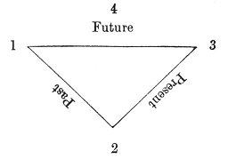
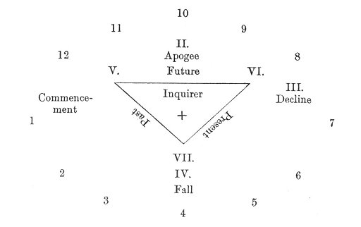

  
[Intangible Textual Heritage](../../index)  [Tarot](../index)  [Tarot
Reading](../pkt/tarot0)  [Index](index)  [Previous](tob53) 
[Next](tob55) 

------------------------------------------------------------------------

p. 318

# FOURTH LESSON.

### BASIS OF THE APPLICATION OF THESE DATA. ARRANGEMENT OF THE CARDS.

WE are now in a position to handle the Tarot as a means of divination.

But before we attempt to read it, we must settle how to arrange the
cards upon the table.

To know the meaning of the earls is only the first step in the art of
cartomancy; to know how to arrange them is still more important. As a
fact, the astronomical data should not be lost sight of, and the Tarot
ought only to be used to represent the revolutions of the stars, the
source of future events; but that is the realm of Astrology, and we must
confine ourselves to that of telling fortunes by the Tarot cards, and
their combinations depend a little upon chance.

We shall, however, give as many reliable elements in this study as
possible. We need only look back to the commencement of the third part
(Key to the Applications of the Tarot), to see that the human life
passes through the four great periods of--

Childhood.  
Youth.  
Maturity.  
Old Age.

 

p. 319

If the student is not interested in Human Life, and simply wishes to see
the evolution of an event, it will also pass through four great
evolutions--

Commencement.  
Apogee.  
Decline.  
Fall.

We must then first determine, in our arrangement of the cards, four
points facing each other in pairs, upon which we can afterwards place
the cards which are to reveal the future to us.

This, therefore, is our first point: the *determination of the four
places which the cards will occupy*.

<table data-cellspacing="0" data-border="0" data-cellpadding="9" width="798">
<colgroup>
<col style="width: 33%" />
<col style="width: 33%" />
<col style="width: 33%" />
</colgroup>
<tbody>
<tr class="odd">
<td width="33%" data-valign="TOP"> </td>
<td width="33%" data-valign="TOP">
4 
Apogee 
Youth
</td>
<td width="33%" data-valign="TOP"> </td>
</tr>
<tr class="even">
<td width="33%" data-valign="TOP">
1 
Commencement 
Childhood
</td>
<td width="33%" data-valign="TOP"> </td>
<td width="33%" data-valign="TOP">
3 
Decline 
Maturity
</td>
</tr>
<tr class="odd">
<td width="33%" data-valign="TOP"> </td>
<td width="33%" data-valign="TOP">
2 
Fall 
Old Age
</td>
<td width="33%" data-valign="TOP"> </td>
</tr>
</tbody>
</table>

 

We must notice that the disposition of the points goes from *left* to
*right*. This is seen by the order of the numbers, whilst the symbols
are read from *right* to *left*.

The Human Life or the Event moves in three very distinct periods--

The Past.  
The Present.  
The Future.

Which gives us a new figure as follows--

p. 320

 

 

 

The Inquirer is found in the Centre. The arrangement of the triangle
follows that of the figures and not of the symbols.

However, since four points are not enough to reproduce the movement of
the sun exactly, we take, for important readings of the Tarot, twelve
points which correspond with the twelve months of the year. The figure
already obtained will, at any rate, serve as a means of consulting the
Tarot upon small events. But we can also get the following figure, which
we must remember for the arrangement of our cards when we wish to
inquire about great events or the course of a lifetime.

p. 321

 

 

 

This figure, which is very important and should be carefully studied, is
composed of three circles.

1\. An outside circle, formed of *twelve houses*, filled by the minor
arcana. The houses are arranged from *left* to *right*; this is shown by
the numbers.

2\. A second intermediate circle, composed of four houses, arranged from
*right* to *left*.

3\. A central circle, formed by the triangle, and containing a house at
each point, giving three houses in the circle.

The last three houses and the four preceding ones will he filled by the
*major arcana*.

The Inquirer will be in the centre of the figure.

------------------------------------------------------------------------

[Next: Fifth Lesson. Fortune-Telling by the Tarot](tob55)
