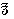

[Intangible Textual Heritage](../../index)  [Theosophy](../index) 
[Index](index)  [Previous](iu005)  [Next](iu007) 

------------------------------------------------------------------------

###### p. 205

### CHAPTER VII.

> "Thou great First Cause, least understood."--**P**OPE.

> "Whence this pleasing hope, this fond desire,  
> This longing after immortality?  
> Or whence this secret dread, and inward horror  
> Of falling into naught? Why shrinks the soul  
> Back on herself, and startles at destruction?  
> 'Tis the divinity that stirs within us;  
> 'Tis heaven itself that points out our hereafter  
> And intimates eternity to man.

> ETERNITY! Thou pleasing, dreadful thought!"**--A**DDISON.

> "There is another and a better world."--**K**OTZEBUE:
>
> The Stranger.

AFTER according so much space to the conflicting opinions of our men of
science about certain occult phenomena of our modern period, it is but
just that we give attention to the speculations of mediaeval alchemists
and certain other illustrious men. Almost without exception, ancient and
mediaeval scholars believed in the arcane doctrines of wisdom. These
included Alchemy, the Chaldeo-Jewish Kabala, the esoteric systems of
Pythagoras and the old Magi, and those of the later Platonic
philosophers and theurgists. We also propose in subsequent pages to
treat of the Indian gymnosophists and the Chaldean astrologers. We must
not neglect to show the grand truths underlying the misunderstood
religions of the past. The four elements of our fathers, earth, air,
water, and fire, contain for the student of alchemy and ancient
psychology--or as it is now termed, *magic--*many things of which our
philosophy has never dreamed. We must not forget that what is now called
*Necromancy* by the Church, and *Spiritualism* by modern believers, and
that includes the evoking of departed spirits, is a science which has,
from remote antiquity, been almost universally diffused over the face of
the globe.

Although neither an alchemist, magician, nor astrologer, but simply a
great philosopher, Henry More, of Cambridge University--a man
universally esteemed, may be named as a shrewd logician, scientist, and
metaphysician. His belief in witchcraft was firm throughout his life.
His faith in immortality and able arguments in demonstration of the
survival of man's spirit after death are all based on the Pythagorean
system, adopted by Cardan, Van Helmont, and other mystics. The infinite
and

###### p. 206

uncreated spirit that we usually call **G**OD, a substance of the
highest virtue and excellency, produced everything else by *emanative
causality.* God thus is the primary substance, the rest, the secondary;
if the former created matter with a power of moving itself, he, the
primary substance, is still the cause of that motion as well as of the
matter, and yet we rightly say that it is matter which moves itself. "We
may define this kind of spirit we speak of to be a substance
indiscernible, that can move itself, that can penetrate, contract, and
dilate itself, and can also penetrate, move, and alter matter," [\*](#fn_291) which is the third emanation. He firmly
believed in apparitions, and stoutly defended the theory of the
individuality of every soul in which "personality, memory, and
conscience will surely continue in the future state." He divided the
astral spirit of man after its exit from the body into two distinct
entities: the "aerial" and the "aethereal vehicle." During the time that
a disembodied man moves in its aerial clothing, he is subject to
*Fate--i.e.,* evil and temptation, attached to its earthly interests,
and therefore is not utterly pure; it is only when he casts off this
garb of the first spheres and becomes ethereal that he becomes sure of
his immortality. "For what shadow can that body cast that is a pure and
transparent light, such as the ethereal vehicle is? And therefore that
oracle is then fulfilled, when the soul has ascended into that condition
we have already described, in which alone it is out of the reach of fate
and mortality." He concludes his work by stating that this transcendent
and divinely-pure condition was the only aim of the Pythagoreans.

As to the skeptics of his age, his language is contemptuous and severe.
Speaking of Scot, Adie, and Webster, he terms them "our new inspired
saints . . . sworn advocates of the witches, who thus madly and boldly,
against all sense and reason, against all antiquity, all interpreters,
and against the Scripture itself, will have even no Samuel in the scene,
but a confederate knave! Whether the Scripture, or these inblown
buffoons, puffed up with nothing but ignorance, vanity, and stupid
infidelity, are to be believed, let any one judge," he adds. [\*\*](#fn_292)

What kind of language would this eminent divine have used against our
skeptics of the nineteenth century?

Descartes, although a worshipper of matter, was one of the most devoted
teachers of the magnetic doctrine and, in a certain sense, even of
Alchemy. His system of physics was very much like that of other great
philosophers. Space, which is infinite, is composed, or rather filled up
with a fluid and elementary matter, and is the sole fountain of all
life,

###### p. 207

enclosing all the celestial globes and keeping them in perpetual motion.
The magnet-streams of Mesmer are disguised by him into the Cartesian
vortices, and both rest on the same principle. Ennemoser does not
hesitate to say that both have more in common "than people suppose, who
have not carefully examined the subject." [\*](#fn_293)

The esteemed philosopher, Pierre Poiret Naude, was the warmest defender
of the doctrines of occult magnetism and its first propounders, [\*\*](#fn_294) in 1679. The magico-theosophical
philosophy is fully vindicated in his works.

The well-known Dr. Hufeland has written a work on magic [\*\*\*](#fn_295) in which he propounds the theory of
the universal magnetic sympathy between men, animals, plants, and even
minerals. The testimony of Campanella, Van Helmont, and Servius, is
confirmed by him in relation to the sympathy existing between the
different parts of the body as well as between the parts of all organic
and even inorganic bodies.

Such also was the doctrine of Tenzel Wirdig. It may even be found
expounded in his works, with far more clearness, logic, and vigor, than
in those of other mystical authors who have treated of the same subject.
In his famous treatise, *The New Spiritual Medicine,* he demonstrates,
on the ground of the later-accepted fact of universal attraction and
repulsion--now called "gravitation"--that the whole nature is
*ensouled.* Wirdig calls this magnetic sympathy "the accordance of
spirits." Everything is drawn to its like, and converges with natures
congenial to itself. Out of this sympathy and antipathy arises a
constant movement in the whole world, and in all its parts, and
uninterrupted communion between heaven and earth, which produces
universal harmony. Everything lives and perishes through magnetism; one
thing affects another one, even at great distances, and its
"congenitals" may be influenced to health and disease by the power of
this sympathy, at any time, and notwithstanding the intervening
space. [\*\*\*\*](#fn_296) "Hufeland," says
Ennemoser, "gives the account of a nose which had been cut from the back
of a porter, but which, when the porter died, died too and fell off from
its artificial position. A piece of skin," adds Hufeland, "taken from a
living head, had its hair turn gray at the same time as that on the head
from which it was taken." [\*\*\*\*\*](#fn_297)

Kepler, the forerunner of Newton in many great truths, even in that of
the universal "gravitation" which he very justly attributed to magnetic
attraction, notwithstanding that he terms astrology "the insane daughter
of a most wise mother"--Astronomy, shares the kabalistic belief

###### p. 208

that the spirits of the stars are so many "intelligences." *He firmly
believes that each planet is the seat of an intelligent principle, and
that they are all inhabited by spiritual beings, who exercise influences
over other beings inhabiting more gross and material spheres than their
own and especially* our earth. [\*](#fn_298) As
Kepler's *spiritual* starry influences were superseded by the vortices
of the more materialistic Descartes, whose atheistical tendencies did
not prevent him from believing that he had found out a diet that would
prolong his life five hundred years and more, so the vortices of the
latter and his astronomical doctrines may some day give place to the
*intelligent* magnetic streams which are directed by the

Anima Mundi.

Baptista Porta, the learned Italian philosopher, notwithstanding his
endeavors to show to the world the groundlessness of their accusations
of magic being a superstition and sorcery, was treated by later critics
with the same unfairness as his colleagues. This celebrated alchemist
left a work on *Natural Magic*, [\*\*](#fn_299)
in which he bases all of the occult phenomena possible to man upon the
world-soul which binds all with all. He shows that the astral light acts
in harmony and sympathy with all nature; that it is the essence out of
which our spirits are formed; and that by acting in unison with their
parent-source, our sidereal bodies are rendered capable of producing
magic wonders. The whole secret depends on our knowledge of kindred
elements. He believed in the philosopher's stone, "of which the world
hath so great an opinion of, which hath been bragged of in so many ages
and *happily attained unto by some.*" Finally, he throws out many
valuable hints as to its "spiritual meaning." In 1643, there appeared
among the mystics a monk, Father Kircher, who taught a complete
philosophy of universal magnetism. His numerous works [\*\*\*](#fn_300) embrace many of the subjects merely
hinted at by Paracelsus. His definition of magnetism is very original,
for he contradicted Gilbert's theory that the earth was a great magnet.
He asserted that although every particle of matter, and even the
intangible invisible "powers" were magnetic, they did not themselves
constitute a magnet. *There is but one* MAGNET *in the universe, and
from it proceeds the magnetization of everything existing.* This magnet
is of course what the kabalists term

###### p. 209

the central Spiritual Sun, or God. The sun, moon, planets, and stars he
affirmed are highly magnetic; but they have become so by induction from
living in the universal magnetic fluid--the Spiritual light. He proves
the mysterious sympathy existing between the bodies of the three
principal kingdoms of nature, and strengthens his argument by a
stupendous catalogue of instances. Many of these were verified by
naturalists, but still more have remained unauthenticated; therefore,
according to the traditional policy and very equivocal logic of our
scientists, they are denied. For instance, he shows a difference between
mineral magnetism and zoomagnetism, or animal magnetism. He demonstrates
it in the fact that except in the case of the lodestone all the minerals
are magnetized by the higher potency, the animal magnetism, while the
latter enjoys it as the direct emanation from the first cause--the
Creator. A needle can be magnetized by simply being held in the hand of
a strong-willed man, and amber develops its powers more by the friction
of the human hand than by any other object; therefore man can impart his
own life, and, to a certain degree, *animate* inorganic objects. This,
"in the eyes of the foolish, is sorcery." "The sun is the most magnetic
of all bodies," he says; thus anticipating the theory of General
Pleasonton by more than two centuries. "The ancient philosophers never
denied the fact," he adds; "but have at all times perceived that the
sun's emanations were binding all things to itself, and that it imparts
this binding power to everything falling under its direct rays."

As a proof of it he brings the instance of a number of plants being
especially attracted to the sun, and others to the moon, and showing
their irresistible sympathy to the former by following its course in the
heavens. The plant known as the *Githymal*, [\*](#fn_301) faithfully follows its sovereign, even
when it is invisible on account of the fog. The acacia uncloses its
petals at its rising, and closes them at its setting. So does the
Egyptian lotos and the common sunflower. The nightshade exhibits the
same predilection for the moon.

As examples of antipathies or sympathies among plants, he instances the
aversion which the vine feels for the cabbage, and its fondness toward
the olive-tree; the love of the ranunculus for the water-lily, and of
the rue for the fig. The antipathy which sometimes exists even among
kindred substances is clearly demonstrated in the case of the Mexican
pomegranate, whose shoots, when cut to pieces, repel each other with the
"most extraordinary ferocity."

Kircher accounts for every feeling in human nature as results of changes
in our magnetic condition. Anger, jealousy, friendship, love, and

###### p. 210

hatred, are all modifications of the magnetic atmosphere which is
developed in us and constantly emanates from us. Love is one of the most
variable, and therefore the aspects of it are numberless. Spiritual
love, that of a mother for her child, of an artist for some particular
art, love as pure friendship, are purely magnetic manifestations of
sympathy in congenial natures. *The magnetism of pure love is the
originator of every created thing.* In its ordinary sense love between
the sexes is electricity, and he calls it *amor febris species,* the
fever of species. There are two kinds of magnetic attraction: sympathy
and fascination; the one holy and natural, the other evil and unnatural.
To the latter, fascination, we must attribute the power of the poisonous
toad, which upon merely opening its mouth, forces the passing reptile or
insect to run into it to its destruction. The deer, as well as smaller
animals, are attracted by the breath of the boa, and are made
irresistibly to come within its reach. The electric fish, the torpedo,
repels the arm with a shock that for a time benumbs it. To exercise such
a power for beneficent purposes, man requires three conditions: 1,
nobility of soul; 2, strong will and imaginative faculty; 3, a subject
weaker than the magnetizer; otherwise he will resist. A man free from
worldly incentives and sensuality, may cure in such a way the most
"incurable" diseases, and his vision may become clear and prophetic.

A curious instance of the above-mentioned universal attraction between
all the bodies of the planetary system and everything organic as well as
inorganic pertaining to them, is found in a quaint old volume of the
seventeenth century. It contains notes of travel and an official report
to the King of France, by his Ambassador, de la Loubere, upon what he
has seen in the kingdom of Siam. "At Siam," he says, "there are two
species of fresh-water fish, which they respectively call *pal-out* and
*pla-cadi* fish. Once salted and placed uncut (whole) in the pot, they
are found to exactly follow the flux and reflux of the sea, growing
higher and lower in the pot as the sea ebbs or flows." [\*](#fn_302) De la Loubere experimented with this
fish for a long time, together with a government engineer, named
Vincent, and, therefore, vouches for the truth of this assertion, which
at first had been dismissed as an idle fable. So powerful is this
mysterious attraction that it affected the fishes even when their bodies
became totally rotten and fell to pieces.

It is especially in the countries unblessed with civilization that we
should seek for an explanation of the nature, and observe the effects of
that subtile power, which ancient philosophers called the "world's
soul."

###### p. 211

In the East only, and on the boundless tracts of unexplored Africa, will
the student of psychology find abundant food for his truth-hungering
soul. The reason is obvious. The atmosphere in populous neighborhoods is
badly vitiated by the smoke and fumes of manufactories, steam-engines,
railroads, and steamboats, and especially by the miasmatic exhalations
of the living and the dead. Nature is as dependent as a human being upon
conditions before she can work, and her mighty breathing, so to say, can
be as easily interfered with, impeded, and arrested, and the correlation
of her forces destroyed in a given spot, as though she were a man. Not
only climate, but also occult influences daily felt not only modify the
physio-psychological nature of man, but even alter the constitution of
so-called inorganic matter in a degree not fairly realized by European
science. Thus the London *Medical and Surgical Journal* advises surgeons
not to carry lancets to Calcutta, because it has been found by personal
experience "that English steel could not bear the atmosphere of India";
so a bunch of English or American keys will be completely covered with
rust twenty-four hours after having been brought to Egypt; while objects
made of native steel in those countries remain unoxidized. So, too, it
has been found that a Siberian Shaman who has given stupendous proofs of
his occult powers among his native Tschuktschen, is gradually and often
completely deprived of such powers when coming into smoky and foggy
London. Is the inner organism of man less sensitive to climatic
influences than a bit of steel? If not, then why should we cast doubt
upon the testimony of travellers who may have seen the Shaman, day after
day, exhibit phenomena of the most astounding character in his native
country, and deny the possibility of such powers and such phenomena,
only because he cannot do as much in London or Paris? In his lecture on
the *Lost Arts*, Wendell Phillips proves that besides the psychological
nature of man being affected by a change of climate, Oriental people
have physical senses far more acute than the Europeans. The French dyers
of Lyons, whom no one can surpass in skill, he says, "have a theory that
there is a certain delicate shade of blue that Europeans *cannot see*. .
. . And in Cashmere, where the girls make shawls worth $30,000, they
will show him (the dyer of Lyons) three hundred distinct colors, which
he not only cannot make, but *cannot even distinguish*." If there is
such a vast difference between the acuteness of the external senses of
two races, why should there not be the same in their psychological
powers? Moreover, the eye of a Cashmere girl is able to see
*objectively* a color which does exist, but which being inappreciable by
the European, is therefore non-existent for him. Why then not concede,
that some peculiarly-endowed organisms, which are thought to be
possessed of that mysterious faculty called *second sight*,

###### p. 212

see their pictures as objectively as the girl sees the colors; and that
therefore the former, instead of mere objective hallucinations called
forth by imagination are, on the contrary, reflections of real things
and persons impressed upon the astral ether, as explained by the old
philosophy of the *Chaldean Oracles,* and surmised by those modern
discoverers, Babbage, Jevons, and the authors of the

Unseen Universe?

"Three spirits live and actuate man," teaches Paracelsus; "three worlds
pour their beams upon him; but all three only as the image and echo of
one and the same all-constructing and uniting principle of production.
The first is the spirit of the elements (terrestrial body and vital
force in its brute condition); the second, the spirit of the stars
(sidereal or astral body--the soul); the third is the *Divine* spirit
(*Augoeides*)*.*" Our human body, being possessed of "primeval
earth-stuff," as Paracelsus calls it, we may readily accept the tendency
of modern scientific research "to regard the processes of both animal
and vegetable life as simply physical and chemical." This theory only
the more corroborates the assertions of old philosophers and the *Mosaic
Bible,* that from the dust of the ground our bodies were made, and to
dust they will return. But we must remember that

> " 'Dust thou art, to dust returnest,'  
> Was not spoken of the soul."

Man is a little world--a microcosm inside the great universe. Like a
foetus, he is suspended, by all his *three* spirits, in the matrix of
the macrocosmos; and while his terrestrial body is in constant sympathy
with its parent earth, his astral soul lives in unison with the sidereal
*anima mundi.* He is in it, as it is in him, for the world-pervading
element fills all space, and *is* space itself, only shoreless and
infinite. As to his third spirit, the divine, what is it but an
infinitesimal ray, one of the countless radiations proceeding directly
from the Highest Cause--the Spiritual Light of the World? This is the
trinity of organic and inorganic nature--the spiritual and the physical,
which are three in one, and of which Proclus says that "The first monad
is the Eternal God; the second, eternity; the third, the paradigm, or
pattern of the universe"; the three constituting the Intelligible Triad.
Everything in this visible universe is the outflow of this Triad, and a
microcosmic triad itself. And thus they move in majestic procession in
the fields of eternity, around the spiritual sun, as in the heliocentric
system the celestial bodies move round the visible suns. The Pythagorean
*Monad*, which lives "in solitude and darkness," may remain on this
earth forever invisible, impalpable, and undemonstrated by experimental
science. Still the whole universe will be gravitating around it, as it
did from the "beginning of time," and

###### p. 213

with every second, man and atom approach nearer to that solemn moment in
the eternity, when the Invisible Presence will become clear to their
spiritual sight. When every particle of matter, even the most
sublimated, has been cast off from the last shape that forms the
ultimate link of that chain of double evolution which, throughout
millions of ages and successive transformations, has pushed the entity
onward; and when it shall find itself reclothed in that primordial
essence, identical with that of its Creator, then this once impalpable
organic atom will have run its race, and the sons of God will once more
"shout for joy" at the return of the pilgrim.

"Man," says Van Helmont, "is the mirror of the universe, and his triple
nature stands in relationship to all things." The will of the Creator,
through which all things were made and received their first impulse, is
the property of every living being. Man, endowed with an additional
spirituality, has the largest share of it on this planet. It depends on
the proportion of matter in him whether he will exercise its magical
faculty with more or less success. Sharing this divine potency in common
with every inorganic atom, he exercises it through the course of his
whole life, whether consciously or otherwise. In the former case, when
in the full possession of his powers, he will be the master, and the
*magnale magnum* (the universal soul) will be controlled and guided by
him. In the cases of animals, plants, minerals, and even of the average
of humanity, this ethereal fluid which pervades all things, finding no
resistance, and being left to itself, moves them as its impulse directs.
Every created being in this sublunary sphere, is formed out of the
*magnale magnum,* and is related to it. Man possesses a double celestial
power, and is allied to heaven. This power is "not only in the outer
man, but to a degree also in the animals, and perhaps in all other
things, as all things in the universe stand in a relation to each other;
or, at least, God is in all things, as the ancients have observed it
with a worthy correctness. It is necessary that the magic strength
should be awakened in the outer as well as in the inner man. . . . And
if we call this a magic power, the uninstructed only can be terrified by
the expression. But, if you prefer it, you can call it a spiritual
power--*spirituale robur vocitaveris.* There is, therefore, such magic
power in the inner man. But, as there exists a certain relationship
between the inner and the outer man, this strength must be diffused
through the whole man." [\*](#fn_303)

In an extended description of the religious rites, monastic life, and
"superstitions" of the Siamese, de la Loubere cites among other things
the wonderful power possessed by the *Talapoin* (the monks, or the holy

###### p. 214

men of Buddha) over the wild beasts. "The Talapoin of Siam," he says,
"will pass whole weeks in the dense woods under a small awning of
branches and palm leaves, and never make a fire in the night to scare
away the wild beasts, as all other people do who travel through the
woods of this country." The people consider it a miracle that no
Talapoin is ever devoured. The tigers, elephants, and rhinoceroses--with
which the neighborhood abounds--respect him; and travellers placed in
secure ambuscade have often seen these wild beasts lick the hands and
feet of the sleeping Talapoin. "They all use magic," adds the French
gentleman, "and think all nature animated (ensouled); [\*](#fn_304) they believe in tutelar geniuses." But
that which seems to shock the author most is the idea which prevails
among the Siamese, "that all that man was in his bodily life, he will be
after death." "When the Tartar, which now reigns at China," remarks de
la Loubere, "would force the Chinese to shave their hair after the
Tartarian fashion, several of them chose rather to suffer death than to
go, they said, into the other world and appear before their ancestors
without hair; imagining that they shaved the head of the soul
also!" [\*\*](#fn_305) "Now, what is altogether
impertinent," adds the Ambassador, "in this absurd opinion is, that the
Orientals attribute the human figure rather than any other to the soul."
Without enlightening his reader as to the particular shape these
benighted Orientals ought to select for their disembodied souls, de la
Loubere proceeds to pour out his wrath on these "savages." Finally, he
attacks the memory of the old king of Siam, the father of the one to
whose court he was sent, by accusing him of having foolishly spent over
two million livres in search of the philosopher's stone. "The Chinese,"
he says, "reputed so wise, have for three or four thousand years had the
folly of believing in the existence, and of seeking out a universal
remedy by which they hope to exempt themselves from the necessity of
dying. They base themselves on some foolish traditions, concerning some
*rare* persons that are reported to have made gold, and to have lived
some ages; there are some very strongly established facts among the
Chinese, the Siamese, and other Orientals, concerning those that know
how to render themselves immortal, either absolutely, or in such a
manner that they can die no otherwise than by violent death. [\*\*\*](#fn_306) Wherefore, they name some persons
who have withdrawn themselves from the sight of men to enjoy free and
peaceable life. They relate wonders concerning the knowledge of these
pretended immortals."

If Descartes, a Frenchman and a scientist, could, in the midst of
civilization, firmly believe that such a universal remedy had been
found,

###### p. 215

and that if possessed of it he could live at least five hundred years,
why are not the Orientals entitled to the same belief? The
master-problems of both life and death are still unsolved by occidental
physiologists. Even sleep is a phenomenon about whose cause there is a
great divergence of opinion among them. How, then, can they pretend to
set limits to the possible, and define the impossible?

From the remotest ages the philosophers have maintained the singular
power of music over certain diseases, especially of the nervous class.
Kircher recommends it, having experienced its good effects in himself,
and he gives an elaborate description of the instrument he employed. It
was a harmonica composed of five tumblers of a very thin glass, placed
in a row. In two of them were two different varieties of wine; in the
third, brandy; in the fourth, oil; in the fifth, water. He extracted
five melodious sounds from them in the usual way, by merely rubbing his
finger on the edges of the tumblers. The sound has an attractive
property; it draws out disease, which streams out to encounter the
musical wave, and the two, blending together, disappear in space.
Asclepiades employed music for the same purpose, some twenty centuries
ago; he blew a trumpet to cure sciatica, and its prolonged sound making
the fibres of the nerves to palpitate, the pain invariably subsided.
Democritus in like manner affirmed that many diseases could be cured by
the melodious sounds of a flute. Mesmer used this very harmonica
described by Kircher for his magnetic cures. The celebrated Scotchman,
Maxwell, offered to prove to various medical faculties that with certain
magnetic means at his disposal, he would cure any of the diseases
abandoned by them as incurable; such as epilepsy, impotence, insanity,
lameness, dropsy, and the most obstinate fevers. [\*](#fn_307)

The familiar story of the exorcism of the "evil spirit from God" that
obsessed Saul, will recur to every one in this connection. It is thus
related: "And it came to pass, when the evil spirit from God was upon
Saul, that David took an harp, and played with his hand: *so Saul was
refreshed, and was well,* and the evil spirit departed from him." [\*\*](#fn_308)

Maxwell, in his *Medicina Magnetica,* expounds the following
propositions, all which are the very doctrines of the alchemists and
kabalists.

"That which men call the world-soul, is a life, as fire, spiritual,
fleet, light, and ethereal as light itself. It is a life-spirit
everywhere; and everywhere the same. . . . All matter is destitute of
action, except as it is ensouled by this spirit. This spirit maintains
all things in their peculiar condition. It is found in nature free from
all fetters; and he

###### p. 216

who understands how to unite it with a harmonizing body, possesses a
treasure which exceeds all riches."

"This spirit is the common bond of all quarters of the earth, and lives
through and in all--*adest in mundo quid commune omnibus mextis, in quo
ipsa permanent.*"

"He who knows this universal life-spirit and its application can prevent
all injuries." [\*](#fn_309)

"If thou canst avail thyself of this spirit and fix it on some
particular body thou wilt perform the mystery of magic."

"He who knows how to operate on men by this universal spirit, can heal,
and this at any distance that he pleases." [\*\*](#fn_310)

"He who can invigorate the particular spirit through the universal one,
*might continue his life to eternity*." [\*\*\*](#fn_311)

"There is a blending together of spirits, or of emanations, even when
they are far separated from each other. And what is this blending
together? It is an eternal and incessant outpouring of the rays of one
body into another."

"In the meantime," says Maxwell, "it is not *without danger* to treat of
this. Many abominable abuses of this may take place."

And now let us see what are these abuses of mesmeric and magnetic powers
in some healing mediums.

Healing, to deserve the name, requires either faith in the patient, or
robust health united with a strong will, in the operator. *With
expectancy supplemented by faith, one can cure himself of almost any
morbific condition.* The tomb of a saint; a holy relic; a talisman; a
bit of paper or a garment that has been handled by the supposed healer;
a nostrum; a penance, or a ceremonial; the laying on of hands, or a few
words impressively pronounced--either will do. It is a question of
temperament, imagination, self-cure. In thousands of instances, the
doctor, the priest, or the relic has had credit for healings that were
solely and simply due to the patient's unconscious will. The woman with
the bloody issue who pressed through the throng to touch the robe of
Jesus, was told that her "faith" had made her whole.

The influence of mind over the body is so powerful that it has effected
miracles at all ages.

"How many unhoped-for, sudden, and prodigious cures have been effected
by imagination," says Salverte. "Our medical books are filled with facts
of this nature which would easily pass for miracles." [\*\*\*\*](#fn_312)

But, if the patient has no faith, what then? If he is physically nega-

###### p. 217

tive and receptive, and the healer strong, healthy, positive,
determined, the disease may be extirpated by the imperative will of the
operator, which, consciously or unconsciously, draws to and reinforces
itself with the universal spirit of nature, and restores the disturbed
equilibrium of the patient's aura. He may employ as an auxiliary, a
crucifix--as Gassner did; or impose the hands and "will," like the
French Zouave Jacob, like our celebrated American, Newton, the healer of
many thousands of sufferers, and like many others; or like Jesus, and
some apostles, he may cure by the word of command. The process in each
case is the same.

In all these instances, the cure is radical and real, and without
secondary ill-effects. But, when one who is himself physically diseased,
attempts healing, he not only fails of that, but often imparts his
illness to his patient, and robs him of what strength he may have. The
decrepit King David reinforced his failing vigor with the healthy
magnetism of the young Abishag; [\*](#fn_313)
and the medical works tell us of an aged lady of Bath, England, who
broke down the constitutions of two maids in succession, in the same
way. The old sages, and Paracelsus also, removed disease by applying a
healthy organism to the afflicted part, and in the works of the
above-said fire-philosopher, their theory is boldly and categorically
set forth. If a diseased person--medium or not--attempts to heal, his
force may be sufficiently robust to displace the disease, to disturb it
in the present place, and cause it to shift to another, where shortly it
will appear; the patient, meanwhile, thinking himself cured.

But, what if the healer be morally diseased? The consequences may be
infinitely more mischievous; for it is easier to cure a bodily disease
than cleanse a constitution infected with moral turpitude. The mystery
of Morzine, Cevennes, and that of the Jansenists, is still as great a
mystery for physiologists as for psychologists. If the gift of prophecy,
as well as hysteria and convulsions, can be imparted by "infection," why
not every vice? The healer, in such a case, conveys to his patient--who
is now his victim--the moral poison that infects his own mind and heart.
His magnetic touch is defilement; his glance, profanation. Against this
insidious taint, there is no protection for the passively-receptive
subject. The healer holds him under his power, spell-bound and
powerless, as the serpent holds a poor, weak bird. The evil that one
such "healing medium" can effect is incalculably great; and such healers
there are by the hundred.

But, as we have said before, there are real and God-like healers, who,
notwithstanding all the malice and skepticism of their bigoted
opponents,

###### p. 218

have become famous in the world's history. Such are the Cure d'Ars, of
Lyons, Jacob, and Newton. Such, also, were Gassner, the clergyman of
Klorstele, and the well-known Valentine Greatrakes, the ignorant and
poor Irishman, who was endorsed by the celebrated Robert Boyle,
President of the Royal Society of London, in 1670. In 1870, he would
have been sent to Bedlam, in company with other healers, if another
president of the same society had had the disposal of the case, or
Professor Lankester would have "summoned" him under the *Vagrant Act*
for practicing upon Her Majesty's subjects "by *palmistry* or
otherwise."

But, to close a list of witnesses which might be extended indefinitely,
it will suffice to say that, from first to last, from Pythagoras down to
Eliphas Levi, from highest to humblest, every one teaches *that the
magical power is never possessed by those addicted to vicious
indulgences.* Only the pure in heart "see God," or exercise divine
gifts--only such can heal the ills of the body, and allow themselves,
with relative security, to be guided by the "invisible powers." Such
only can give peace to the disturbed spirits of their brothers and
sisters, for the healing waters come from no poisonous source; grapes do
not grow on thorns, and thistles bear no figs. But, for all this, "magic
has nothing supernal in it"; it is a science, and even the power of
"casting out devils" was a branch of it, of which the Initiates made a
special study. "That skill which expels demons out of human bodies, is a
science useful and sanative to men," says Josephus. [\*](#fn_314)

The foregoing sketches are sufficient to show why we hold fast to the
wisdom of the ages, in preference to any new theories that may have been
hatched from the occurrences of our later days, respecting the laws of
intermundane intercourse and the occult powers of man. While phenomena
of a physical nature may have their value as a means of arousing the
interest of materialists, and confirming, if not wholly, at least
inferentially, our belief in the survival of our souls and spirits, it
is questionable whether, under their present aspect, the modern
phenomena are not doing more harm than good. Many minds, hungering after
proofs of immortality, are fast falling into fanaticism; and, as Stow
remarks, "fanatics are governed rather by imagination than judgment."

Undoubtedly, believers in the modern phenomena can claim for themselves
a diversity of endowments, but the "discerning of spirits" is evidently
absent from this catalogue of "spiritual" gifts. Speaking of the
"Diakka," whom he one fine morning had discovered in a shady corner of
the "Summer Land," A. J. Davis, the great American seer, remarks: "A
Diakka is one who takes insane delight in *playing parts,* in juggling

###### p. 219

tricks, in *personating* opposite characters; to whom prayer and profane
utterances are of equi-value; surcharged with a passion for lyrical
narrations; . . . morally deficient, he is without the active feelings
of justice, philanthropy, or tender affection. He knows nothing of what
men call the sentiment of gratitude; the ends of hate and love are the
same to him; his motto is often fearful and terrible to others--**SELF**
is the whole of private living, and exalted annihilation *the end of all
private life*. [\*](#fn_315) Only yesterday,
one said to a lady medium, signing himself *Swedenborg,* this:
'Whatsoever is, has been, will be, or may be, *that* **I AM**; and
private life is but the aggregative phantasms of thinking throblets,
rushing in their rising onward to the central heart of eternal death!'
" [\*\*](#fn_316)

Porphyry, whose works--to borrow the expression of an irritated
phenomenalist--"are mouldering like every other antiquated trash in the
closets of oblivion," speaks thus of these Diakka--if such be their
name--rediscovered in the nineteenth century: "It is with the direct
help of these bad demons, that every kind of sorcery is accomplished . .
. it is the result of their operations, and men who injure their
fellow-creatures by enchantments, usually pay great honors to these bad
demons, and especially to their chief. These spirits pass their time in
deceiving us, with a great display of cheap prodigies and *illusions;*
their ambition is to be taken for gods, and their leader demands to be
recognized as the supreme god." [\*\*\*](#fn_317)

The spirit signing himself Swedenborg--just quoted from Davis's
*Diakka,* and hinting that he is the **I** AM, singularly resembles this
chief leader of Porphyry's bad demons.

What more natural than this vilification of the ancient and experienced
theurgists by certain mediums, when we find Iamblichus, the expositor of
spiritualistic theurgy, strictly forbidding all endeavors to procure
such phenomenal manifestations; unless, after a long preparation of
moral and physical purification, and under the guidance of experienced
theurgists. When, furthermore, he declares that, with very few
exceptions, for *a person* "*to appear elongated or thicker, or be borne
aloft in the air,*" is a sure mark of obsession by *bad* demons. [\*\*\*\*](#fn_318)

Everything in this world has its time, and truth, however based upon
unimpeachable evidence, will not root or grow, unless, like a plant, it
is thrown into soil in its proper season. "The age must be prepared,"

###### p. 220

says Professor Cooke; and some thirty years ago this humble work would
have been doomed to self-destruction by its own contents. But the modern
phenomenon, notwithstanding the daily *exposes,* the ridicule with which
it is crowned at the hand of every materialist, and its own numerous
errors, grows and waxes strong in facts, if not in wisdom and spirit.
What would have appeared twenty years ago simply preposterous, may well
be listened to now that the phenomena are endorsed by great scientists.
Unfortunately, if the manifestations increase in power daily, there is
no corresponding improvement in philosophy. The discernment of spirits
is still as wanting as ever.

Perhaps, among the whole body of spiritualist writers of our day, not
one is held in higher esteem for character, education, sincerity, and
ability, than Epes Sargent, of Boston, Massachusetts. His monograph
entitled *The Proof Palpable of Immortality,* deservedly occupies a high
rank among works upon the subject. With every disposition to be
charitable and apologetic for mediums and their phenomena, Mr. Sargent
is still compelled to use the following language: "The power of spirits
to reproduce simulacra of persons who have passed from the earth-life,
suggests the question--How far can we be assured of the identity of
*any* spirit, let the tests be what they may? We have not yet arrived at
that stage of enlightenment that would enable us to reply confidently to
this inquiry. . . . There is much that is yet a puzzle in the language
and action of this class of materialized spirits." As to the
intellectual calibre of most of the spirits which lurk behind the
physical phenomena, Mr. Sargent will unquestionably be accepted as a
most competent judge, and he says, "the great majority, as in this
world, are of the unintellectual sort." If it is a fair question, we
would like to ask why they should be so lacking in intelligence, if they
are human spirits? Either intelligent human spirits *cannot*
materialize, or, the spirits that do materialize have not human
intelligence, and, therefore, by Mr. Sargent's own showing, they may
just as well be "elementary" spirits, who have ceased to be human
altogether, or those demons, which, according to the Persian Magi and
Plato, hold a middle rank between gods and disembodied men.

There is good evidence, that of Mr. Crookes for one, to show that many
"materialized" spirits talk in an audible voice. Now, we have shown, on
the testimony of ancients, that the voice of human spirits is not and
*cannot* be articulated; being, as Emanuel Swedenborg declares, "a deep
suspiration." Who of the two classes of witnesses may be trusted more
safely? Is it the ancients who had the experience of so many ages in
theurgical practices, or modern spiritualists, who have had none at all,
and who have no facts upon which to base an opinion, except such as have
been communicated by "spirits," whose identity they have no means

###### p. 221

of proving? There are mediums whose organisms have called out sometimes
hundreds of these would-be "human" forms. And yet we do not recollect to
have seen or heard of one expressing anything but the most commonplace
ideas. This fact ought surely to arrest the attention of even the most
uncritical spiritualist. If a spirit can speak at all, and if the way is
opened to intelligent as well as to unintellectual beings, why should
they not sometimes give us addresses in some remote degree approximating
in quality to the communications we receive through the "direct
writing"? Mr. Sargent puts forward a very suggestive and important idea
in this sentence. "How far they are limited in their mental operations
and in their recollections by the act of materialization, or how far by
the intellectual horizon of the medium is still a question." [\*](#fn_319) If the same kind of "spirits"
materialize that produce the direct writing, and both manifest through
mediums, and the one talk nonsense, while the other often give us
sublime philosophical teachings, why should their mental operations be
limited "by the intellectual horizon of the medium" in the one instance
more than in the other? The materializing mediums--at least so far as
our observation extends--are no more uneducated than many peasants and
mechanics who at different times have, under supernal influences, given
profound and sublime ideas to the world. The history of psychology teems
with examples in illustration of this point, among which that of Boehme,
the inspired but ignorant shoemaker, and our own Davis, are conspicuous.
As to the matter of unintellectuality we presume that no more striking
cases need be sought than those of the child-prophets of Cevennes, poets
and seers, such as have been mentioned in previous chapters. When
spirits have once furnished themselves with vocal organs to speak at
all, it surely ought to be no more difficult for them to talk as persons
of their assumed respective education, intelligence, and social rank
would in life, instead of falling invariably into one monotonous tone of
commonplace and, but too often, platitude. As to Mr. Sargent's hopeful
remark, that "the science of Spiritualism being still in its infancy, we
may hope for more light on this question," we fear we must reply, that
*it is not through* "*dark cabinets*" *that this light will ever
break*. [\*\*](#fn_320)

It is simply ridiculous and absurd to require from every investigator
who comes forward as a witness to the marvels of the day and
psychological phenomena the diploma of a master of arts and sciences.
The experience of the past forty years is an evidence that it is not
always the minds which are the most "scientifically trained" that are
the best in matters of simple common sense and honest truth. Nothing
blinds like

###### p. 222

fanaticism, or a one-sided view of a question. We may take as an
illustration Oriental magic or ancient spiritualism, as well as the
modern phenomena. Hundreds, nay thousands of perfectly trustworthy
witnesses, returning from residence and travels in the East, have
testified to the fact that uneducated fakirs, sheiks, dervishes, and
lamas have, in their presence, without confederates or mechanical
appliances, produced wonders. They have affirmed that the phenomena
exhibited by them were in contravention of all the *known* laws of
science, and thus tended to prove the existence of many yet unknown
occult potencies in nature, seemingly directed by preterhuman
intelligences. What has been the attitude assumed by our scientists
toward this subject? How far did the testimony of the most
"scientifically" trained minds make impression on their own? Did the
investigations of Professors Hare and de Morgan, of Crookes and Wallace,
de Gasparin and Thury, Wagner and Butlerof, etc., shake for one moment
their skepticism? How were the personal experiences of Jacolliot with
the fakirs of India received, or the psychological elucidations of
Professor Perty, of Geneva, viewed? How far does the loud cry of
mankind, craving for palpable and demonstrated signs of a God, an
individual soul, and of eternity, affect them; and what is their
response? They pull down and destroy every vestige of spiritual things,
but they erect nothing. "We cannot get such signs with either retorts or
crucibles," they say; "hence, it's all but a delusion!" In this age of
cold reason and prejudice, even the Church has to look to science for
help. Creeds built on sand, and high-towering but rootless dogmas,
crumble down under the cold breath of research, and pull down *true*
religion in their fall. But the longing for some outward sign of a God
and a life hereafter, remains as tenaciously as ever in the human heart.
In vain is all sophistry of science; it can never stifle the voice of
nature. Only her representatives have poisoned the pure waters of simple
faith, and now humanity mirrors itself in waters made turbid with all
the mud stirred up from the bottom of the once pure spring. The
anthropomorphic God of our fathers is replaced by anthropomorphic
monsters; and what is still worse, by the reflection of humanity itself
in these waters, whose ripples send it back the distorted images of
truth and facts as evoked by its misguided imagination. "It is not a
miracle that we want," writes the Reverend Brooke Herford, "but to find
palpable evidence of the spiritual and the divine. It is not to the
prophets that men cry for such a 'sign,' but rather to the scientists.
Men feel as if all that groping about in the foremost verge or innermost
recesses of creation should bring the investigator at length close to
the deep, underlying facts of all things, to some unmistakable signs of
God." The signs are there, and the scientists too; what can we expect
more of them, now

###### p. 223

that they have done so well their duty? Have they not, these Titans of
thought, dragged down God from His hiding-place, and given us instead a

protoplasm?

At the Edinburgh meeting of the British Association, in 1871, Sir
William Thomson said: "Science is bound by the everlasting law of honor
to face fearlessly every problem which can fairly be presented to it."
In his turn, Professor Huxley remarks: "With regard to the
miracle-question, I can only say that the word 'impossible' is not, to
my mind, applicable to matters of philosophy." The great Humboldt
remarks that "a presumptuous skepticism that rejects facts without
examination of their truth is, in some respects, more injurious than
unquestioning credulity."

These men have proved untrue to their own teachings. The opportunity
afforded them by the opening of the Orient, to investigate for
themselves the phenomena alleged by every traveller to take place in
those countries, has been rejected. Did our physiologists and
pathologists ever so much as think of availing themselves of it to
settle this most momentous subject of human thought? Oh, no; for they
would never dare. It is not to be expected that the principal
Academicians of Europe and America should undertake a joint journey to
Thibet and India, and investigate the fakir marvel on the spot! And were
one of them to go as a solitary pilgrim and witness all the miracles of
creation, in that land of wonders, who, of his colleagues, could be
expected to believe his testimony?

It would be as tedious as superfluous to begin a restatement of facts,
so forcibly put by others, Mr. Wallace and W. Howitt, [\*](#fn_321) have repeatedly and cleverly described
the thousand and one absurd errors into which the learned societies of
France and England have fallen, through their blind skepticism. If
Cuvier could throw aside the fossil excavated in 1828 by Boue, the
French geologist, only because the anatomist thought himself wiser than
his colleague, and would not believe that human skeletons could be found
eighty feet deep in the mud of the Rhine; and if the French Academy
could discredit the assertions of Boucher de Perthes, in 1846, only to
be criticised in its turn in 1860, when the truth of de Perthes'
discoveries and observations was fully confirmed by the whole body of
geologists finding flint weapons in the drift-gravels of northern
France; and if McEnery's testimony, in 1825, to the fact that he had
discovered worked flints, together with the remains of extinct animals,
in Kent's Hole Cavern [\*\*](#fn_322) was
laughed at; and that of

###### p. 224

Godwin Austen to the same effect, in 1840, ridiculed still more, if that
were possible; and all that excess of scientific skepticism and
merriment could, in 1865, finally come to grief, and be shown to have
been entirely uncalled for; when--says Mr. Wallace "all the previous
reports for forty years were confirmed and shown to be even less
wonderful than the reality;"--who can be so credulous as to believe in
the infallibility of our science? And why wonder at the exhibition of
such a lack of moral courage in individual members of this great and
stubborn body known as modern science?

Thus fact after fact has been discredited. From all sides we hear
constant complaints. "Very little is known of psychology!" sighs one F.
R. S. "We must confess that we know little, if anything, in physiology,"
says another. "Of all sciences, there is none which rests upon so
uncertain a basis as medicine," reluctantly testifies a third. "What do
we know about the presumed nervous fluids? . . . Nothing, as yet," puts
in a fourth one; and so on in every branch of science. And, meanwhile,
phenomena, surpassing in interest all others of nature, and to be solved
only by physiology, psychology, and the "as yet unknown" fluids, are
either rejected as delusions, or, if even true, "do not interest"
scientists. Or, what is still worse, when a *subject,* whose organism
exhibits in itself the most important features of such occult though
natural potencies, offers his person for an investigation, instead of an
honest experiment being attempted with him he finds himself entrapped by
a scientist (?) and paid for his trouble with a sentence of three
months' imprisonment! This is indeed promising.

It is easy to comprehend that a fact given in 1731, testifying to
another fact which happened during the papacy of Paul **III**., for
instance, is disbelieved in 1876. And when scientists are told that the
Romans preserved lights in their sepulchres for countless years by the
*oiliness of gold;* and that one of such ever-burning lamps was found
brightly burning in the tomb of Tullia, the daughter of Cicero,
notwithstanding that the tomb had been shut up fifteen hundred and fifty
years, [\*](#fn_323)--they have a certain right
to doubt, and even disbelieve the statement, until they assure
themselves, on the evidence of their own senses, that such a thing is
possible. In such a case they can reject the testimony of all the
ancient and medieval philosophers. The burial of living fakirs and their
subsequent resuscitation, after thirty days of inhumation, may have a
suspicious look to them. So also with the self-infliction of mortal
wounds, and the exhibition of their own bowels to the persons present by
various lamas, who heal such wounds almost instantaneously.

###### p. 225

For certain men who deny the evidence of their own senses as to
phenomena produced in their own country, and before numerous witnesses,
the narratives to be found in classical books, and in the notes of
travellers, must of course seem absurd. But what we will never be able
to understand is the collective stubbornness of the Academies, in the
face of such bitter lessons in the past, to these institutions which
have so often "darkened counsel by words without knowledge." Like the
Lord answering Job "out of the whirlwind," magic can say to modern
science: "Where wast thou when I laid the foundations of the earth?
declare, if thou hast understanding!" And, who art thou who dare say to
nature, "Hitherto shalt thou come, but no further; and here shall thy
proud waves be stayed"?

But what matters it if they do deny? Can they prevent phenomena taking
place in the four corners of the world, if their skepticism were a
thousand times more bitter? Fakirs will still be buried and
resuscitated, gratifying the curiosity of European travellers; and lamas
and Hindu ascetics will wound, mutilate, and even disembowel themselves,
and find themselves all the better for it; and the denials of the whole
world will not blow sufficiently to extinguish the perpetually-burning
lamps in certain of the subterranean crypts of India, Thibet, and Japan.
One of such lamps is mentioned by the Rev. S. Mateer, of the London
Mission. In the temple of Trevandrum, in the kingdom of Travancore,
South India, "there is a deep well inside the temple, into which immense
riches are thrown year by year, and in another place, in a hollow
covered by a stone, a great golden lamp, which was lit over 120 years
ago, still continues burning," says this missionary in his description
of the place. Catholic missionaries attribute these lamps, as a matter
of course, to the obliging services of the devil. The more prudent
Protestant divine mentions the fact, and makes no commentary. The Abbe
Huc has seen and examined one of such lamps, and so have other people
whose good luck it has been to win the confidence and friendship of
Eastern lamas and divines. No more can be denied the wonders seen by
Captain Lane in Egypt; the Benares experiences of Jacolliot and those of
Sir Charles Napier; the levitations of human beings in broad daylight,
and which can be accounted for only on the explanation given in the
Introductory chapter of the present work. [\*](#fn_324) Such levitations are testified
to--besides Mr. Crookes--by Professor Perty, who shows them produced in
open air, and lasting sometimes twenty minutes; all these phenomena and
many more have happened, do, and will happen in every country of this
globe, and that in spite of all the skeptics and scientists that ever
were evolved out of the Silurian mud.

###### p. 226

Among the ridiculed claims of alchemy is that of the *perpetual lamps.*
If we tell the reader that we have seen such, we may be asked--in case
that the sincerity of our personal belief is not questioned--how we can
tell that the lamps we have observed are perpetual, as the period of our
observation was but limited? Simply that, as we know the ingredients
employed, and the manner of their construction, and the natural law
applicable to the case, we are confident that our statement can be
corroborated upon investigation in the proper quarter. What that quarter
is, and from whom that knowledge can be learned, our critics must
discover, by taking the pains we did. Meanwhile, however, we will quote
a few of the 173 authorities who have written upon the subject. None of
these, as we recollect, have asserted that these sepulchral lamps would
burn perpetually, but only for an indefinite number of years, and
instances are recorded of their continuing alight for many centuries. It
will not be denied that, if there is a natural law by which a lamp can
be made without replenishment to burn ten years, there is no reason why
the same law could not cause the combustion to continue one hundred or
one thousand years.

Among the many well-known personages who firmly believed and strenuously
asserted that such sepulchral lamps burned for several hundreds of
years, and would have continued to burn *may be* forever, had they not
been extinguished, or the vessels broken by some accident, we may reckon
the following names: Clemens Alexandrinus, Hermolaus Barbarus, Appian,
Burattinus, Citesius, Coelius, Foxius, Costaeus, Casalius, Cedrenus,
Delrius, Ericius, Gesnerus, Jacobonus, Leander, Libavius, Lazius, P.
della Mirandola, Philalethes, Licetus, Maiolus, Maturantius, Baptista
Porta, Pancirollus, Ruscellius, Scardeonius, Ludovicus Vives,
Volateranus, Paracelsus, several Arabian alchemists, and finally, Pliny,
Solinus, Kircher, and Albertus Magnus.

The discovery is claimed by the ancient Egyptians, those sons of the
Land of Chemistry. [\*](#fn_325) At least, they
were a people who used these lamps far more than any other nation, on
account of their religious doctrines. The astral soul of the mummy was
believed to be lingering about the body for the whole space of the three
thousand years of the circle of necessity. Attached to it by a magnetic
thread, which could be broken but by its own exertion, the Egyptians
hoped that the ever-burning lamp, symbol of their incorruptible and
immortal spirit, would at last decide the more material soul to part
with its earthly dwelling, and unite forever with its divine SELF.
Therefore lamps were hung in the sepulchres of the rich. Such lamps are
often found in the subterranean caves of the dead,

###### p. 227

and Licetus has written a large folio to prove that in his time,
whenever a sepulchre was opened, a burning lamp was found within the
tomb, but was instantaneously extinguished on account of the
*desecration.* T. Livius, Burattinus, and Michael Schatta, in their
letters to Kircher, [\*](#fn_326) affirm that
they found many lamps in the subterranean caves of old Memphis.
Pausanias speaks of the golden lamp in the temple of Minerva at Athens,
which he says was the workmanship of Callimachus, and burnt a whole
year. Plutarch [\*\*](#fn_327) affirms that he
saw one in the temple of Jupiter Amun, and that the priests assured him
that it had burnt continually for years, and though it stood in the open
air, neither wind nor water could extinguish it. St. Augustine, the
Catholic authority, also describes a lamp in the fane of Venus, of the
same nature as the others, unextinguishable either by the strongest wind
or by water. A lamp was found at Edessa, says Kedrenus, "which, being
hidden at the top of a certain gate, burned 500 years." But of all such
lamps, the one mentioned by Olybius Maximus of Padua is by far the more
wonderful. It was found near Atteste, and Scardeonius [\*\*\*](#fn_328) gives a glowing description of it:
"In a large earthen urn was contained a lesser, and in that a burning
lamp, which had continued so for 1500 years, by means of a most pure
liquor contained in two bottles, one of gold and the other of silver.
These are in the custody of Franciscus Maturantius, and are by him
valued at an exceeding rate."

Taking no account of exaggerations, and putting aside as mere
unsupported negation the affirmation by modern science of the
impossibility of such lamps, we would ask whether, in case these
inextinguishable fires are found to have really existed in the ages of
"miracles," the lamps burning at Christian shrines and those of Jupiter,
Minerva, and other Pagan deities, ought to be differently regarded.
According to certain theologians, it would appear that the former (for
Christianity also claims such lamps) have burned by a *divine*,
miraculous power, and that the light of the latter, made by "heathen"
art, was supported by the wiles of the devil. Kircher and Licetus show
that they were ordered in these two diverse ways. The lamp at Antioch,
which burned 1500 years, in an open and public place, over the door of a
church, was preserved by the "*power of God,*" who "hath made so
infinite a number of stars to burn with perpetual light." As to the
Pagan lamps, St. Augustine assures us they were the work of the devil,
"who deceives us in a thousand ways." What more easy for Satan to do
than represent a flash of light, or a bright flame to them who first
enter into such a subterranean cave? This was asserted

###### p. 228

by all good Christians during the Papacy of Paul **III**., when upon
opening a tomb in the Appian Way, at Rome, there was found the entire
body of a young girl swimming in a bright liquor which had so well
preserved it, that the face was beautiful and like life itself. At her
feet burned a lamp, whose flame vanished upon opening the sepulchre.
From some engraved signs it was found to have been buried for over 1500
years, and supposed to have been the body of Tulliola, or Tullia,
Cicero's daughter. [\*](#fn_329)

Chemists and physicists deny that perpetual lamps are possible, alleging
that whatever is resolved into vapor or smoke cannot be permanent, but
must consume; and as the oily nutriment of a lighted lamp is exhaled
into a vapor, hence the fire cannot be perpetual for want of food.
Alchemists, on the other hand, deny that all the nourishment of kindled
fire must of necessity be converted into vapor. They say that there are
things in nature which will not only resist the force of fire and remain
inconsumable, but will also prove inextinguishable by either wind or
water. In an old chemical work of the year 1700, called Νεκροκεδεια, the
author gives a number of refutations of the claims of various
alchemists. But though he denies that a fire can be made to burn
*perpetually,* he is half-inclined to believe it possible that a lamp
should burn several hundred years. Besides, we have a mass of testimony
from alchemists who devoted years to these experiments and came to the
conclusion that it was possible.

There are some peculiar preparations of gold, silver, and mercury; also
of naphtha, petroleum, and other bituminous oils. Alchemists also name
the oil of camphor and amber, the *Lapis asbestos seu Amianthus,* the
*Lapis Carystius, Cyprius,* and *Linum vivum seu Creteum,* as employed
for such lamps. They affirm that such matter can be prepared either of
gold or silver, reduced to fluid, and indicate that gold is the fittest
*pabulum* for their wondrous flame, as, of all metals, gold wastes the
least when either heated or melted, and, moreover, can be made to
reabsorb its oily humidity as soon as exhaled, so continuously feeding
its own flame when it is once lighted. The Kabalists assert that the
secret was known to Moses, who had learned it from the Egyptians; and
that the lamp ordered by the "Lord" to burn on the tabernacle, was an
inextinguishable lamp. "And thou shalt command the children of Israel,
that they bring thee pure oil-olive beaten for the light, *to cause the
lamp to burn always*" (Exod. xxvii. 20).

Licetus also denies that these lamps were prepared of metal, but on

###### p. 229

page 44 of his work mentions a preparation of quicksilver filtrated
seven times through white sand by fire, of which, he says, lamps were
made that would burn perpetually. Both Maturantius and Citesius firmly
believe that such a work can be done by a purely chemical process. This
liquor of quicksilver was known among alchemists as *Aqua Mercurialis,
Materia Metallorum, Perpetua Dispositio,* and *Materia prima Artis,*
also *Oleum Vitri.* Tritenheim and Bartolomeo Korndorf both made
preparations for the inextinguishable fire, and left their recipes for
it. [\*](#fn_330)

Asbestos, which was known to the Greeks under the name of Ασβεστος, or
*inextinguishable*, is a kind of stone, which once set on fire

###### p. 230

cannot be quenched, as Pliny and Solinus tell us. Albertus Magnus
describes it as a stone of an iron color, found mostly in Arabia. It is
generally found covered with a hardly-perceptible oleaginous moisture,
which upon being approached with a lighted candle will immediately catch
fire. Many were the experiments made by chemists to extract from it this
indissoluble oil, but they are alleged to have all failed. But, are our
chemists prepared to say that the above operation is utterly
impracticable? If this oil could once be extracted there can be no
question but it would afford a perpetual fuel. The ancients might well
boast of having had the secret of it, for, we repeat, there are
experimenters living at this day who have done so successfully. Chemists
who have vainly tried it, have asserted that the fluid or liquor
chemically extracted from that stone was more of a watery than oily
nature, and so impure and feculent that it could not burn; others
affirmed, on the contrary, that the oil, as soon as exposed to the air,
became so thick and solid that it would hardly flow, and when lighted
emitted no flame, but escaped in dark smoke; whereas the lamps of the
ancients are alleged to have burned with the purest and brightest flame,
without emitting the slightest smoke. Kircher, who shows the
practicability of purifying it, thinks it so difficult as to be
accessible only to the highest adepts of alchemy.

St. Augustine, who attributes the whole of these arts to the Christian
scapegoat, the devil, is flatly contradicted by Ludovicus Vives, [\*](#fn_331) who shows that all such would-be
magical operations are the work of man's industry and deep study of the
hidden secrets of nature, wonderful and miraculous as they may seem.
Podocattarus, a Cypriote knight, [\*\*](#fn_332) had both flax and linen made out of
another asbestos, which *Porcacchius* says [\*\*\*](#fn_333) he saw at the house of this knight.
Pliny calls this flax *linum vinum*, and Indian flax, and says it is
done out of *asbeston sive asbestinum,* a kind of flax of which they
made cloth that was to be cleaned by throwing it in the fire. He adds
that it was as precious as pearls and diamonds, for not only was it very
rarely found but exceedingly difficult to be woven, on account of the
shortness of the threads. Being beaten flat with a hammer, it is soaked
in warm water, and when dried its filaments can be easily divided into
threads like flax and woven into cloth. Pliny asserts he has seen some
towels made of it, and assisted in an experiment of purifying them by
fire. Baptista Porta also states that he found the same, at Venice, in
the hands of a Cyprian lady; he calls this discovery of Alchemy a

secretum optimum.

Dr. Grew, in his description of the curiosities in Gresham College

###### p. 231

(seventeenth century), believes the art, as well as the use of such
linen, altogether lost, but it appears that it was not quite so, for we
find the Museum Septalius boasting of the possession of thread, ropes,
paper, and net-work done of this material as late as 1726; some of these
articles made, moreover, by the own hand of Septalius, as we learn in
Greenhill's *Art of Embalming,* p. 361. "Grew," says the author, "seems
to make *Asbestinus Lapis* and *Amianthus* all one, and calls them in
English the thrum-stone"; he says it grows in short threads or thrums,
from about a quarter of an inch to an inch in length, parallel and
glossy, as fine as those small, single threads the silk-worms spin, and
very flexible like to flax or tow. That the secret is not altogether
lost is proved by the fact that some Buddhist convents in China and
Thibet are in possession of it. Whether made of the fibre of one or the
other of such stones, we cannot say, but we have seen in a monastery of
female Talapoins, a yellow gown, such as the Buddhist monks wear, thrown
into a large pit, full of glowing coals, and taken out two hours
afterward as clear as if it had been washed with soap and water.

Similar severe trials of asbestos having occurred in Europe and America
in our own times, the substance is being applied to various industrial
purposes, such as roofing-cloth, incombustible dresses and fireproof
safes. A very valuable deposit on Staten Island, in New York harbor,
yields the mineral in bundles, like dry wood, with fibres of several
feet in length. The finer variety of asbestos, called αμιαντος
(undefiled) by the ancients, took its name from its white, satin-like
lustre.

The ancients made the wick of their perpetual lamps from another stone
also, which they called *Lapis Carystius.* The inhabitants of the city
of Carystos seemed to have made no secret of it, as *Matthaeus Raderus*
says in his work [\*](#fn_334) that they
"kemb'd, spun, and wove this downy stone into mantles, table-linen, and
the like, which when foul they purified again with fire instead of
water." Pausanias, in *Atticus,* and Plutarch [\*\*](#fn_335) also assert that the wicks of lamps
were made from this stone; but Plutarch adds that it was no more to be
found in his time. Licetus is inclined to believe that the perpetual
lamps used by the ancients in their sepulchres had no wicks at all, as
very few have been found; but Ludovicus Vives is of a contrary opinion
and affirms that he has seen quite a number of them.

Licetus, moreover, is firmly persuaded that a "pabulum for fire may be
given with such an equal temperament as cannot be consumed but after a
long series of ages, and so that neither the matter shall exhale

###### p. 232

but strongly resist the fire, nor the fire consume the matter, but be
restrained by it, as it were with a chain, from flying upward." To this,
Sir Thomas Browne, [\*](#fn_336) speaking of
lamps which have burned many hundred years, included in small bodies,
observes that "this proceeds from the purity of the oil, which yields no
fuliginous exhalations to suffocate the fire; for if air had nourished
the flame, then it had not continued many minutes, for it would
certainly in that case have been spent and wasted by the fire." But he
adds, "the art of preparing this inconsumable oil is lost."

Not quite; and time will prove it, though all that we now write should
be doomed to fail, like so many other truths.

We are told, in behalf of science, that she accepts no other mode of
investigation than observation and experiment. Agreed; and have we not
the records of say three thousand years of observation of facts going to
prove the occult powers of man? As to experiment, what better
opportunity could have been asked than the so-called modern phenomena
have afforded? In 1869, various scientific Englishmen were invited by
the London Dialectical Society to assist in an investigation of these
phenomena. Let us see what our philosophers replied. Professor Huxley
wrote: "I have no time for such an inquiry, which would involve much
trouble and (unless it were unlike all inquiries of that kind I have
known) much annoyance. . . . I take no interest in the subject . . . but
supposing the phenomena to be genuine--they do not interest me." [\*\*](#fn_337) Mr. George H. Lewes expresses a wise
thing in the following sentence: "When any man says that phenomena are
produced by no known physical laws, he declares he knows the laws by
which they are produced." [\*\*\*](#fn_338)
Professor Tyndall expresses doubt as to the possibility of good results
at any seance which he might attend. His presence, according to the
opinion of Mr. Varley, throws everything in confusion. [\*\*\*\*](#fn_339) Professor Carpenter writes, "I
have satisfied myself by personal investigation, that, whilst a great
number of what pass as such (*i.e*., spiritual manifestations) are the
results of intentional imposture, and many others of self-deception,
there are certain phenomena which are quite genuine, and must be
considered as fair subjects of scientific study . . . the source of
these phenomena does not lie in any communication *ab-extra*, but
depends upon the *subjective* condition of the individual which operates
according to certain recognized physiological laws . . . the process to
which I have given the name *'unconscious cerebration*' . . . performs a

###### p. 233

large part in the production of the phenomena known as
spiritualistic." [\*](#fn_340)

And it is thus that the world is apprised through the organ of exact
science, that *unconscious cerebration* has acquired the faculty of
making the guitars fly in the air and forcing furniture to perform
various clownish tricks!

So much for the opinions of the English scientists. The Americans have
not done much better. In 1857, a committee of Harvard University warned
the public against investigating this subject, which "corrupts the
morals and degrades the intellect." They called it, furthermore, "a
contaminating influence, which surely tends to lessen the truth of man
and the purity of woman." Later, when Professor Robert Hare, the great
chemist, defying the opinions of his contemporaries, investigated
spiritualism, and became a believer, he was immediately declared *non
compos mentis;* and in 1874, when one of the New York daily papers
addressed a circular letter to the principal scientists of this country,
asking them to investigate, and offering to pay the expenses, they, like
the guests bidden to the supper, "with one consent, began to make
excuses."

Yet, despite the indifference of Huxley, the jocularity of Tyndall, and
the "unconscious cerebration" of Carpenter, many a scientist as noted as
either of them, has investigated the unwelcome subject, and, overwhelmed
with the evidence, become converted. And another scientist, and a great
author--although not a spiritualist--bears this honorable testimony:
"That the spirits of the dead occasionally revisit the living, or haunt
their former abodes, has been in all ages, in all European countries, a
fixed belief, not confined to rustics, but participated in by the
intelligent. . . . If human testimony on such subjects can be of any
value, there is a body of evidence reaching from the remotest ages to
the present time, as *extensive and unimpeachable as is to be found* in
support of anything whatever." [\*\*](#fn_341)

Unfortunately, human skepticism is a stronghold capable of defying any
amount of testimony. And to begin with Mr. Huxley, our men of science
accept of but so much as suits them, and no more.

> "Oh shame to men! devil with devil damn'd  
> Firm concord holds,--*men* only disagree  
> Of creatures rational. . . ."  id="fr_343">[\*\*\*](#fn_342)

How can we account for such divergence of views among men taught out of
the same text-books and deriving their knowledge from the same

###### p. 234

source? Clearly, this is but one more corroboration of the truism that
no two men see the same thing exactly alike. This idea is admirably
formulated by Dr. J. J. Garth Wilkinson, in a letter to the Dialectical
Society.

"I have long," says he, "been convinced, by the experience of my life as
a pioneer in several heterodoxies which are rapidly becoming
orthodoxies, that nearly all truth is temperamental to us, or given in
the affections and intuitions, and that discussion and inquiry do little
more than feed temperament."

This profound observer might have added to his experience that of Bacon,
who remarks that ". . . a *little* philosophy inclineth a man's mind to
atheism, but *depth* in philosophy bringeth man's mind about to
religion."

Professor Carpenter vaunts the advanced philosophy of the present day
which "ignores no fact however strange that can be attested by valid
evidence"; and yet he would be the first to reject the claims of the
ancients to philosophical and scientific knowledge, although based upon
evidence quite "as valid" as that which supports the pretensions of men
of our times to philosophical or scientific distinction. In the
department of science, let us take for example the subjects of
electricity and electro-magnetism, which have exalted the names of
Franklin and Morse to so high a place upon our roll of fame. Six
centuries before the Christian era, Thales is said to have discovered
the electric properties of amber; and yet the later researches of
Schweigger, as given in his extensive works on Symbolism, have
thoroughly demonstrated that all the ancient mythologies were based on
the science of natural philosophy, and show that the most occult
properties of electricity and magnetism were known to the theurgists of
the earliest Mysteries recorded in history, those of Samothrace.
Diodorus, of Sicily, Herodotus, and Sanchoniathon, the Phoenician--the
oldest of historians--tell us that these Mysteries originated in the
night of time, centuries and probably thousands of years prior to the
historical period. One of the best proofs of it we find in a most
remarkable picture, in Raoul-Rochette's *Monuments d'Antiquite Figures,*
in which, like the "erect-haired Pan," all the figures have their hair
streaming out in every direction--except the central figure of the
Kabeirian Demeter, from whom the power issues, and one other, a kneeling
man. [\*](#fn_343) The picture, according to
Schweigger, evidently represents a part of the ceremony of initiation.
And yet it is not so long since the elementary works on natural
philosophy began to be ornamented with cuts of *electrified* heads, with
hair

###### p. 235

standing out in all directions, under the influence of the electric
fluid. Schweigger shows that a *lost natural philosophy of antiquity*
was connected with the most important religious ceremonies. He
demonstrates in the amplest manner, that *magic* in the prehistoric
periods had a part in the mysteries and that the greatest phenomena, the
so-called miracles--whether Pagan, Jewish, or Christian--rested in fact
on the arcane knowledge of the ancient priests of physics and all the
branches of chemistry, or rather alchemy.

In chapter xi., which is entirely devoted to the wonderful achievements
of the ancients, we propose to demonstrate our assertions more fully. We
will show, on the evidence of the most trustworthy classics, that at a
period far anterior to the siege of Troy, the learned priests of the
sanctuaries were thoroughly acquainted with electricity and even
lightning-conductors. We will now add but a few more words before
closing the subject.

The theurgists so well understood the minutest properties of magnetism,
that, without possessing the lost key to their arcana, but depending
wholly upon what was known in their modern days of electro-magnetism,
Schweigger and Ennemoser have been able to trace the identity of the
"twin brothers," the Dioskuri, with the polarity of electricity and
magnetism. Symbolical myths, previously supposed to be meaningless
fictions, are now found to be "the cleverest and at the same time most
profound expressions of a strictly scientifically defined truth of
nature," according to Ennemoser. [\*](#fn_344)

Our physicists pride themselves on the achievements of our century and
exchange antiphonal hymns of praise. The eloquent diction of their
class-lectures, their flowery phraseology, require but a slight
modification to change these lectures into melodious sonnets. Our modern
Petrarchs, Dantes, and Torquato Tassos rival with the troubadours of old
in poetical effusion. In their unbounded glorification of matter, they
sing the amorous commingling of the wandering atoms, and the loving
interchange of protoplasms, and lament the coquettish fickleness of
"forces" which play so provokingly at hide-and-seek with our grave
professors in the great drama of life, called by them
"force-correlation." Proclaiming matter sole and autocratic sovereign of
the Boundless Universe, they would forcibly divorce her from her
consort, and place the widowed queen on the great throne of nature made
vacant by the exiled spirit. And now, they try to make her appear as
attractive as they can by incensing and worshipping at the shrine of
their own building. Do they forget, or are they utterly unaware of the
fact, that in the absence of its

###### p. 236

legitimate sovereign, this throne is but a whitened sepulchre, inside of
which all is rottenness and corruption! That matter without the spirit
which vivifies it, and of which it is but the "gross purgation," to use
a hermetic expression, is nothing but a soulless corpse, whose limbs, in
order to be moved in predetermined directions, require an intelligent
operator at the great galvanic battery called **L**IFE!

In what particular is the knowledge of the present century so superior
to that of the ancients? When we say knowledge we do not mean that
brilliant and clear definition of our modern scholars of particulars to
the most trifling detail in every branch of exact science; of that
tuition which finds an appropriate term for every detail insignificant
and microscopic as it may be; a name for every nerve and artery in human
and animal organisms, an appellation for every cell, filament, and rib
in a plant; but the philosophical and ultimate expression of every truth
in nature.

The greatest ancient philosophers are accused of shallowness and a
superficiality of knowledge of those details in exact sciences of which
the moderns boast so much. Plato is declared by his various commentators
to have been utterly ignorant of the anatomy and functions of the human
body; to have known nothing of the uses of the nerves to convey
sensations; and to have had nothing better to offer than vain
speculations concerning physiological questions. He has simply
generalized the divisions of the human body, they say, and given nothing
reminding us of anatomical facts. As to his own views on the human
frame, the microcosmos being in his ideas the image in miniature of the
macrocosmos, they are much too transcendental to be given the least
attention by our exact and materialistic skeptics. The idea of this
frame being, as well as the universe, formed out of triangles, seems
preposterously ridiculous to several of his translators. Alone of the
latter, Professor Jowett, in his introduction to the *Timaeus,* honestly
remarks that the modern physical philosopher "hardly allows to his
notions the merit of being 'the dead men's bones' out of which he has
himself risen to a higher knowledge"; [\*](#fn_345) forgetting how much the metaphysics of
olden times has helped the "physical" sciences of the present day. If,
instead of quarrelling with the insufficiency and at times absence of
terms and definitions strictly scientific in Plato's works, we analyze
them carefully, the *Timaeus,* alone, will be found to contain within
its limited space the germs of every new discovery. The circulation of
the blood and the law of gravitation are clearly mentioned, though the
former fact, it may be, is not so clearly defined as to withstand the
reiterated attacks of modern

###### p. 237

science; for according to Prof. Jowett, the specific discovery that the
blood flows out at one side of the heart through the arteries, and
returns through the veins at the other, was unknown to him, though Plato
was perfectly aware "that blood is a fluid in constant motion."

Plato's method, like that of geometry, was to descend from universals to
particulars. Modern science vainly seeks a first cause among the
permutations of molecules; the former sought and found it amid the
majestic sweep of worlds. For him it was enough to know the great scheme
of creation and to be able to trace the mightiest movements of the
universe through their changes to their ultimates. The petty details,
whose observation and classification have so taxed and demonstrated the
patience of modern scientists, occupied but little of the attention of
the old philosophers. Hence, while a fifth-form boy of an English school
can prate more learnedly about the little things of physical science
than Plato himself, yet, on the other hand, the dullest of Plato's
disciples could tell more about great cosmic laws and their mutual
relations, and demonstrate a familiarity with and control over the
occult forces which lie behind them, than the most learned professor in
the most distinguished academy of our day.

This fact, so little appreciated and never dwelt upon by Plato's
translators, accounts for the self-laudation in which we moderns indulge
at the expense of that philosopher and his compeers. Their alleged
mistakes in anatomy and physiology are magnified to an inordinate extent
to gratify our self-love, until, in acquiring the idea of our own
superior learning, we lose sight of the intellectual splendor which
adorns the ages of the past; it is as if one should, in fancy, magnify
the solar spots until he should believe the bright luminary to be
totally eclipsed.

The unprofitableness of modern scientific research is evinced in the
fact that while we have a name for the most trivial particle of mineral,
plant, animal, and man, the wisest of our teachers are unable to tell us
anything definite about the vital force which produces the changes in
these several kingdoms. It is necessary to seek further for
corroboration of this statement than the works of our highest scientific
authorities themselves.

It requires no little moral courage in a man of eminent professional
position to do justice to the acquirements of the ancients, in the face
of a public sentiment which is content with nothing else than their
abasement. When we meet with a case of the kind we gladly lay a laurel
at the feet of the bold and honest scholar. Such is Professor Jowett,
Master of Balliol College, and Regius Professor of Greek in the
University of Oxford, who, in his translation of Plato's works, speaking
of "the physical philosophy of the ancients as a whole," gives them the
following

###### p. 238

credit: 1. "That the nebular theory was the received belief of the early
physicists." Therefore it could not have rested, as Draper
asserts, [\*](#fn_346) upon the telescopic
discovery made by Herschel I. 2. "That the development of animals out of
frogs who came to land, and of man out of the animals, was held by
Anaximenes in the sixth century before Christ." The professor might have
added that this theory antedated Anaximenes by some thousands of years,
perhaps; that it was an accepted doctrine among Chaldeans, and that
Darwin's evolution of species and monkey theory are of an antediluvian
origin. 3*.* " . . . that, even by Philolaus and the early Pythagoreans,
the earth was held to be a body like the other stars revolving in
space." [\*\*](#fn_347) Thus Galileo, studying
some Pythagorean fragments, which are shown by Reuchlin to have yet
existed in the days of the Florentine mathematician; [\*\*\*](#fn_348) being, moreover, familiar with the
doctrines of the old philosophers, but reasserted an astronomical
doctrine which prevailed in India at the remotest antiquity. 4. The
ancients " . . . thought that there was a sex in plants as well as in
animals." Thus our modern naturalists had but to follow in the steps of
their predecessors. 5. "That musical notes depended on the relative
length or tension of the strings from which they were emitted, and were
measured by ratios of number." 6. "That mathematical laws pervaded the
world and even qualitative differences were supposed to have their
origin in number"; and 7. "The annihilation of matter was denied by
them, and held to be a *transformation* only." [\*\*\*\*](#fn_349) "Although one of these
discoveries might have been supposed to be a happy guess," adds Mr.
Jowett, "we can hardly attribute them all to mere coincidences." [\*\*\*\*\*](#fn_350)

In short, the Platonic philosophy was one of order, system, and
proportion; it embraced the evolution of worlds and species, the
correlation and conservation of energy, the transmutation of material
form, the indestructibility of matter and of spirit. Their position in
the latter respect being far in advance of modern science, and binding,
the arch of their

###### p. 239

philosophical system with a keystone at once perfect and immovable. If
science has made such colossal strides during these latter days--if we
have such clearer ideas of natural law than the ancients--why are our
inquiries as to the nature and source of life unanswered? If the modern
laboratory is so much richer in the fruits of experimental research than
those of the olden time, how comes it that we make no step except on
paths that were trodden long before the Christian era? How does it
happen that the most advanced standpoint that has been reached in our
times only enables us to see in the dim distance up the Alpine path of
knowledge the monumental proofs that earlier explorers have left to mark
the plateaux they had reached and occupied?

If modern masters are so much in advance of the old ones, why do they
not restore to us the lost arts of our postdiluvian forefathers? Why do
they not give us the unfading colors of Luxor--the Tyrian purple; the
bright vermilion and dazzling blue which decorate the walls of this
place, and are as bright as on the first day of their application? The
indestructible cement of the pyramids and of ancient aqueducts; the
Damascus blade, which can be turned like a corkscrew in its scabbard
without breaking; the gorgeous, unparalleled tints of the stained glass
that is found amid the dust of old ruins and beams in the windows of
ancient cathedrals; and the secret of the true malleable glass? And if
chemistry is so little able to rival even with the early mediaeval ages
in some arts, why boast of achievements which, according to strong
probability, were perfectly known thousands of years ago? The more
archaeology and philology advance, the more humiliating to our pride are
the discoveries which are daily made, the more glorious testimony do
they bear in behalf of those who, perhaps on account of the distance of
their remote antiquity, have been until now considered ignorant
flounderers in the deepest mire of superstition.

Why should we forget that, ages before the prow of the adventurous
Genoese clove the Western waters, the Phoenician vessels had
circumnavigated the globe, and spread civilization in regions now silent
and deserted? What archaeologist will dare assert that the same hand
which planned the Pyramids of Egypt, Karnak, and the thousand ruins now
crumbling to oblivion on the sandy banks of the Nile, did *not* erect
the monumental Nagkon-Wat of Cambodia? or trace the hieroglyphics on the
obelisks and doors of the deserted Indian village, newly discovered in
British Columbia by Lord Dufferin? or those on the ruins of Palenque and
Uxmal, of Central America? Do not the relics we treasure in our
museums--last mementos of the long "lost arts"--speak loudly in favor of
ancient civilization? And do they not prove, over and over again, that
nations and continents that have passed away have buried

###### p. 240

along with them arts and sciences, which neither the first crucible ever
heated in a mediaeval cloister, nor the last cracked by a modern chemist
have revived, nor will--at least, in the present century.

"They were not without some knowledge of optics," Professor Draper
magnanimously concedes to the ancients; others positively deny to them
even that little. "The convex lens found at Nimroud shows that they were
not unacquainted with magnifying instruments." [\*](#fn_351) Indeed? If they were not, all the
classical authors must have lied. For, when Cicero tells us that he had
seen the entire *Iliad* written on skin of such a miniature size, that
it could easily be rolled up inside a nut-shell, and Pliny asserts that
Nero had a ring with a small glass in it, through which he watched the
performance of the gladiators at a distance--could audacity go farther?
Truly, when we are told that Mauritius could see from the promontory of
Sicily over the entire sea to the coast of Africa, with an instrument
called *nauscopite,* we must either think that all these witnesses lied,
or that the ancients were more than slightly acquainted with optics and
magnifying glasses. Wendell Phillips states that he has a friend who
possesses an extraordinary ring "perhaps three-quarters of an inch in
diameter, and on it is the naked figure of the god Hercules. By the aid
of glasses, you can distinguish the interlacing muscles, and *count
every separate hair on the eyebrows*. . . . Rawlinson brought home a
stone about twenty inches long and ten wide, containing an entire
treatise on mathematics. It would be perfectly illegible without
glasses. . . . In Dr. Abbott's Museum, there is a ring of Cheops, to
which Bunsen assigns 500 B.C. The signet of the ring is about the size
of a quarter of a dollar, and the engraving is *invisible* without the
aid of glasses. . . . At Parma, they will show you a gem once worn on
the finger of Michael Angelo, of which the engraving is 2,000 years old,
and on which there are the figures of *seven* women. You must have the
aid of powerful glasses in order to distinguish the forms at all. . . .
So the microscope," adds the learned lecturer, "instead of dating from
our time, finds its brothers in the Books of Moses--and these are infant
brothers."

The foregoing facts do not seem to show that the ancients had merely
"*some* knowledge of optics." Therefore, totally disagreeing in this
particular with Professor Fiske and his criticism of Professor Draper's
*Conflict* in his *Unseen World,* the only fault we find with the
admirable book of Draper is that, as an historical critic, he sometimes
uses his own optical instruments in the wrong place. While, in order to
magnify the atheism of the Pythagorean Bruno, he looks through convex
lenses; when-

###### p. 241

ever talking of the knowledge of the ancients, he evidently sees things
through *concave* ones.

It is simply worthy of admiration to follow in various modern works the
cautious attempts of both pious Christians and skeptical, albeit very
learned men, to draw a line of demarcation between what we are and what
we are not to believe, in ancient authors. No credit is ever allowed
them without being followed by a qualifying caution. If Strabo tells us
that ancient Nineveh was forty-seven miles in circumference, and his
testimony is accepted, why should it be otherwise the moment he
testifies to the accomplishment of Sibylline prophecies? Where is the
common sense in calling Herodotus the "Father of History," and then
accusing him, in the same breath, of silly gibberish, whenever he
recounts marvellous manifestations, of which he was an eye-witness?
Perhaps, after all, such a caution is more than ever necessary, now that
our epoch has been christened the Century of Discovery. The
disenchantment may prove too cruel for Europe. Gunpowder, which has long
been thought an invention of Bacon and Schwartz, is now shown in the
school-books to have been used by the Chinese for levelling hills and
blasting rocks, centuries before our era. "In the Museum of Alexandria,"
says Draper, "there was a machine invented by Hero, the mathematician, a
little more than 100 years B.C. It revolved by the agency of steam, and
was of the form that we should now call a reaction-engine. . . . Chance
had nothing to do with the invention of the modern steam-engine." [\*](#fn_352) Europe prides herself upon the
discoveries of Copernicus and Galileo, and now we are told that the
astronomical observations of the Chaldeans extend back to within a
hundred years of the flood; and Bunsen fixes the flood at not less than
10,000 years before our era. [\*\*](#fn_353)
Moreover, a Chinese emperor, more than 2,000 years before the birth of
Christ (*i.e*., before Moses) put to death his two chief astronomers for
not predicting an eclipse of the sun.

It may be noted, as an example of the inaccuracy of current notions as
to the scientific claims of the present century, that the discoveries of
the indestructibility of matter and force-correlation, especially the
latter, are heralded as among our crowning triumphs. It is "the most
important discovery of the present century," as Sir William Armstrong
expressed it in his famous address as president of the British
Association. But, this "important discovery" is no discovery after all.
Its origin, apart from the undeniable traces of it to be found among the
old philosophers, is lost in the dense shadows of prehistoric days. Its
first vestiges are discovered

###### p. 242

in the dreamy speculations of Vedic theology, in the doctrine of
emanation and absorption, the nirvana in short. John Erigena outlined it
in his bold philosophy in the eighth century, and we invite any one to
read his *De Divisione Naturae,* who would convince himself of this
truth. Science tells that when the theory of the indestructibility of
matter (also a very, very old idea of Demokritus, by the way) was
demonstrated, it became necessary to extend it to force. No material
particle can ever be lost; no part of the force existing in nature can
vanish; hence, force was likewise proved indestructible, and its various
manifestations or forces, under divers aspects, were shown to be
mutually convertible, and but different modes of motion of the material
particles. And thus was rediscovered the force-correlation. Mr. Grove,
so far back as 1842, gave to each of these forces, such as heat,
electricity, magnetism, and light, the character of convertibility;
making them capable of being at one moment a cause, and at the next an
effect. [\*](#fn_354) But whence come these
forces, and whither do they go, when we lose sight of them? On this
point science is silent.

The theory of "force-correlation," though it may be in the minds of our
contemporaries "the greatest discovery of the age," can account for
neither the beginning nor the end of one of such forces; neither can the
theory point out the cause of it. Forces may be convertible, and one may
produce the other, still, no exact science is able to explain the alpha
and omega of the phenomenon. In what particular are we then in advance
of Plato who, discussing in the *Timaeus* the primary and secondary
qualities of matter [\*\*](#fn_355) and the
feebleness of human intellect, makes Timaeus say: "God knows the
original qualities of things; man can only hope to attain to
probability." We have but to open one of the several pamphlets of Huxley
and Tyndall to find precisely the same confession; but they improve upon
Plato by not allowing even God to know more than themselves; and perhaps
it may be upon this that they base their claims of superiority? The
ancient Hindus founded their doctrine of emanation and absorption on
precisely that law. The Το Ον, the primordial point in the boundless
circle, "whose circumference is nowhere, and the centre everywhere,"
emanating from itself all things, and manifesting them in the visible
universe under multifarious forms; the forms interchanging, commingling,
and, after a gradual transformation from the pure spirit (or the
Buddhistic "*nothing*")*,* into the grossest matter, beginning to recede
and as gradually re-emerge into their primitive state, which is the
absorption into Nirvana [\*\*\*](#fn_356)--what
else is this but correlation of forces?

###### p. 243

Science tells us that heat may be shown to develop electricity,
electricity produce heat; and magnetism to evolve electricity, and *vice
versa.* Motion, they tell us, results from motion itself, and so on, *ad
infinitum.* This is the A B C of occultism and of the earliest
alchemists. The indestructibility of matter and force being discovered
and proved, the great problem of eternity is solved. What need have we
more of spirit? its uselessness is henceforth scientifically
demonstrated!

Thus modern philosophers may be said not to have gone one step beyond
what the priests of Samothrace, the Hindus, and even the Christian
Gnostics well knew. The former have shown it in that wonderfully
ingenious mythos of the Dioskuri, or "the sons of heaven"; the twin
brothers, spoken of by Schweigger, "who constantly die and return to
life together, while it is absolutely necessary *that one should die
that the other may live.*" They knew as well as our physicists, that
when a force has disappeared it has simply been converted into another
force. Though archaeology may not have discovered any ancient apparatus
for such special conversions, it may nevertheless be affirmed with
perfect reason and upon analogical deductions that nearly all the
ancient religions were based on such indestructibility of matter and
force--plus the emanation of the whole from an ethereal, spiritual
fire--or the central sun, which is God or spirit, on the knowledge of
whose potentiality is based ancient theurgic magic.

In the manuscript commentary of Proclus on magic he gives the following
account: "In the same manner as lovers gradually advance from that
beauty which is apparent in sensible forms, to that which is divine; so
the ancient priests, when they considered that there is a certain
alliance and sympathy in natural things to each other, and of things
manifest to occult powers, and discovered that all things subsist in
all, they fabricated a sacred science from this mutual sympathy and
similarity. Thus they recognized things supreme in such as are
subordinate, and the subordinate in the supreme; in the celestial
regions, terrene properties subsisting in a causal and celestial manner;
and in earth celestial properties, but according to a terrene
condition."

Proclus then proceeds to point to certain mysterious peculiarities of

###### p. 244

plants, minerals, and animals, all of which are well known to our
naturalists, but none of which are explained. Such are the rotatory
motion of the sunflower, of the heliotrope, of the lotos--which, before
the rising of the sun, folds its leaves, drawing the petals within
itself, so to say, then expands them gradually, as the sun rises, and
draws them in again as it descends to the west--of the sun and lunar
stones and the helioselenus, of the cock and lion, and other animals.
"Now the ancients," he says, "having contemplated this mutual sympathy
of things (celestial and terrestrial) applied them for occult purposes,
both celestial and terrene natures, by means of which, through a certain
similitude, they deduced divine virtues into this inferior abode. . . .
All things are full of divine natures; terrestrial natures receiving the
plenitude of such as are celestial, but celestial of *super*celestial
essences, while every order of things proceeds gradually in a beautiful
descent from *the highest to the lowest*. [\*](#fn_357) For whatever particulars are collected
into one above the order of things, are afterwards dilated in
descending, *various souls being distributed under their various ruling
divinities*." [\*\*](#fn_358)

Evidently Proclus does not advocate here simply a superstition, but
science; for notwithstanding that it is occult, and unknown to our
scholars, who deny its possibilities, magic is still a science. It is
firmly and solely based on the mysterious affinities existing between
organic and inorganic bodies, the visible productions of the four
kingdoms, and the invisible powers of the universe. That which science
calls gravitation, the ancients and the mediaeval hermetists called
magnetism, attraction, affinity. It is the universal law, which is
understood by Plato and explained in *Timaeus* as the attraction of
lesser bodies to larger ones, and of similar bodies to similar, the
latter exhibiting a magnetic power rather than following the law of
gravitation. The anti-Aristotelean formula that *gravity causes all
bodies to descend with equal rapidity, without reference to their
weight,* the difference being caused by some other *unknown* agency,
would seem to point a great deal more forcibly to *magnetism* than to
gravitation, the former attracting rather in virtue of the substance
than of the weight. A thorough familiarity with the occult faculties of
everything existing in nature, visible as well as invisible; their
mutual relations, attractions, and repulsions; the cause of these,
traced to the *spiritual* principle which pervades and animates all
things; the ability to furnish the best conditions for this principle to
manifest itself, in other words a profound and exhaustive knowledge of
natural law--this *was* and *is* the basis of magic.

###### p. 245

In his notes on *Ghosts and Goblins,* when reviewing some facts adduced
by certain illustrious defenders of the spiritual phenomena, such as
Professor de Morgan, Mr. Robert Dale Owen, and Mr. Wallace, among
others--Mr. Richard A. Proctor says that he "cannot see any force in the
following remarks by Professor Wallace: 'How is such evidence as this,'
he (Wallace) says, speaking of one of Owen's stories, 'refuted or
explained away? Scores, and even hundreds, of equally-attested facts are
on record, but no attempt is made to explain them. They are simply
ignored, and in many cases admitted to be inexplicable.' " To this Mr.
Proctor jocularly replies that as "our philosophers declare that they
have long ago decided these ghost stories to be all delusions;
*therefore* they need only be ignored; and they feel much 'worritted'
that fresh evidence should be adduced, and fresh converts made, some of
whom are so unreasonable as to ask for a new trial on the ground that
the former verdict was contrary to the evidence."

"All this," he goes on to say, "affords excellent reason why the
'converts' should not be ridiculed for their belief; but something more
to the purpose must be urged before 'the philosophers' can be expected
to devote much of their time to the inquiry suggested. It ought to be
shown that *the well-being of the human race is to some important degree
concerned in the matter,* whereas the trivial nature of all ghostly
conduct hitherto recorded is admitted even by converts!"

Mrs. Emma Hardinge Britten has collected a great number of authenticated
facts from secular and scientific journals, which show with what serious
questions our scientists sometimes replace the vexed subject of "Ghosts
and Goblins." She quotes from a Washington paper a report of one of
these solemn conclaves, held on the evening of April 29th, 1854.
Professor Hare, of Philadelphia, the venerable chemist, who was so
universally respected for his individual character, as well as for his
life-long labors for science, "was *bullied* into silence" by Professor
Henry, as soon as he had touched the subject of spiritualism. "The
impertinent action of one of the members of the 'American Scientific
Association,' " says the authoress, "was sanctioned by the majority of
that distinguished body and subsequently endorsed by all of them in
their proceedings." [\*](#fn_359) On the
following morning, in the report of the session, the *Spiritual
Telegraph* thus commented upon the events:

"It would seem that a subject like this"--(presented by Professor Hare)
"was one which would lie peculiarly within the domain of 'science.' But
the 'American Association for the Promotion of Science' [\*\*](#fn_360) decided

###### p. 246

that it was either unworthy of their attention or dangerous for them to
meddle with, and so they voted to put the invitation on the table. . . .
We cannot omit in this connection to mention that the 'American
Association for *the Promotion of Science*' held a very learned,
extended, grave, and profound discussion at the same session, *upon the
cause why 'roosters crow between twelve and one o'clock at night!*' " A
subject worthy of philosophers; and one, moreover, which must have been
shown to effect "the well-being of the human race" in a *very*
"*important* degree."

It is sufficient for one to express belief in the existence of a
mysterious sympathy between the life of certain plants and that of human
beings, to assure being made the subject of ridicule. Nevertheless,
there are many well-authenticated cases going to show the reality of
such an affinity. Persons have been known to fall sick simultaneously
with the uprooting of a tree planted upon their natal day, and dying
when the tree died. Reversing affairs, it has been known that a tree
planted under the same circumstances withered and died simultaneously
with the person whose twin brother, so to speak, it was. The former
would be called by Mr. Proctor an "effect of the imagination"; the
latter a "curious coincidence."

Max Muller gives a number of such cases in his essay *On Manners and
Customs.* He shows this popular tradition existing in Central America,
in India, and Germany. He traces it over nearly all Europe; finds it
among the Maori Warriors, in British Guiana, and in Asia. Reviewing
Tyler's *Researches into the Early History of Mankind,* a work in which
are brought together quite a number of such traditions, the great
philologist very justly remarks the following: "If it occurred in Indian
and German tales only, we might consider it as ancient Aryan property;
but when we find it again in Central America, nothing remains but either
to admit a later communication between European settlers and native
American story-tellers . . . or to inquire whether there is not some
intelligible and truly human element in this supposed sympathy between
the life of flowers and the life of man."

The present generation of men, who believe in nothing beyond the
superficial evidence of their senses, will doubtless reject the very
idea of such a sympathetic power existing in plants, animals, and even
stones. The caul covering their inner sight allows them to see but that
which they cannot well deny. The author of the *Asclepian Dialogue*
furnishes us with a reason for it, that might perhaps fit the present
period and account for this epidemic of unbelief. In our century, as
then, "there

###### p. 247

is a lamentable departure of divinity from man, when nothing worthy of
heaven or celestial concerns is heard or believed, and when every divine
voice is by a *necessary* silence dumb." [\*](#fn_361) Or, as the Emperor Julian has it, "the
*little* soul" of the skeptic "is indeed acute, but sees nothing with a
vision healthy and sound."

We are at the bottom of a cycle and evidently in a transitory state.
Plato divides the intellectual progress of the universe during every
cycle into fertile and barren periods. In the sublunary regions, the
spheres of the various elements remain eternally in perfect harmony with
the divine nature, he says; "but their parts," owing to a too close
proximity to earth, and their commingling with the *earthly* (which is
matter, and therefore the realm of evil), "are sometimes according, and
sometimes contrary to (divine) nature." When those circulations--which
Eliphas Levi calls "currents of the astral light"--in the universal
ether which contains in itself every element, take place in harmony with
the divine spirit, our earth and everything pertaining to it enjoys a
fertile period. The occult powers of plants, animals, and minerals
magically sympathize with the "superior natures," and the divine soul of
man is in perfect intelligence with these "inferior" ones. But during
the barren periods, the latter lose their magic sympathy, and the
spiritual sight of the majority of mankind is so blinded as to lose
every notion of the superior powers of its own divine spirit. We are in
a barren period: the eighteenth century, during which the malignant
fever of skepticism broke out so irrepressibly, has entailed unbelief as
an hereditary disease upon the nineteenth. The divine intellect is
veiled in man; his animal brain alone

philosophizes.

Formerly, magic was a universal science, entirely in the hands of the
sacerdotal savant. Though the focus was jealously guarded in the
sanctuaries, its rays illuminated the whole of mankind. Otherwise, how
are we to account for the extraordinary identity of "superstitions,"
customs, traditions, and even sentences, repeated in popular proverbs so
widely scattered from one pole to the other that we find exactly the
same ideas among the Tartars and Laplanders as among the southern
nations of Europe, the inhabitants of the steppes of Russia, and the
aborigines of North and South America? For instance, Tyler shows one of
the ancient Pythagorean maxims, "Do not stir the fire with a sword," as
popular among a number of nations which have not the slightest
connection with each other. He quotes De Plano Carpini, who found this
tradition prevailing among the Tartars so far back as in 1246. A Tartar
will not consent for any amount of money to stick a knife into the fire,
or touch it with any sharp or pointed instrument, for fear of cutting
the "head of the fire."

###### p. 248

The Kamtchadal of North-eastern Asia consider it a great sin so to do.
The Sioux Indians of North America dare not touch the fire with either
needle, knife, or any sharp instrument. The Kalmucks entertain the same
dread; and an Abyssinian would rather bury his bare arms to the elbows
in blazing coals than use a knife or axe near them. All these facts
Tyler also calls "simply curious coincidences." Max Muller, however,
thinks that they lose much of their force by the fact "of the
Pythagorean doctrine being at the bottom of it."

Every sentence of Pythagoras, like most of the ancient maxims, has a
dual signification; and, while it had an occult physical meaning,
expressed literally in its words, it embodied a moral precept, which is
explained by Iamblichus in his *Life of Pythagoras.* This "Dig not fire
with a sword," is the ninth symbol in the *Protreptics* of this
Neo-platonist. "This symbol," he says, "exhorts to prudence." It shows
"the propriety of not opposing sharp words to a man full of fire and
wrath--not contending with him. For frequently by uncivil words you will
agitate and disturb an ignorant man, and you will suffer yourself. . . .
Herakleitus also testifies to the truth of this symbol. For, he says,
'It is difficult to fight with anger, for whatever is necessary to be
done redeems the soul.' And this he says truly. For many, by gratifying
anger, have changed the condition of their soul, and have made death
preferable to life. But by governing the tongue and being quiet,
friendship is produced from strife, the fire of anger being
extinguished, and you yourself will not appear to be destitute of
intellect." [\*](#fn_362)

We have had misgivings sometimes; we have questioned the impartiality of
our own judgment, our ability to offer a respectful criticism upon the
labors of such giants as some of our modern philosophers--Tyndall,
Huxley, Spencer, Carpenter, and a few others. In our immoderate love for
the "men of old"--the primitive sages--we were always afraid to trespass
the boundaries of justice and refuse their dues to those who deserve
them. Gradually this natural fear gave way before an unexpected
reinforcement. We found out that we were but the feeble echo of public
opinion, which, though suppressed, has sometimes found relief in able
articles scattered throughout the periodicals of the country. One of
such can be found in the *National Quarterly Review* of December, 1875,
entitled "Our Sensational Present-Day Philosophers." It is a very able
article, discussing fearlessly the claims of several of our scientists
to new discoveries in regard to the nature of matter, the human soul,
the mind, the universe; how the universe came into existence, etc. "The
religious world has been much startled," the author proceeds to say,
"and not a

###### p. 249

little excited by the utterances of men like Spencer, Tyndall, Huxley,
Proctor, and a few others of the same school." Admitting very cheerfully
how much science owes to each of those gentlemen, nevertheless the
author "most emphatically" denies that they have made any discoveries at
all. There is nothing new in the speculations, even of the most advanced
of them; nothing which was not known and taught, in one form or another,
thousands of years ago. He does not say that these scientists "put
forward their theories as their own discoveries, but they leave the fact
to be implied, and the newspapers do the rest. . . . The public, which
has neither time nor the inclination to examine the facts, adopts the
faith of the newspapers . . . and wonders what will come next! . . . The
supposed originators of such startling theories are assailed in the
newspapers. Sometimes the obnoxious scientists undertake to defend
themselves, but we cannot recall a single instance in which they have
candidly said, 'Gentlemen, be not angry with us; we are merely
*revamping* stories which are nearly as old as the mountains.' " This
would have been the simple truth; "but even scientists or philosophers,"
adds the author, "are not always proof against the weakness of
encouraging any notion which they think may secure niches for them among
the immortal Ones." [\*](#fn_363)

Huxley, Tyndall, and even Spencer have become lately the great oracles,
the "infallible popes" on the dogmas of protoplasm, molecules,
primordial forms, and atoms. They have reaped more palms and laurels for
their great discoveries than Lucretius, Cicero, Plutarch, and Seneca had
hairs on their heads. Nevertheless, the works of the latter teem with
ideas on the protoplasm, primordial forms, etc., let alone the atoms,
which caused Demokritus to be called the *atomic* philosopher. In the
same *Review* we find this very startling denunciation:

"Who, *among the innocent,* has not been astonished, even within the
last year, at the wonderful results accomplished by oxygen? What an
excitement Tyndall and Huxley have created by proclaiming, in their own
ingenious, oracular way, just the very doctrines which we have just
quoted from Liebig; yet, as early as 1840, Professor Lyon Playfair
translated into English the most 'advanced' of Baron Liebig's
works." [\*\*](#fn_364)

"Another recent utterance," he says, "which startled a large number of
innocent and pious persons, is, that every thought we express, or
attempt to express, produces a certain wonderful change in the substance
of the brain. But, for this and a good deal more of its kind, our
philosophers had only to turn to the pages of Baron Liebig. Thus, for
instance,

###### p. 250

that scientist proclaims: 'Physiology has sufficiently decisive grounds
for the opinions, that *every thought, every sensation* is accompanied
by a change in the composition of the *substance of the brain;* that
every motion, every manifestation of force is the result of a
transformation of the structure or of its substance.' " [\*](#fn_365)

Thus, throughout the sensational lectures of Tyndall, we can trace,
almost to a page, the whole of Liebig's speculations, interlined now and
then with the still earlier views of Demokritus and other Pagan
philosophers. A potpourri of old hypotheses elevated by the great
authority of the day into quasi-demonstrated formulas, and delivered in
that pathetic, picturesque, mellow, and thrillingly-eloquent phraseology
so preeminently his own.

Further, the same reviewer shows us many of the identical ideas and all
the material requisite to demonstrate the great discoveries of Tyndall
and Huxley, in the works of Dr. Joseph Priestley, author of
*Disquisitions on Matter and Spirit,* and even in Herder's

Philosophy of History.

"Priestley," adds the author, "was not molested by government, simply
because he had no ambition to obtain fame by proclaiming his atheistic
views from the house-top. This philosopher . . . was the author of from
seventy to eighty volumes, and the discoverer of oxygen." It is in these
works that "he puts forward those identical ideas which have been
declared so 'startling,' 'bold,' etc., as the utterances of our
present-day philosophers."

"Our readers," he proceeds to say, "remember what an excitement has been
created by the utterances of some of our modern philosophers as to the
origin and nature of ideas, but those utterances, like others that
preceded and followed them, contain nothing new." "An idea," says
Plutarch, "is a *being* incorporeal, which has no subsistence by itself,
but gives figure and form unto shapeless matter, and *becomes the cause
of its manifestation*" (*De Placitio Philosophorum*)

.

Verily, no modern atheist, Mr. Huxley included, can outvie Epicurus in
materialism; he can but mimic him. And what is his "protoplasm," but a
*rechauffe* of the speculations of the Hindu Swabhavikas or Pantheists,
who assert that all things, the gods as well as men and animals, are
born from Swabhava or their own nature? [\*\*](#fn_366) As to Epicurus, this is what
Lucretius makes him say: "The soul, thus produced, must be *material,*
because we trace it issuing from a material source; because it exists,
and exists alone in a material system; is nourished by material food;
grows with the growth of the body; becomes matured with its maturity;
declines with its decay; and hence, whether belonging to man

###### p. 251

or brute, must die with its death." Nevertheless, we would remind the
reader that Epicurus is here speaking of the *Astral Soul,* not of
Divine Spirit. Still, if we rightly understand the above, Mr. Huxley's
"mutton-protoplasm" is of a very ancient origin, and can claim for its
birthplace, Athens, and for its cradle, the brain of old Epicurus.

Further, still, anxious not to be misunderstood or found guilty of
depreciating the labor of any of our scientists, the author closes his
essay by remarking, "We merely want to show that, at least, that portion
of the public which considers itself intelligent and enlightened should
cultivate its memory, or remember the 'advanced' thinkers of the past
much better than it does. Especially should those do so who, whether
from the desk, the rostrum, or the pulpit, undertake to instruct all
willing to be instructed by them. There would then be much less
groundless apprehension, much less charlatanism, and above all, much
less plagiarism, than there is." [\*](#fn_367)

Truly says Cudworth that the greatest ignorance of which our modern
wiseacres accuse the ancients is their belief in the soul's immortality.
Like the old skeptic of Greece, our scientists--to use an expression of
the same Dr. Cudworth--are afraid that if they admit spirits and
apparitions they must admit a God too; and there is nothing too absurd,
he adds, for them to suppose, in order to keep out the existence of God.
The great body of ancient materialists, skeptical as they now seem to
us, thought otherwise, and Epicurus, who rejected the soul's
immortality, believed still in a God, and Demokritus fully conceded the
reality of apparitions. The preexistence and God-like powers of the
human spirit were believed in by most all the sages of ancient days. The
magic of Babylon and Persia based upon it the doctrine of their
*machagistia.* The *Chaldean Oracles,* on which Pletho and Psellus have
so much commented, constantly expounded and amplified their testimony.
Zoroaster, Pythagoras, Epicharmus, Empedocles, Kebes, Euripides, Plato,
Euclid, Philo, Boehius, Virgil, Marcus Cicero, Plotinus, Iamblichus,
Proclus, Psellus, Synesius, Origen, and, finally, *Aristotle* himself,
far from denying our immortality, support it most emphatically. Like
Cardon and Pompanatius, "who were no friends to the soul's immortality,"
as says Henry More, "Aristotle expressly concludes that the rational
soul is both a distinct being from the soul of the world, though of the
same essence," and that "it does preexist before it comes into the
body." [\*\*](#fn_368)

Years have rolled away since the Count Joseph De Maistre wrote a
sentence which, if appropriate to the Voltairean epoch in which he
lived,

###### p. 252

applies with still more justice to our period of utter skepticism. "I
have heard," writes this eminent man, "I have heard and read of myriads
of good jokes on the ignorance of the ancients, who were always seeing
spirits everywhere; methinks that we are a great deal more imbecile than
our forefathers, in never perceiving any such now, anywhere." [\*](#fn_369)

------------------------------------------------------------------------

### Footnotes

[206:\*](iu006.htm#fr_292) "Antidote," lib. i.,
cap. 4.

[206:\*\*](iu006.htm#fr_293) "Letter to
Glanvil, the author of 'Sadducismus Triumphatus,' May, 25, 1678."

[207:\*](iu006.htm#fr_294) "History of Magic,"
vol. ii., p. 272.

[207:\*\*](iu006.htm#fr_295) "Apologie pour
tous les grands personnages faussement accuses de magie."

[207:\*\*\*](iu006.htm#fr_296) Berlin, 1817.

[207:\*\*\*\*](iu006.htm#fr_297) "Nova Medicina
Spirituum," 1675.

[207:\*\*\*\*\*](iu006.htm#fr_298) "History of
Magic."

[208:\*](iu006.htm#fr_299) It would be a
useless and too long labor to enter here upon the defence of Kepler's
theory of relation between the five regular solids of geometry and the
magnitudes of the orbits of five principal planets, rather derided by
Prof. Draper in his "Conflict." Many are the theories of the ancients
that have been avenged by modern discovery. For the rest, we must bide
our time.

[208:\*\*](iu006.htm#fr_300) "Magia Naturalis,"
Lugduni, 1569.

[208:\*\*\*](iu006.htm#fr_301) Athanasius
Kircher: "Magnes sive de arte magnetici, opus tripartitum." Coloniae,
1654.

[209:\*](iu006.htm#fr_302) Lib. iii., p. 643.

[210:\*](iu006.htm#fr_303) "Notes from a New
Historical Relation of the Kingdom of Siam," by de la Louere, French
Ambassador to Siam in the years 1687-8. Edition of 1692.

[213:\*](iu006.htm#fr_304) Baptist Van Helmont:
"Opera Omnia," 1682, p. 720, and others.

[214:\*](iu006.htm#fr_305) De la Loubere:
"Notes," etc. (see *ante*), p. 115.

[214:\*\*](iu006.htm#fr_306) Ibid., p. 120.

[214:\*\*\*](iu006.htm#fr_307) Ibid., p. 63.

[215:\*](iu006.htm#fr_308) See his "Conf.,"
xiii., 1. c. in praefatione.

[215:\*\*](iu006.htm#fr_309) I Samuel, xvi.,
14-23.

[216:\*](iu006.htm#fr_310) "Aphorisms," 22.

[216:\*\*](iu006.htm#fr_311) Ibid., p. 69.

[216:\*\*\*](iu006.htm#fr_312) Ibid., p. 70.

[216:\*\*\*\*](iu006.htm#fr_313) "Philosophie
des Sciences Occultes."

[217:\*](iu006.htm#fr_314) I Kings, i. 1-4, 15.

[218:\*](iu006.htm#fr_315) Josephus:
"Antiquities," viii., 2.

[219:\*](iu006.htm#fr_316) "The Diakka and
their Victims; an Explanation of the False and Repulsive in
Spiritualism."

[219:\*\*](iu006.htm#fr_317) See Chapter on the
human spirits becoming the denizens of the *eighth* sphere, whose end is
generally the *annihilation* of personal individuality.

[219:\*\*\*](iu006.htm#fr_318) Porphyry: "On
the Good and Bad Demons."

[219:\*\*\*\*](iu006.htm#fr_319) "De Mysteriis
Egyptorum," lib. iii., c. 5.

[221:\*](iu006.htm#fr_320) Epes Sargent: "Proof
Palpable of Immortality," p. 45.

[221:\*\*](iu006.htm#fr_321) See Matthew xxiv.
26.

[223:\*](iu006.htm#fr_322) See Wallace,
"Miracles and Modern Spiritualism," and W. Howitt, "History of the
Supernatural," vol. ii.

[223:\*\*](iu006.htm#fr_323) See Wallace's
paper read before the Dialectical Society, in 1871: "Answer to Hume,
etc."

[224:\*](iu006.htm#fr_324) "Φιλολογος"
(Bailey's), second edition.

[225:\*](iu006.htm#fr_325) See Art. on
"Æthrobacy."

[226:\*](iu006.htm#fr_326) Psalm cv. 23. "The
Land of Ham," or *chem,* Greek χεμι, whence the terms *alchemy* and
*chemistry*.

[227:\*](iu006.htm#fr_327) "Œdipi Ægyptiaci
Theatrum Hieroglyphicum," p. 544.

[227:\*\*](iu006.htm#fr_328) "Lib. de Defectu
Oraculorum."

[227:\*\*\*](iu006.htm#fr_329) Lib. i., Class
3*, Cap. ult*.

[228:\*](iu006.htm#fr_330) The details of this
story may be found in the work of Erasmus Franciscus, who quotes from
Pflaumerus, Pancirollus, and many others.

[229:\*](iu006.htm#fr_331) "*Sulphur*. *Alum*
ust. a   iv.; sublime them
into flowers to   ij., of
which add of crystalline Venetian borax (powdered)   j.; upon these affuse high
rectified spirit of wine and digest it, then abstract it and pour on
fresh; repeat this so often till the sulphur melts like wax without any
smoke, upon a hot plate of brass: this is for the *pabulum,* but the
wick is to be prepared after this manner: gather the threads or thrums
of the *Lapis asbestos,* to the thickness of your middle and the length
of your little finger, then put them into a Venetian glass, and covering
them over with the aforesaid depurated sulphur or aliment, set the glass
in sand for the space of twenty-four hours, so hot that the sulphur may
bubble all the while. The wick being thus besmeared and anointed, is to
be put into a glass like a scallop-shell, in such manner that some part
of it may lie above the mass of prepared sulphur; then setting this
glass upon hot sand, you must melt the sulphur, so that it may lay hold
of the wick, and when it is lighted, it will burn with a perpetual flame
and you may set this lamp in any place where you please."

The other is as follows:

"℞. *Solis tosti,* lb. j.; affuse over it strong wine vinegar, and
abstract it to the consistency of oil; then put on fresh vinegar and
macerate and distill it as before. Repeat this four times successively,
then put into this vinegar *vitr. antimonii subtilis loevigat,* lb. j.;
set it on ashes in a close vessel for the space of six hours, to extract
its tincture, decant the liquor, and put on fresh, and then extract it
again; this repeat so often till you have got out all the redness.
Coagulate your extractions to the consistency of oil, and then rectify
them in Balneo Mariae (bain Marie). Then take the antimony, from which
the tincture was extracted, and reduce it to a very fine meal, and so
put it into a glass bolthead; pour upon it the rectified oil, which
abstract and cohobate seven times, till such time as the powder has
imbibed all the oil, and is quite dry. This extract again with spirit of
wine, so often, till all the essence be got out of it, which put into a
Venice matrass, well luted with paper five-fold, and then distill it so
that the spirit being drawn off, there may remain at the bottom an
inconsumable oil, to be used with a wick after the same manner with the
sulphur we have described before."

"These are the eternal lights of Tritenheimus," says Libavius, his
commentator, "which indeed, though they do not agree with the pertinacy
of naphtha, yet these things can illustrate one another. Naphtha is not
so durable as not to be burned, for it exhales and deflagrates, but if
it be fixed by adding the juice of the *Lapis asbestinos* it can afford
perpetual fuel," says this learned person.

We may add that we have ourselves seen a lamp so prepared, and we are
told that since it was first lighted on May 2, 1871, it has not gone
out. As we know the person who is making the experiment incapable to
deceive any one, being himself an ardent experimenter in hermetic
secrets, we have no reason to doubt his assertion.

[230:\*](iu006.htm#fr_332) "Commentary upon St.
Augustine's 'Treatise de Civitate Dei.' "

[230:\*\*](iu006.htm#fr_333) The author of "De
Rebus Cypriis," 1566 A. D.

[230:\*\*\*](iu006.htm#fr_334) "Book of Ancient
Funerals."

[231:\*](iu006.htm#fr_335) "Comment. on the
77th Epigram of the **IX**th Book of Martial."

[231:\*\*](iu006.htm#fr_336) "De Defectu
Oraculorum."

[232:\*](iu006.htm#fr_337) "Vulgar Errors," p.
124.

[232:\*\*](iu006.htm#fr_338) "London
Dialectical Society's Report on Spiritualism," p. 229.

[232:\*\*\*](iu006.htm#fr_339) Ibid., p. 230.

[232:\*\*\*\*](iu006.htm#fr_340) Ibid., p. 265.

[233:\*](iu006.htm#fr_341) Ibid., p. 266.

[233:\*\*](iu006.htm#fr_342) Draper: "Conflict
between Religion and Science," p. 121.

[233:\*\*\*](iu006.htm#fr_343) Milton:
"Paradise Lost."

[234:\*](iu006.htm#fr_344) See Ennemoser:
"History of Magic," vol. ii., and Schweigger: "Introduction to Mythology
through Natural History."

[235:\*](iu006.htm#fr_345) "History of Magic,"
vol. ii.

[236:\*](iu006.htm#fr_346) B. Jowett, **M.A**.:
"The Dialogues of Plato," vol. ii., p. 508.

[238:\*](iu006.htm#fr_347) "Conflict between
Religion and Science," p. 240.

[238:\*\*](iu006.htm#fr_348) "Plutarch,"
translated by Langhorne.

[238:\*\*\*](iu006.htm#fr_349) Some kabalistic
scholars assert that the Greek original Pythagoric sentences of Sextus,
which are now said to be lost, existed still, in a convent at Florence,
at that time, and that Galileo was acquainted with these writings. They
add, moreover, that a treatise on astronomy, a manuscript by Archytas, a
direct disciple of Pythagoras, in which were noted all the most
important doctrines of their school, was in the possession of Galileo.
Had some *Ruffinas* got hold of it, he would no doubt have perverted it,
as Presbyter Ruffinas has perverted the above-mentioned sentences of
Sextus, replacing them with a fraudulent version, the authorship of
which he sought to ascribe to a certain Bishop Sextus. See Taylor's
Introduction to Iamblichus' "Life of Pythagoras," p. xvii.

[238:\*\*\*\*](iu006.htm#fr_350) Jowett:
Introduction to the "Timaeus," vol. ii., p. 508.

[238:\*\*\*\*\*](iu006.htm#fr_351) Ibid.

[240:\*](iu006.htm#fr_352) "Conflict between
Religion and Science," p. 14.

[241:\*](iu006.htm#fr_353) "Conflict between
Religion and Science," p. 311.

[241:\*\*](iu006.htm#fr_354) "Egypt's Place in
Universal History," vol. v., p. 88.

[242:\*](iu006.htm#fr_355) W. R. Grove:
"Preface to the Correlation of Physical Forces."

[242:\*\*](iu006.htm#fr_356) "Timaeus," p. 22.

[242:\*\*\*](iu006.htm#fr_357) Beginning with
Godfrey Higgins and ending with Max Muller, every archaeologist p. 243 and philologist who has fairly and seriously
studied the old religions, has perceived that taken literally they could
only lead them on a false track. Dr. Lardner disfigured and
misrepresented the old doctrines--whether unwittingly or otherwise--in
the grossest manner. The *pravritti,* or the existence of nature when
alive, in activity, and the *nirvritti,* or the rest, the state of
non-living, is the Buddhistic esoteric doctrine. The "pure nothing," or
non-existence, if translated according to the esoteric sense, would mean
the "pure spirit," the NAMELESS or something our intellect is unable to
grasp, hence nothing. But we will speak of it further.

[244:\*](iu006.htm#fr_358) This is the exact
opposite of the modern theory of evolution.

[244:\*\*](iu006.htm#fr_359) Ficinus: See
"Excerpta" and "Dissertation on Magic"; Taylor: "Plato," vol. i., p. 63.

[245:\*](iu006.htm#fr_360) "Modern American
Spiritualism," p. 119.

[245:\*\*](iu006.htm#fr_361) The full and
correct name of this learned Society is--"The American Association p. 246 for the *Advancement* of Science." It is,
however, often called for brevity's sake, "The American Scientific
Association."

[247:\*](iu006.htm#fr_362) See Taylor's
translation of "Select Works of Plotinus," p. 553, etc.

[248:\*](iu006.htm#fr_363) Iamblichus: "De Vita
Pythag.," additional notes (Taylor).

[249:\*](iu006.htm#fr_364) "The National
Quarterly Review," Dec., 1875.

[249:\*\*](iu006.htm#fr_365) Ibid., p. 94.

[250:\*](iu006.htm#fr_366) "Force and Matter,"
p. 151.

[250:\*\*](iu006.htm#fr_367) Burnouf:
"Introduction," p. 118.

[251:\*](iu006.htm#fr_368) "The National
Quarterly Review," Dec., 1875, p. 96.

[251:\*\*](iu006.htm#fr_369) "De Anima," lib.
i., cap. 3.

[252:\*](iu006.htm#fr_370) De Maistre: "Soirees
de St. Petersburg."

------------------------------------------------------------------------

[Next: Chapter VIII](iu007)
